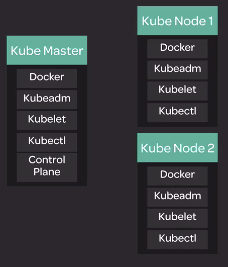

# Getting Started with Kubernetes

https://linuxacademy.com/course/kubernetes-essentials/
https://linuxacademy.com/course/cloud-native-certified-kubernetes-administrator-cka/
https://linuxacademy.com/course/kubernetes-the-hard-way/
https://medium.com/platformer-blog/how-i-passed-the-cka-certified-kubernetes-administrator-exam-8943aa24d71d


## Kubernetes Architecture



**Kube Master has the following components**

  - `Docker` : Runtime environment
  - `kubeadm` : Additional Tool to setup kubernetes cluster. Automates large part of setting up Kubernetes cluster.

  - `kubelet` : Agent that manages the process of running containers. Its an essential components and needs to be running on all nodes. Serves as middleman betweek Kubernetes and Docker.

  - `kubectl` : command line tool to interact/administrative with cluster


  - control-plane : its the series of services that forms the runtime control plane.

Since we are using `kubeadm` , the control plane services will be running as containers.

---

## Setting up the Lab

> Pre-work
> 1. Set Hostname Correctly /etc/hostname
> 2. Set /etc/hosts file correct
> 3. Disable Swap in /etc/fstab
> vi /etc/fstab and # the swap line.


**Step 1.** Install **Docker** (rkt,containerd are the alternatives) on all three servers.

```sh
curl -fsSL https://download.docker.com/linux/ubuntu/gpg | sudo apt-key add -

sudo add-apt-repository \
   "deb [arch=amd64] https://download.docker.com/linux/ubuntu \
   $(lsb_release -cs) \
   stable"

sudo apt-get update
#Install a sepcific version of Docker
sudo apt-get install -y docker-ce=18.06.1~ce~3-0~ubuntu
# Make the package version statick and does not auto upgrade.
sudo apt-mark hold docker-ce
```

**Step 2.** Install the **Kubernetes Components**

```sh

# This just sets the right gpg key so tht during install there is no complain about gpg key mismatch
curl -s https://packages.cloud.google.com/apt/doc/apt-key.gpg | sudo apt-key add -

# Set the kubernets repository
cat << EOF | sudo tee /etc/apt/sources.list.d/kubernetes.list
deb https://apt.kubernetes.io/ kubernetes-xenial main
EOF

#Install and update the Kubernetes
sudo apt-get update
sudo apt-get install -y kubelet=1.12.7-00 kubeadm=1.12.7-00 kubectl=1.12.7-00

```
<br>

> `sudo apt-mark hold packhage-name`
> This hold the package from being automatically upgraded.

**Step 3.** **Bootstraping the cluster**

```

root@kube-master:~# kubeadm init --pod-network-cidr=10.244.0.0/16

[preflight/images] Pulling images required for setting up a Kubernetes cluster
[kubeconfig] Wrote KubeConfig file to disk: "/etc/kubernetes/admin.conf"
[kubeconfig] Wrote KubeConfig file to disk: "/etc/kubernetes/kubelet.conf"
[kubeconfig] Wrote KubeConfig file to disk: "/etc/kubernetes/controller-manager.conf"
[kubeconfig] Wrote KubeConfig file to disk: "/etc/kubernetes/scheduler.conf"
[controlplane] wrote Static Pod manifest for component kube-apiserver to "/etc/kubernetes/manifests/kube-apiserver.yaml"
[controlplane] wrote Static Pod manifest for component kube-controller-manager to "/etc/kubernetes/manifests/kube-controller-manager.yaml"
[controlplane] wrote Static Pod manifest for component kube-scheduler to "/etc/kubernetes/manifests/kube-scheduler.yaml"
[etcd] Wrote Static Pod manifest for a local etcd instance to "/etc/kubernetes/manifests/etcd.yaml"
[init] waiting for the kubelet to boot up the control plane as Static Pods from directory "/etc/kubernetes/manifests"
[init] this might take a minute or longer if the control plane images have to be pulled
[apiclient] All control plane components are healthy after 20.508207 seconds
[uploadconfig] storing the configuration used in ConfigMap "kubeadm-config" in the "kube-system" Namespace
[kubelet] Creating a ConfigMap "kubelet-config-1.12" in namespace kube-system with the configuration for the kubelets in the cluster
[markmaster] Marking the node kube-master as master by adding the label "node-role.kubernetes.io/master=''"
[markmaster] Marking the node kube-master as master by adding the taints [node-role.kubernetes.io/master:NoSchedule]
[patchnode] Uploading the CRI Socket information "/var/run/dockershim.sock" to the Node API object "kube-master" as an annotation
[bootstraptoken] using token: n72r7z.8gmlov9v8fe95ztd
[bootstraptoken] configured RBAC rules to allow Node Bootstrap tokens to post CSRs in order for nodes to get long term certificate credentials
[bootstraptoken] configured RBAC rules to allow the csrapprover controller automatically approve CSRs from a Node Bootstrap Token
[bootstraptoken] configured RBAC rules to allow certificate rotation for all node client certificates in the cluster
[bootstraptoken] creating the "cluster-info" ConfigMap in the "kube-public" namespace
[addons] Applied essential addon: CoreDNS
[addons] Applied essential addon: kube-proxy

Your Kubernetes master has initialized successfully!

To start using your cluster, you need to run the following as a regular user:

  mkdir -p $HOME/.kube
  sudo cp -i /etc/kubernetes/admin.conf $HOME/.kube/config
  sudo chown $(id -u):$(id -g) $HOME/.kube/config

You should now deploy a pod network to the cluster.
Run "kubectl apply -f [podnetwork].yaml" with one of the options listed at:
  https://kubernetes.io/docs/concepts/cluster-administration/addons/

You can now join any number of machines by running the following on each node
as root:

  kubeadm join 150.1.7.54:6443 --token n72r7z.8gmlov9v8fe95ztd --discovery-token-ca-cert-hash sha256:fa5ff8c29297b2a6094c41be012e6de72fc7db50cdeebcee90faeadaee7180d2

```

**Step 4.**

When it is done, set up the local `kubeconfig` from above :
```sh
mkdir -p $HOME/.kube
sudo cp -i /etc/kubernetes/admin.conf $HOME/.kube/config
sudo chown $(id -u):$(id -g) $HOME/.kube/config
```

And use the config above for joinign the nodes

```sh
root@kube-node-1:~# swapoff -a
kubeadm join 150.1.7.54:6443 --token n72r7z.8gmlov9v8fe95ztd --discovery-token-ca-cert-hash sha256:fa5ff8c29297b2a6094c41be012e6de72fc7db50cdeebcee90faeadaee7180d2


This node has joined the cluster:
* Certificate signing request was sent to apiserver and a response was received.
* The Kubelet was informed of the new secure connection details.
```

Run '`kubectl get nodes`' on the master to see this node join the cluster.

```sh
root@kube-master:~# kubectl get nodes
NAME          STATUS     ROLES    AGE     VERSION
kube-master   NotReady   master   6m45s   v1.12.7
kube-node-1   NotReady   <none>   4m      v1.12.7
kube-node-2   NotReady   <none>   16s     v1.12.7
root@kube-master:~#
```

> Notice the status above of NotReady , it is goign to staty in the NotReady status untill we setup networking . We will do that next.


# We will do the networking using Flannel

Kubernetes can do multiple other networkign plugins , but in this lessons we will use the Flannel.

**Step 1.** First thing which we need to do is to do this on all the nodes :

```sh
echo "net.bridge.bridge-nf-call-iptables=1" | sudo tee -a /etc/sysctl.conf
sudo sysctl -p
```

**Step 2.** next thing we do is setup the Flannel based on the YAML values provided by coreOS here :

https://raw.githubusercontent.com/coreos/flannel/bc79dd1505b0c8681ece4de4c0d86c5cd2643275/Documentation/kube-flannel.yml

```sh
kubectl apply -f https://raw.githubusercontent.com/coreos/flannel/bc79dd1505b0c8681ece4de4c0d86c5cd2643275/Documentation/kube-flannel.yml

net.bridge.bridge-nf-call-iptables = 1
annel/bc79dd1505b0c8681ece4de4c0d86c5cd2643275/Documentation/kube-flannel.yml/fl
clusterrole.rbac.authorization.k8s.io/flannel created
clusterrolebinding.rbac.authorization.k8s.io/flannel created
serviceaccount/flannel created
configmap/kube-flannel-cfg created
daemonset.extensions/kube-flannel-ds-amd64 created
daemonset.extensions/kube-flannel-ds-arm64 created
daemonset.extensions/kube-flannel-ds-arm created
daemonset.extensions/kube-flannel-ds-ppc64le created
daemonset.extensions/kube-flannel-ds-s390x created

```

> If you are curious the YAML file has content like this (networking parameters)

```yaml
data:
  cni-conf.json: |
    {
      "name": "cbr0",
      "plugins": [
        {
          "type": "flannel",
          "delegate": {
            "hairpinMode": true,
            "isDefaultGateway": true
          }
        },
        {
          "type": "portmap",
          "capabilities": {
            "portMappings": true
          }
        }
      ]
    }
  net-conf.json: |
    {
      "Network": "10.244.0.0/16",
      "Backend": {
        "Type": "vxlan"
      }
    }
```

Now all our nodes are up

```sh
root@kube-master:~# kubectl get nodes
NAME          STATUS   ROLES    AGE   VERSION
kube-master   Ready    master   20m   v1.12.7
kube-node-1   Ready    <none>   17m   v1.12.7
kube-node-2   Ready    <none>   13m   v1.12.7
```

To verify if our Flannel services are up , we can look into the "system" pod which is the internal pod for the kubernetes system and has the flannel services running.


```sh
root@kube-master:~# kubectl get pods -n kube-system
NAME                                  READY   STATUS    RESTARTS   AGE
coredns-bb49df795-hhzfj               1/1     Running   0          20m
coredns-bb49df795-zh972               1/1     Running   0          20m
etcd-kube-master                      1/1     Running   0          20m
kube-apiserver-kube-master            1/1     Running   0          19m
kube-controller-manager-kube-master   1/1     Running   0          19m
kube-flannel-ds-amd64-4jf9p           1/1     Running   0          107s
kube-flannel-ds-amd64-gvnzp           1/1     Running   0          107s
kube-flannel-ds-amd64-jvtdn           1/1     Running   0          107s
kube-proxy-2mxbl                      1/1     Running   0          20m
kube-proxy-hkczm                      1/1     Running   0          14m
kube-proxy-nqtfd                      1/1     Running   0          18m
kube-scheduler-kube-mast
```

---
<p align="center">
  
</p>

---

# Containers and Pods


# Kubernetes Troubleshooting

```sh
root@kube-master:~# swapoff --a
root@kube-master:~# systemctl start kubelet

root@kube-master:~# systemctl status kubelet
● kubelet.service - kubelet: The Kubernetes Node Agent
   Loaded: loaded (/lib/systemd/system/kubelet.service; enabled; vendor preset:
  Drop-In: /etc/systemd/system/kubelet.service.d
           └─10-kubeadm.conf
   Active: active (running) since Wed 2019-10-30 03:57:33 EET; 29s ago
     Docs: https://kubernetes.io/docs/home/
 Main PID: 2057 (kubelet)
    Tasks: 20
```
