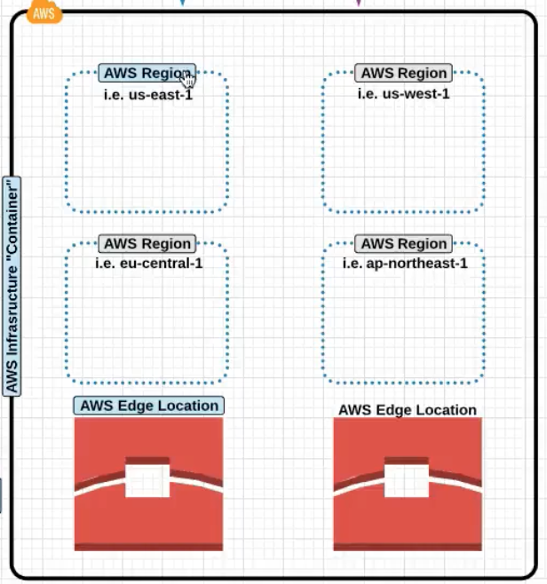

<!-- TOC START min:1 max:5 link:true update:true -->
  - [Introduction](#introduction)
  - [AWS Organisation](#aws-organisation)
    - [AWS Account and Physical Organisation](#aws-account-and-physical-organisation)
    - [Physical Organisation](#physical-organisation)
    - [AWS Terminology](#aws-terminology)
  - [AWS Access Management](#aws-access-management)
    - [IAM Policy](#iam-policy)
    - [IAM groups](#iam-groups)
    - [IAM Roles](#iam-roles)
      - [Role Assumption](#role-assumption)
      - [Security Token Service](#security-token-service)
      - [IAM API Keys](#iam-api-keys)
  - [AWS Networking](#aws-networking)
    - [Typical VPC screen](#typical-vpc-screen)
    - [VPC Routing Basics](#vpc-routing-basics)
    - [VPC Security](#vpc-security)
    - [VPC Workflow](#vpc-workflow)
    - [VPC Limits](#vpc-limits)
  - [Server-Based Compute Services](#server-based-compute-services)
    - [EC2 Limits](#ec2-limits)
    - [EC2 Purchasing Options](#ec2-purchasing-options)
    - [Linux AMI Virtualisation Type :](#linux-ami-virtualisation-type-)
    - [EC2 Instance Type :](#ec2-instance-type-)
    - [EC2 Instance Metadata](#ec2-instance-metadata)
    - [EC2 Instance Storage types](#ec2-instance-storage-types)
    - [Different EBS types](#different-ebs-types)
    - [EBS snapshot](#ebs-snapshot)
    - [Placement groups](#placement-groups)
    - [EFS Elastic File System](#efs-elastic-file-system)
  - [Server**less** Compute Services (AWS Lambda)](#serverless-compute-services-aws-lambda)
  - [Quick Detour](#quick-detour)
    - [CloudWatch (Monitoring)](#cloudwatch-monitoring)
    - [CloudTrail (API Logging Service)](#cloudtrail-api-logging-service)
    - [SNS Notification Service](#sns-notification-service)
  - [Advanced Networking](#advanced-networking)
  - [Workflow](#workflow)
    - [Service Traffic to and from Private Web Servers](#service-traffic-to-and-from-private-web-servers)
    - [ELB Troubleshooting](#elb-troubleshooting)
    - [Auto Scaling Troubleshooting](#auto-scaling-troubleshooting)
  - [Storage Services](#storage-services)
    - [S3 Permissions](#s3-permissions)
    - [S3 Storage Class](#s3-storage-class)
      - [S3 Versioning](#s3-versioning)
      - [S3 Lifecycle managment](#s3-lifecycle-managment)
      - [S3 Event Notification](#s3-event-notification)
      - [S3 Static Web Hosting](#s3-static-web-hosting)
      - [CORS / Cross Origin Resource Sharing](#cors--cross-origin-resource-sharing)
      - [Multipart Upload](#multipart-upload)
      - [AWS Import Export](#aws-import-export)
      - [Snowball](#snowball)
      - [Storage Gateway](#storage-gateway)
      - [DNS Management](#dns-management)
      - [CloudFront](#cloudfront)
      - [VPN Connection](#vpn-connection)
      - [AWS Direct Connnect](#aws-direct-connnect)
      - [VPC Peering](#vpc-peering)
      - [AWS CLI Configuration](#aws-cli-configuration)
      - [AWS Database](#aws-database)
      - [AWS RDS](#aws-rds)
    - [RDS Launch Demo](#rds-launch-demo)
    - [DynamoDB](#dynamodb)
    - [ElasticCache](#elasticcache)
    - [RedShift](#redshift)
  - [AWS Application Services](#aws-application-services)
    - [SNS](#sns)
      - [Workflow Example](#workflow-example)
    - [SQS Essentials](#sqs-essentials)
    - [SWF , Simple Workflow Service](#swf--simple-workflow-service)
    - [AWS API Gateway](#aws-api-gateway)
    - [CloudWatch Essentials](#cloudwatch-essentials)
  - [Hybrid Environments](#hybrid-environments)
- [Advanced Networking (START HERE IN LINUXACADEMY)](#advanced-networking-start-here-in-linuxacademy)
  - [Advanced VPC Networking](#advanced-vpc-networking)
  - [Network Troubleshooting](#network-troubleshooting)
  - [Storage Services](#storage-services-1)
  - [Hybrid Environments](#hybrid-environments-1)

<!-- TOC END -->

## Introduction

## AWS Organisation

### AWS Account and Physical Organisation

This represents how how you manage multiple services and account managment.

<!-- assets/markdown-img-paste-20180317155120909.png" alt="Drawing" style="width: 300px;"/>
-->

 > The above picture shows a organisation of the AWS Users and Groups and the different ways (You can have different groups for `PROD` and `QA`) , Console or CLI they can use to login and manage the AWS Cloud.

### Physical Organisation

At a very high level AWS can be broken down into two main blocks

- **`AWS Regions`** : These are grouping of independenly separated datacenters in a specific geographic regions know as `Availabilty Zones`.

- **`AWS Edge Location`** : It is a Datacenter whic does not contain any AWS Services ; Instead it is used to deliver contents to parts of the world. `CloudFront`

> Not All AWS Services are availaible globally , one of the example of a Global Service is the `IAM`

An `AWS Region` has multiple `Availabilty Zones`

Now within each `Availabilty Zone` there can be multiple `Datacenters`

`Availabilty Zones` are **phyically sperated** to each other but **have high speed connection between them** to provide **Fault Tolerance**

> So as an example `S3` is replicated accross all `Availabilty Zones` and all `Datacenters` for **reliability and high availaibility**.

Now as we further move ahead , the `VPC` is the

### AWS Terminology

- `High Availability (HA)` This means creating and managing the ability to automatically “failover” to a secondary system if the primary system goes down for any reason as well as **eliminating all single points of failure** from your infrastructure.

- `Fault Tolerance` this means infrastructure that is designed in such a way that **when one component fails**(be it hardware or software), a **backup component takes over operations immediately** so that there is no loss of service.

- `Scalability` is the capability to scale out **easily**.

- `Elasticity` the ability to **scale-up** as well as **scale-down**

-------

## AWS Access Management

Now lets look at the `IAM` Components where you manager Users, roles and groups, IAM Consistes of :

- `IAM User`
- `IAM Groups`
- `IAM Policy`
- `IAM Role `
- `IAM API Keys`
- `IAM Password Policy`

> IAM is Global and does not require a region selection.

Now once you have enable IAM , you can use the link show in the picture below to login

### IAM Policy

An IAM Policy , looks like this. Note that `Deny` will have a precedence over `Allow`.

An example of where you can see the policy in detail and whats how it is organised

### IAM groups

Groups are like AD Groups in a company where you segregate users into respective division , like HR, Finace etc .

So now the `policies` can be attached to the `groups` directy.

### IAM Roles

- Look at the example below and notice how that all the Users and Roles are created at the IAM Level.

  - `Non AWS Account Holder` : Now what we integrate AWS with the AD in a company. The users from AD who are **authenticated via SAML** now need to be mapped to `Role` to be able to do things in the AWS

  - `EC2 instance needing access to S3`

> An EC2 instance can only have one role attached to it .

#### Role Assumption

Now lets say , the users below in the `DEV` group need access to the  resources in the `PROD`, then can **assume** a `Role` and be able to access the resource in `PROD`.

**How does the above assumption happen?**

An `IAM Policy` is attached to an `IAM Role` which is then assigned to the `User` or `Resource` which needs acces.

Notice in the screenshot below , we have 3 different types of Roles:

- **`AWS Service Roles`** : Like EC2 accessing S3
- **`Role for Cross Account access`** : Allowing access for `DEV` IAM group to `PROD`
- **`Role for Identity Provider Access`** : Federation and SAML , Facebook, Google.

#### Security Token Service

This a temporary credetials which allows access to the AWS Resource.
So in the example of `EC2` accessing `S3` and `STS` is generated for the EC2 instance.

The benefit is that the **credetials are not required to be embedded** in the application.

STS times out / expires after certain time period.

#### IAM API Keys

These are the API Keys like openstack which enables programmatic access to the AWS APIs.

-------
## AWS Networking

> VPC `Virtual Private Cloud` is how the networking is architected in the cloud.

- Now lets take a deeper dive into VPC ad look it under the hood.

  `VPC` spans `Avalaibility Zones` and `Multiple Datacenters`.

  

  Now take a look at the picture belpw and see what the a dissection of VPC looks like internally.

   - Notice how the VPC spans the two different AZs in the picture.
   - Notice the **private subnets** e.g `172.16.0.0` spanning two different AZs. This enables you to design and put your servers in **different failure domains enabling High Avalaibility**
   - You can define custom `CIDR` in each subnet.
   - You can create routes between the Subnets.
   - You can also have subnet level firewalls and access rules.

  

### Typical VPC screen

- Notice on the left the different networking constructs you have to work and play with :)

  

### VPC Routing Basics

- Now lets take a look at a deeper level on the VPC Routing Basics the `Internet  gateway`, `Subnets` and the `Routing table`.

  - `Internet Gateway` : The is a default internet gateway connected to the default VPC. It is horizontally scales in the backend and there is no need to manage the bandwidth and capacity of the same. It has **built in Fault tolernace at the Amazon Networking level**.

    > We dont have to manage `Internet Gateways` bandwidth, AWS Does that for us.

    Again , you can only have **one Internet Gatewat attached a VPC**.

    Notice the attached `Internet Gateway` to the VPC in the picture below.

    

    Now take a look at the `Route Table` in the picture below and how `0.0.0.0` is mapped to the `Internet Gateway` for all **outbound internet traffic**.

    

  - `Subnets`: After creating VPC, you can create o**ne or more subnets** in each `Availabilty Zone`. Each **subet much reside in one Availaibilty Zone** and **cannot span** different `Availability Zone`.

    > So **VPC spans Availabilty Zones** but **Subnet are contained in one Availabilty Zone**.

    IMPORTANT NOTE : `Subnets` are associated to `Route Tables` and the `Route Table` may or may not be attached to an `Internet Gateway`

  The following association is show in the picture below .

  `Subnet ---> Route Table ---> Internet Gateway`

  

  `Explicit Association` is when you move the route tables from default to the one which you created.

  **High Level AWS Networking Internal Architecture**

  

### VPC Security

- **`Network ACLs`** `allow` or `deny` traffic at the subnet level and are stateless, which means that the return traffic had to be `ALLOWED` for traffic for both direction.

  This follows at the Cisco ACL `access-list` order charecteristics.

- **`Security Groups`** Just like Openstack Security groups but they are **statefull** . Security group **only supports** `allow` rules.

### VPC Workflow

1. Create the `VPC` and give it a `CIDR` Block range. **Notice** that you can also define `IPv6` CIDR ranges. When `Tenancy`  is set to dedicate you are **not sharing** your servers with the other users.

2. Create the `Internet Gateway`

3. Attach the `Internet Gateway` to the `VPC`

4. Next we will create **two different** `Route Tables`, one which is **connected** to the `Internet Gateway` and the other **which is not** connected.

Now **connect** the `Route Table` created above to the `Internet Gateway`. If you leave the `Route Table` not connected to the `Internet Gateway` it becomes a private route table.

5. Now Create a `Subnet`. Notice that you have to specifically define the `Availabilty Zone` (a subnet can only span an AZ) and the `CIDR` block range which is within the range of the VPC.

6. Now you can create the Network ACL which is a straight forward process.

### VPC Limits

- 5 VPCs per region (you can have this increased)
- 5 Internet Gateways per region , this is equal the VPC limit as **one VPC can only have one internet gateway**.
- 50 VPN Connections per region.

-------

## Server-Based Compute Services

### EC2 Limits

- Take a look at the default EC2 Limits :

  

### EC2 Purchasing Options

- 

  Workflow : Choose `AMI` --> Choose `Instance Type`

**There are 3 different types of EC2 Instances :**

- **`Ondemand`** Most expensive , run and destroy whenever you like. You care billed as per per `second` or per `hour`. **These differ based on Images** too , not all images support per second basis. A`mazon Linux` or `Ubuntu` offer per second pricing.

  > Note that if the image is stopped  you are not charged for the same.

- **`Reserved`** Allows you purchase instance for `1` or `3` years and you get **discount** becuause of the commitment. But here you pay the whole amount regardless of how much you use it. You can pay upfront partial partial and no upfornt

- **`Spot`** In this case prices of instances fluctuate based on what AWS considers is **unused capacity in their datacenters**. In this case you the billing happens like the `Ondemand` instance.

  And instance is provisioned for you **when your bid price is less than or equal to the instance price**. If the **AWS's price increases your instance is terminated**.

  If the instance is **terminated by AWS** you **dont pay for that slot** of duration (1 minute or 1 hour) . If **you delete it**, **you pay** for it.

### Linux AMI Virtualisation Type :

- **`HVM`**  **Hardware Virtual Machine** , Conside this like Intel VTx/d technology by which guests can take advantage of virtualisation feature supported by the CPU. Proved enhanced networking and GPU processing to the VM.

- **`PV`**  **Paravirtual** AMIs Guests could run on Hardware which does not have HVM support. cannot take advantage of GPU / Advanced networking.

### EC2 Instance Type :

Has the following virtual hardware components, you have to choose the right instance type **based on your application requirement** :

- `vCPU`
- `RAM`
- `Storage Options `
- `Network Performance`

  Notice in the picture below the above characteristics.
  

  Different Instance types

  

### EC2 Instance Metadata

- `http://169.254.169.254/lates/user-data` Shows the **user data provided for bootstrapping**.

- `http://169.254.169.254/lates/user-data` Displays **AMI, Instance Type** etc.

### EC2 Instance Storage types

EBS Elastic Block Store ,

 - EBS Volumes are persistent and can stay even after instance deletion, unlike Instance Store.
 - Can **only be attached to one instance** a time.
 - EBC can be backed up into snapshots. These snapshot can later be restored to EBS volume.
 - EBS Volume measures performance in IOPS , AWS one IOPS is 256KB chunk (input or output)
 - Even with provision IOPs you may not get the performance you want, you may want to choose an instance type which is EBS optimized instance type.
 - New EBS volume no longer need to be pre-warmed. Maximum performance is received as soon as the EBS volume is spawned.
 - Now with the above point note that if you created a volume from a snapshot you still need to warm-up  (read all the storage blocks)/ read otherwise the access could be slow.

### Different EBS types

- `General Purpose` (1GiB - 16TiB), best used for Dev and Test environment. This allows 3 IOPS/GiB (so size of the disk has direct relation with the IOPS) but is burstable upto 3000 IOPS.
- `Provisioned IOPS SSD` (4GiB - 16TiB) , Used for mission critical applications. This performs at the provisioned IOPS level and can go upto 20,000 IOPS.
- `Magnetic` Rarely used , slow .

Now there is another type of store different than EBS :

- `Instance Store` volumes are ephemeral data. The data on the volume only exists till the life of the instance. If the instance is stopped or shutdown the data will be lost.
If the instance is rebooted the data is retained.

### EBS snapshot

- You can take a snapshot to recreate the volume. Snapshots are stored in S3. You are only charged for the difference between the snapshots.

### Placement groups

> Instances must have **10G connection** type to be able to use Placement Groups.

 - When there is a requirement to keep the instances as close possible to other instances a placement group is used. Like `Affinity Groups` in Openstack.

    Instances not created in a Placement group cannot be moved into a placement group.
    **A placement group cannot span AZs**.

### EFS Elastic File System

- **Consider this like NFS** , this can be shared between multiple EC2 instances.

-------

## Server**less** Compute Services (AWS Lambda)

- You do not need EC2 servers (Serverless) to run your application , you can directly run your programs here !

  A picture says a thousand words :

  

  ### When should you run Lambda
  > You are only billed for the duration your code is running.

  Generally you will run Lambda when you want a function to run in response to an event.

  Example Lambda Use :
`Upload Object to S3 --> S3 Event --> Triggers a Lambda Function`

## Quick Detour

### CloudWatch (Monitoring)

- Used to monitor AWS Services such as EC2
- Provides centralised monitoring and performance mentrics.
- CloudWatch Alarms can be used a triggers.

### CloudTrail (API Logging Service)

- Logs all API calls.

### SNS Notification Service

- Automates the process of sending notification email or text . SNS is integrated in many AWS services so it is easy to use it.

-------

## Advanced Networking

###

If you notice in the picture below , we have now added a load balancer and an autoscaling group which now spans two vPCs .

**`Elastic Loadbalancer`** : EC2 Service which loadbalances traffic to multiple EC2 instances across multiple `Availabilty Zones`.

- Also `Elastic Loadbalancer` should also be paired with `Auto Scaling Group` for High Availabilty.

- There could also be an Internal Elastic Loadbalancer for loadbalancing traffic internally within private subnets.
- Elastic Loadbalancer can also stop sending traffic to a non responding instance based on `Health Checks`.
- It can an also do the SSL Encryption and Decryption at its level , instead of these certificates installed at the instance level.

**`Auto Scaling Group`** :  Automates the process of increasing or decreasing the amount of provised on-demand instances availaible for your application.

 - Auto Scaling can increase or decrease the amount of instances based on `CloudWatch` metrics.

Auto Scaling has two main components :

- `Launch Configuration` : The template of the instance which will be launched.
- `Auto Scaling Groups` : All the rules and setting which defines the trigger for when the instance will be created or deleted.
      - Number of `MIN` and `MAX` instances allowed.
      - VPCs and AZs to launch instances into.

> For an architecture to be considered highly availaible and fault tolerant it MUST have an ELB service traffic to an Auto Scaling Group with a minimum of two instances in separate AZs.

## Workflow

It makes sense to create the Target Groups first and then the Load Balancers

> In the example below we are creating the following scenario and based on the content (pictures or videos) in the URL and route based on the same.

1. Create a Target Group

2. Add Target (instances) to the target group

3. Configure the Load balancer

4. Add the Target group created in step 1

5. Note that we have now the DNS name of the loadbalancer which can be accessed to access the service:

6. Additionaly when the Load balancer is created we can edit the rules for more advanced rules and routing:

Example is , that any time the path contains *pictures* we can forward it to the pictures target group , similary another group can be created for videos:

### Service Traffic to and from Private Web Servers

**`Bastion Host`**: A terminal server for getting into instance in the private subnet.

**`NAT Gateway`** : For providing internet access to the instances in the private subnet.
`NAT Gateway` is without an actual instance doing the NATing and `NAT Instances` uses an actual instance.

### ELB Troubleshooting

- Loadbalancing is  not occuring in multiple `Availaibility Zones`
Enable Cross-Zone Loadbalancing

- If the Instance not coming up as health in the AWS, Check the ping protocol and make sure it is right.

- Also check the security group setting of the ELB to ensure if it has the right ports allowed for the communication

- Access Logs show IP Address of ELB and not the source traffic. For this to work configure the S3 Access Logs  in the picture below.

- Unable to add instances from a specific subnet . In this case you need to make sure that the AZ of the instance in question should be listed in the `Edit Availabilty Zone` and then it will appear in `Edit Instances` .

### Auto Scaling Troubleshooting

- An Auto Scaled instance continues to Start and Stop or `Create`/`Terminate` instances in short intervals.
This could happen if the `trigger` is too close for example CPU threshold `< 30 , > 40 `

- Also keep a note of `Max` instaces as this may not let you spin more instances.

-------

## Storage Services

Notice the Transit service which are responsible for sending data in and out of S3 and Glacier.

Differen components of S3

### S3 Permissions

`Bucket Policies` These are the permissions which are direclty assigned to the S3 Bucket . These are called Bucket Policies.

`S3 Access Control List` : For Public Access or AWS authenticated user.

### S3 Storage Class

Object Durability : The percent the object is goign to be there. Not goign to be deleted or corrupted.
Object Availaibilty : Availaible for Access.

Different types of S3 Storage :

- `Standard`:  Durability : 99.999999999%  Availabilty : 99.99%
- `Standard Infrequent Access`:  Durability : 99.999999999%  Availabilty : 99.90%
- `Reduced Redundancy Storage `:  Durability : 99.99%  Availabilty : 99.99%
- `Glacier`:  Durability : 99.999999999%. Following are the recovery options :
  - `Expedited` : 1- 5 minutes.
  - `Standard`: 3-5 hours.
  - `Bulk`: 5-12 hours.

> To move object to Glacier you have to use `Life Cycle Policies`

#### S3 Versioning

By default versioning is disabled on all objects.  Once enable it cannt be disabled completely , but stopped for future objects.
Versioning can only be setup at the bucket level.

#### S3 Lifecycle managment

In the example below , we are moving the object to Infrequent Access to Glacier.

#### S3 Event Notification

Allows you to setup automated communication between S3 and other AWS services when a selected event occurs.
Event can be sent to `SNS`, `Lambda`, `SQS Queue`

#### S3 Static Web Hosting

Mainly lets say if your servers are unreachanble , they can atleast get a page notifying your company message rather than a 404.

#### CORS / Cross Origin Resource Sharing

Sharing accross wed domains

To be able to share information between two different buckets for two different domains CORS have to be enabled.

#### Multipart Upload

Uploading files in pieces , *highly suggested* when objects are bigger than `100MB`

#### AWS Import Export

You send a physical device to AWS which AWS Uploads for you .

#### Snowball

AWS Send you a transfer appliance which you can copy your data to to send .
This is for PB Scale data.

#### Storage Gateway

Connects On-Premise Datacenter to S3 Storage

- `Gateway Cached Volumes` (Read as **locally** **cached** volumes): Create the volume and mount them as iSCSI devices. The data will be stored in S3 and frequently accessed data will be cached locally.
- `Gateway Stored Volumes` (Read as **locally** **stored** volumes) : All data is stored locally and snapshots of the same as incremental backup are stored in S3.

#### DNS Management

`Hosted Zones` : A Hosted Zone basically keep record of your DNS domain and know what to do with a DNS Request .

`Public Hosted Zone` : On the Internet

`Private Zone` : Withing Virtual Private Cloud .

`Record Sets` : Record Sets are instructions that actually match domain names to IP Address. Record set comprised of the following:
  - Record type
  - Standard/alias
  - Routing Policy
  - Evaluated target health

Common Record types include :

- `A` : Point to IPv4 address
- `AAAA` : Points to IPv6 IP address
- `CNAME` : Used to point to a hostname or other hostname.
`MX` : Point to a mail record.

#### CloudFront

CloudFront is a global CDN which delivers content from an `origin` location to an `edge` locations .

> In order to server a new version of an object, either create a new object with a new name or create an `invalidation` on the CloudFront distribution based on onject names.
> Invalidations have cost so if you have to invalidate large CloudFront distributions then perhaps you should create a new distribution and move DNS names.

#### VPN Connection

`Virtual Private Gateway` : It is the connector at the VPC Side , the `Customer Gateway` is the connector at the customer side.

#### AWS Direct Connnect

AWS Direct Connect is a service that provides a dedicated network connection between your network and one of the AWS Direct connect providers.

Dedicated Private connection is like a VPN connection to your DC , it does not provide Internet .

`Private Virtual Interface` : This allows you to interface with an AWS VPC with automatic route discovery using BGP , this requires a private of a public ASN number.

`Public Virtual Interfaces` : This allows you to have a direct connection to public AWS endpoints like Amazon S3 or DynamoDB

#### VPC Peering

> Earlier VPC Peerign was only allowed withing the region , but with new feature VPC Peering can be done within different regions as well.

Notice the appearance of vpc-peer entry to point to in the route table

#### AWS CLI Configuration

`aws configure`

`aws s3 mb s3://testbucket`

#### AWS Database

RDS is a fully managed database service , you do not have access to the instance.

RDS sizes like M1 , Large etc correcpoind to the instance sizes.

The following databases are supported :

- MySQL
- MariaDB
- PostgreSQL
- Oracle
- MS SQL Servers
- Aurora
  - Amazon Developed DB Service.

Benefits of RDS :
- Automatic minor updates
- Automatic backups.

#### AWS RDS

`RDS Read Replica` : A DB copy which can be used for `READS` and can offload some load from the main DB .

`Multi AZ Failover` : RDS can be synchronously replicated to the `Standby` Instance which can be used for the failover.

### RDS Launch Demo

1. First This is to create a subnet group (you do not create the subnet but just associate the subnet already created)

2. Select the instance type.

3. Provide the SB Launch Details

4. View of a fully launched database

Notice the `middle tab` with lot of information

Creating `Read Replicas`

### DynamoDB

DynamoDB is a serverless SQL Service. A fully managed NoSQL Service , similar to MongoDB.
All you need to do is define the throughput capacity. This scales automatically (grow and shrink)
AWS handles the backups as well.

Very straight forward configuration

Used for storing : IoT , Gaming , Mobile

### ElasticCache

It a fullymanaged `in-memory` cache engine. It caches large taxing queries on the DB which increases performance.

memcached and redis are the currently availaible engines to power the ElasticCache.

### RedShift

Amazon Redshift is a petabyte scale datawareshousing solution, fully managed and scalable and is generally used for Big Data analytics.

## AWS Application Services

### SNS

SNS corodinates and manages the sending and delivery of messages to specific endpoints.
Since it is integrated into many services natively it is very easy to set this up .

SNS is broken down into 3 main parts:
- **`Topic`** : Topic is a group of subscriptions you send the messages to.
- **`Subscription`** : An endpoint to which the message is sent to.
  - `HTTP`, `HTTPS`, `Email`, `Email-JSON`, `SQS`, `Mobile Apps`, `Lambda`, `SMS`
- **`Publisher`** : Entity that triggers the sending of the event , for examle , Human, S3 Event, Cloudwatch Alarm.

#### Workflow Example
  - Create a Topic
  
  - Now , within the topic create a subscription
  
  
  - Now click on Publish a topic
  
  
  And finally publish the message to the email subscription created above
  

  

### SQS Essentials

> SQS Is a fully managed service by AWS

Simple Queing Service allows the creation of decoupled services. Messages between servers are retrieved through polling.

There are two types of polling:

1. Long polling : Long polling (1-20 seconds) , Less number of API Calls.
2. Short polling : More frequent polling , more number of API calls.

SQS can contain upto 256KB of text (in any format)

Amazon SQS offers two different types of queues :

1. `Standard Queue` : Does not gaurantee FIFO but tries the same . It gurantees the delivery of the message atleast once.
2. `FIFO Queue` : For the applications where order is important , or where duplicates can not be tolerated.

### SWF , Simple Workflow Service

SWF is a fully managed workflow service provided by AWS.  A workflow execution can last upto 1 year.

Components of SWF :

 - `Workflow` : A sequence of steps required to perform a speficific task.
 - `Activities` : A `single step` in the workflow.
 - `Tasks`
   - `Activity Task` : Tells the worker to perform a specific task.
   - `Decision Task` : Tells the decider the sate of the workflow execution and allows him to take the decision on the next steps.
 - `Worker` : Responsible for taking a task and working on it .

### AWS API Gateway

API Gateway is a fully managed service which allows you to create and manage your own APIs.

Lets say you have an application running on Lambda Functions and EC2 .

You can `version` control your APIs as well.

CloudFront Edge locations are the entrypoint , which help with DDoS protection as well.

API Gateway also caches the responses as well .

### CloudWatch Essentials

CloudWatch is used to monitor AWS Services, such as EC2,ELB and S3.
You monitor your environment by configuring and viewing Cloudwatch metrics.

CloudWatch Alarms allow for you to be notfiied when a certain defined threshold is met for CloudWatch Metrics.

Tuesday : 3 - 4 PM
Thursday : 3 -

-------

## Hybrid Environments

-------

# Advanced Networking (START HERE IN LINUXACADEMY)
-------

## Advanced VPC Networking
-------

## Network Troubleshooting
-------

## Storage Services
-------

## Hybrid Environments
