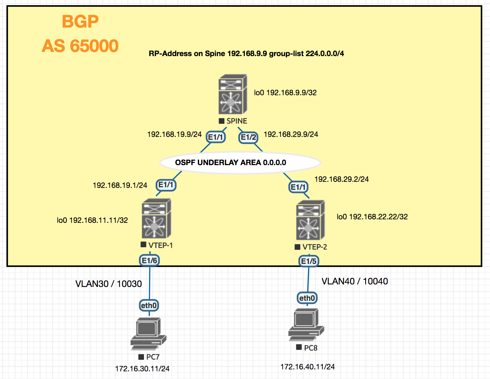

<!-- TOC START min:1 max:5 link:true update:true -->
  - [Introduction](#introduction)

<!-- TOC END -->


## Introduction

  

```sh
  version 7.0(3)I7(3)
  hostname SPINE-1

  nv overlay evpn
  feature ospf
  feature bgp
  feature pim
  feature interface-vlan
  feature vn-segment-vlan-based
  feature nv overlay


  ip pim rp-address 192.168.9.9 group-list 224.0.0.0/4
  ip pim ssm range 232.0.0.0/8

  interface Ethernet1/1
    no switchport
    ip address 192.168.19.9/24
    ip router ospf UNDERLAY area 0.0.0.0
    ip pim sparse-mode
    no shutdown

  interface Ethernet1/2
    no switchport
    ip address 192.168.29.9/24
    ip router ospf UNDERLAY area 0.0.0.0
    ip pim sparse-mode
    no shutdown

  interface mgmt0
    vrf member management

  interface loopback1
    ip address 192.168.9.9/32
    ip router ospf UNDERLAY area 0.0.0.0
    ip pim sparse-mode
  cli alias name mac show system internal l2fwder mac
  cli alias name wr copy running start
  line console
  line vty
  boot nxos bootflash:/nxos.7.0.3.I7.3.bin
  router ospf UNDERLAY
  router bgp 65000
    log-neighbor-changes
    address-family ipv4 unicast
    address-family l2vpn evpn
      retain route-target all
    template peer VTEP-PEERS
      remote-as 65000
      update-source loopback1
      address-family ipv4 unicast
        send-community
        send-community extended
        route-reflector-client
      address-family l2vpn evpn
        send-community
        send-community extended
        route-reflector-client
    neighbor 192.168.11.11
      inherit peer VTEP-PEERS
    neighbor 192.168.22.22
      inherit peer VTEP-PEERS

  !
  !end

  ```

```sh

  version 7.0(3)I7(3)
  hostname VTEP-1

 nv overlay evpn
 feature ospf
 feature bgp
 feature pim
 feature interface-vlan
 feature vn-segment-vlan-based
 feature nv overlay
 fabric forwarding anycast-gateway-mac 0001.0001.0001

 ip pim rp-address 192.168.9.9 group-list 224.0.0.0/4
 ip pim ssm range 232.0.0.0/8


 vlan 1,30,40,100,200
 vlan 10
   name L3_VNI
   vn-segment 10000010
 vlan 30
   vn-segment 10000030
 vlan 40
   vn-segment 10000040

 vrf context L3_VNI
   vni 10000010
   rd auto
   address-family ipv4 unicast
     route-target both auto
     route-target both auto evpn

 interface Vlan10
   no shutdown
   mtu 9216
   vrf member L3_VNI
   ip forward

 interface Vlan30
   no shutdown
   mtu 9216
   vrf member L3_VNI
   ip address 172.16.30.1/24
   fabric forwarding mode anycast-gateway

 interface Vlan40
   no shutdown
   mtu 9216
   vrf member L3_VNI
   ip address 172.16.40.1/24
   fabric forwarding mode anycast-gateway

 interface nve1
   no shutdown
   host-reachability protocol bgp
   source-interface loopback2
   member vni 10000010 associate-vrf
   member vni 10000030
     mcast-group 239.1.1.10
   member vni 10000040
     mcast-group 239.1.1.20


 interface Ethernet1/1
   description Going to Spine
   no switchport
   ip address 192.168.19.1/24
   ip router ospf UNDERLAY area 0.0.0.0
   ip pim sparse-mode
   no shutdown

 interface loopback2
   description Loopback for BGP
   ip address 192.168.11.11/32
   ip router ospf UNDERLAY area 0.0.0.0
   ip pim sparse-mode
 cli alias name wr copy runn start
 cli alias name mac show system internal l2fwder mac
 line console
 line vty
 boot nxos bootflash:/nxos.7.0.3.I7.3.bin
 router ospf UNDERLAY
 router bgp 65000
   address-family ipv4 unicast
   address-family l2vpn evpn
   neighbor 192.168.9.9
     remote-as 65000
     update-source loopback2
     address-family ipv4 unicast
     address-family l2vpn evpn
       send-community extended

 evpn
   vni 10000030 l2
     rd auto
     route-target import auto
    route-target export auto
   vni 10000040 l2
     rd auto
     route-target import auto
     route-target export auto
 
 !
 !end
 ```


```sh
version 7.0(3)I7(3)
hostname VTEP-2
nv overlay evpn
feature ospf
feature bgp
feature pim
feature interface-vlan
feature vn-segment-vlan-based
feature nv overlay
fabric forwarding anycast-gateway-mac 0001.0001.0001

ip pim rp-address 192.168.9.9 group-list 224.0.0.0/4
ip pim ssm range 232.0.0.0/8


vlan 1,10,30,40,100,200
vlan 10
  name L3_VNI
  vn-segment 10000010
vlan 30
  vn-segment 10000030
vlan 40
  vn-segment 10000040

vrf context L3_VNI
  vni 10000010
  rd auto
  address-family ipv4 unicast
    route-target both auto
    route-target both auto evpn

interface Vlan10
  no shutdown
  mtu 9216
  vrf member L3_VNI
  ip forward

interface Vlan30
  no shutdown
  mtu 9216
  vrf member L3_VNI
  ip address 172.16.30.1/24
  fabric forwarding mode anycast-gateway

interface Vlan40
  no shutdown
  mtu 9216
  vrf member L3_VNI
  ip address 172.16.40.1/24
  fabric forwarding mode anycast-gateway

interface nve1
  no shutdown
  host-reachability protocol bgp
  source-interface loopback2
  member vni 10000010 associate-vrf
  member vni 10000030
    mcast-group 239.1.1.10
  member vni 10000040
    mcast-group 239.1.1.20


interface Ethernet1/1
  description "Going to Spine"
  no switchport
  ip address 192.168.29.2/24
  ip router ospf UNDERLAY area 0.0.0.0
  ip pim sparse-mode
  no shutdown


interface loopback2
  description "Loopback for BGP"
  ip address 192.168.22.22/32
  ip router ospf UNDERLAY area 0.0.0.0
  ip pim sparse-mode
cli alias name mac show system internal l2fwder mac
cli alias name wr copy runnin start
line console
line vty
boot nxos bootflash:/nxos.7.0.3.I7.3.bin
router ospf UNDERLAY
router bgp 65000
  address-family ipv4 unicast
  address-family l2vpn evpn
  neighbor 192.168.9.9
    remote-as 65000
    update-source loopback2
    address-family ipv4 unicast
    address-family l2vpn evpn
      send-community extended

evpn
  vni 10000030 l2
    rd auto
    route-target import auto
   route-target export auto
  vni 10000040 l2
    rd auto
    route-target import auto
    route-target export auto


!
!end
```
