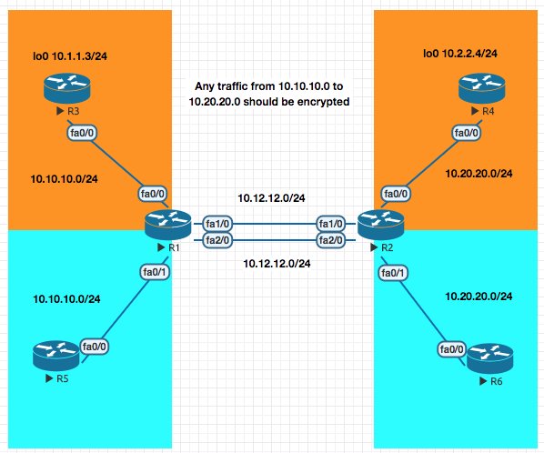
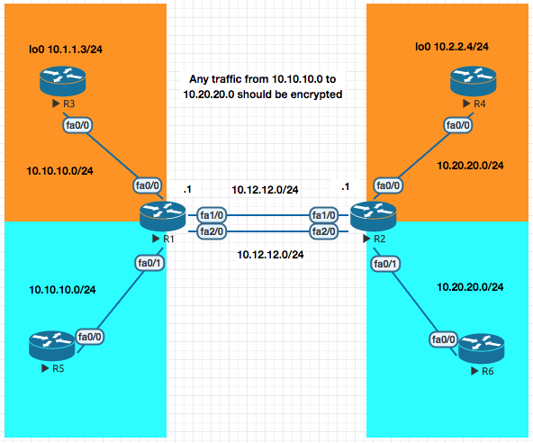
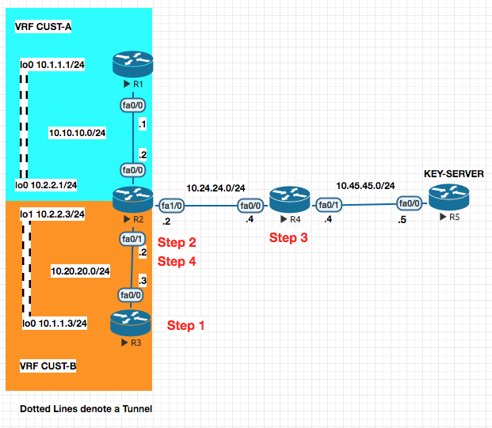
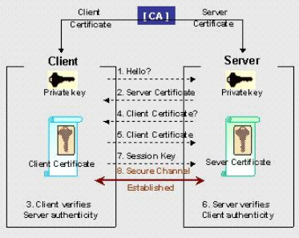
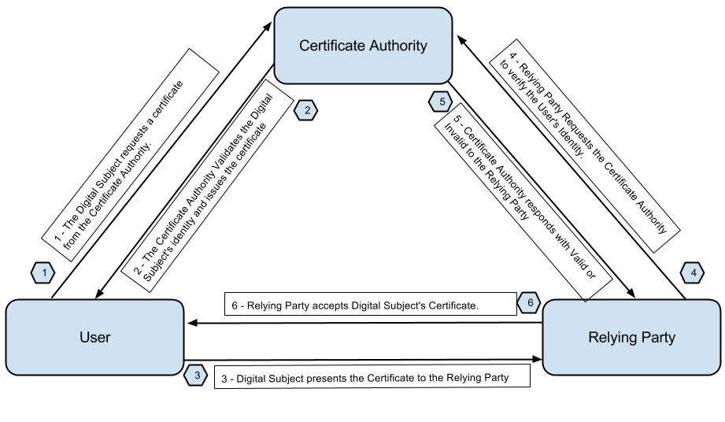
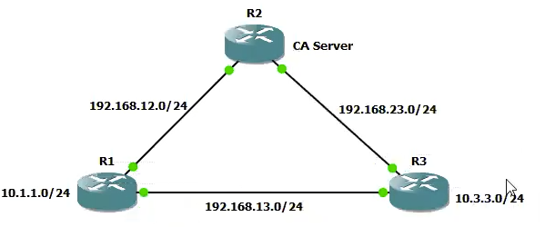
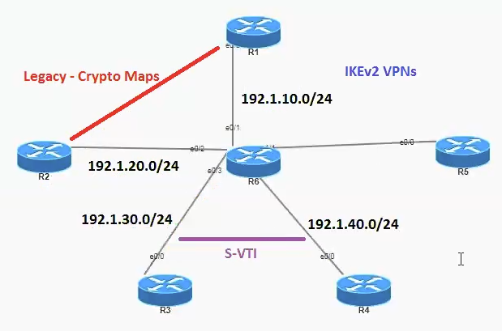
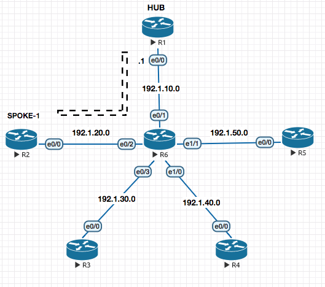
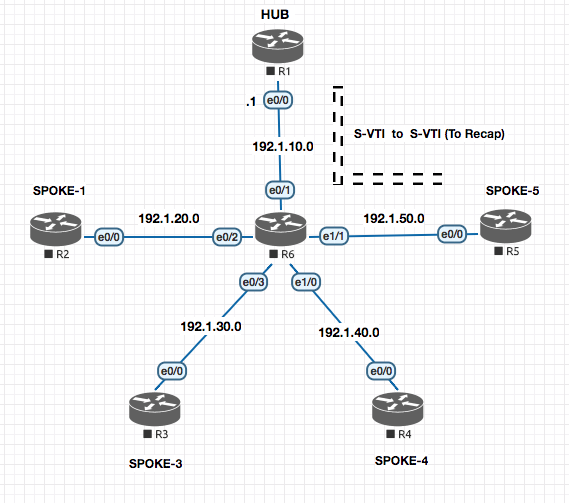
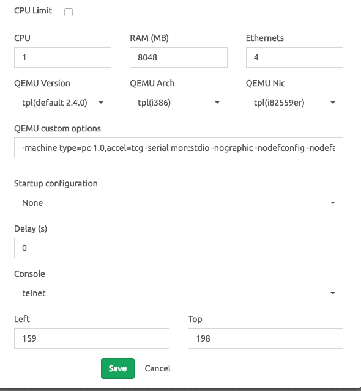

<!-- TO depthFrom:1 depthTo:6 withLinks:1 updateOnSave:1 orderedList:0 -->

- [VPN (Policy based )](#vpn-policy-based-)
			- [Key Exchange Protocol](#key-exchange-protocol)
		- [GRE Tunnel](#gre-tunnel)
				- [Step 1](#step-1)
				- [Step 2](#step-2)
		- [GRE over IPSec - Tunnel Mode](#gre-over-ipsec-tunnel-mode)
		- [GRE / IPSec - Transport Mode](#gre-ipsec-transport-mode)
			- [Configuration](#configuration)
		- [Native IPSec Tunnel [S-VTI]](#native-ipsec-tunnel-s-vti)
		- [MGRE (Multipoint GRE)](#mgre-multipoint-gre)
			- [A Multipoint GRE Full Configuration Snippet](#a-multipoint-gre-full-configuration-snippet)
		- [DMVPN (Dynamic Multipoint VPN)](#dmvpn-dynamic-multipoint-vpn)
		- [DMVPN - EIGRP - Phases [I,II,III]](#dmvpn-eigrp-phases-iiiiii)
		- [Redundancy [Dual-Hub DMVPN Setup]](#redundancy-dual-hub-dmvpn-setup)
		- [GETVPN](#getvpn)
			- [Configuration of a GETVPN](#configuration-of-a-getvpn)
		- [VRF - A Quick Introduction](#vrf-a-quick-introduction)
					- [Basic VRF Configuration Example](#basic-vrf-configuration-example)
					- [VRF Reachability test](#vrf-reachability-test)
					- [VRF Routing configuration example](#vrf-routing-configuration-example)
		- [VRF - Aware VPNs](#vrf-aware-vpns)
			- [MAJOR DIFFERENCE IS IN THIS SECTION - BEGIN](#major-difference-is-in-this-section-begin)
			- [MAJOR DIFFERENCE IS IN THIS SECTION - END](#major-difference-is-in-this-section-end)
- [* * * Lab Remaining from here * * *](#-lab-remaining-from-here-)
		- [VRF Aware [Get VPN]](#vrf-aware-get-vpn)
- [Routers as a CA Server](#routers-as-a-ca-server)
	- [CA Based VPNs](#ca-based-vpns)
- [IKEv2 VPNS](#ikev2-vpns)
	- [IKEv3 VPN using legacy methods](#ikev3-vpn-using-legacy-methods)
	- [IKEv2 VPN using S-VTIs (uses GRE tunnel and the routing on it)](#ikev2-vpn-using-s-vtis-uses-gre-tunnel-and-the-routing-on-it)
- [Flex VPN](#flex-vpn)
	- [Site to Site VPN [D-VTI / S-VTI based ]](#site-to-site-vpn-d-vti-s-vti-based-)
	- [Static VTI to Static VTI Configuration](#static-vti-to-static-vti-configuration)
		- [Everything above is already configured from the section before , so no need to reconfigure it.](#everything-above-is-already-configured-from-the-section-before-so-no-need-to-reconfigure-it)
		- [Everything above is already configured from the section before , so no need to reconfigure it.](#everything-above-is-already-configured-from-the-section-before-so-no-need-to-reconfigure-it)
	- [Spoked to Spoke FLEX VPN](#spoked-to-spoke-flex-vpn)
		- [Everything above is already configured from the section before , so no need to reconfigure it.](#everything-above-is-already-configured-from-the-section-before-so-no-need-to-reconfigure-it)
- [ASA Firewalls](#asa-firewalls)
	- [Interface Configuration](#interface-configuration)
	- [Security Levels](#security-levels)
	- [Routing [RIP , EIGRP , OSPF]](#routing-rip-eigrp-ospf)
			- [Troubleshooting Commands and Outputs](#troubleshooting-commands-and-outputs)
			- [Error Messages and Resolution](#error-messages-and-resolution)

<!-- /TOC -->

### VPN (Policy based )

#### Key Exchange Protocol

ip name-server

For two sides to encrypt or decrypt the traffic , a key needs to be shared between two endpoints.

You need the following to secure a Tunnel :

    - Key
    - Encryption
    - Hashing

> **Diffie Hellman** is the algorith that generates a `KEY` . Lifetime of a DH key is 3600 secs (1hr).

There are two tunnels :
1. `PHASE 1` The **first tunnel** is to exchange the KEY . `ISAKMP` Internet Security Association and Key Managment Protocol is used here .
2. `PHASE 2` The **second tunnel** is for Data transfer. `ESP` Encapsulation Security Payload is used in this phase.


> Though its not recommened , you can manually setup the `Phase 2` tunnel to use a manual key skipping the `Phase 1` negotiation (without using `ISAKMP`).


**Configuration example**

**1.  Configure the Parameters for `Phase 1`**
```sh
crypto isakmp policy 10
 auth pre-share   //KEY
 encryption 3des  //ENCRYTPION
 hash md5         //HASH
 group 2 // The group command actually generates the hey to be used in the second phase .

crytpto isakmp policy 20
 auth pre-share
 encrytption 3des
 hash sha
 group 2

crypto isakmp key cisco111 address 1.1.1.1
crypto isakmp key cisco111 address 2.2.2.2
```

**2.  Configure the Parameters for `Phase 2` (only encryption and hash , as we have already got the key from phase 1)**

```sh
crypto ipsec tranform-set TSET esp-3des esp-md5

```

**3.  Define traffic that will be encrypted over the Tunnel**

```sh
access-list 101 permit 10.1.1.0 0.0.0.255 10.2.2.0 0.0.0.255
```

**4. Finally Create a Crypto MAP to tie all of the above together**

```sh
crypto map CMAP 5 ipsec-isakmp ! (5 is sequence number , and isakmp means  (get the key from Diffie-Hellman))
match address 101  //access-list
set peer 192.168.1.10
set transform-set TSET // Configured above
```

**5. Apply on the interface**

int fa0/0
 crpypt map CMAP


Always ping with ping source field
show crypto ipsec sa
show crpto isakmp sa


THe tunnel will stay up for :

Phase 1  86400 sec 24 hrs
Phase 2 3600 sec 1 hr


> In the above VPN Configuration , the interesting traffic is define by an `ACL`. Such VPNs are called **Policy based VPN**.


---
### GRE Tunnel

GRE Tunnel basically creates a virtual point to point link between two routers which traditionally were establishing VPN based on interesting traffic define by ACLs . Which was a tedious process.


Here is the sample configuration of a GRE Tunnel. It is basically a two step process
1. Creat a virtual link between the two routers , in this example R1 and R2

2. Now since they are "virtually" directly connected , you can run a routing protocol to exchange routing information directly within them.

##### Step 1
R1

```sh
interface tun0
 ip add 192.168.1.1 255.255.255.0
 tunnel source 192.1.10.2
 tunnel destination 192.1.20.2

```

R2

```sh
interface tun0
 ip add 192.168.1.2 255.255.255.0
 tunnel source 192.1.20.2
 tunnel destination 192.1.10.2
```


##### Step 2
Now you can run a routing protocol of choice to make them talk

```sh
!
router eigrp 10
 network 10.0.0.0
 network 192.168.1.0
 no auto-summary
!
```

---
### GRE over IPSec - Tunnel Mode


In this mode once the GRE tunnel is up , we basically apply the Crypto Map configuration as a `profile` to the tunnel interface (in this e.g IPROF )

> Notice that there is no need to define `match` for interesting traffic or `set-peer` as this is all taken care by the `tunnel0` interface by default as every traffic via the tunnel interface is interesting and the peer (set peer) is known because of GRE. .


```sh
! R1
! Configure Phase I

crypto isakmp policy 10
 auth pre-share
 encryption 3des
 hash md5
 group 2

crypto isakmp key cisco123 address 192.1.20.2


! Configure Phase II

crypto ipsec transform-set TSET esp-3des esp-md5

! Configure an IPSec Profile and attach the transform-set to it

crypto ipsec profile IPROF
 set transform-set TSET

! Assign the IPSec Profile to the Tunnel interface

interface tunnel0
  tunnel protection ipsec profile IPROF

```

```sh
! R2
! Configure Phase I

crypto isakmp policy 10
 auth pre-share
 encryption 3des
 hash md5
 group 2

crypto isakmp key cisco123 address 192.1.10.2


! Configure Phase II

crypto ipsec transform-set TSET esp-3des esp-md5

! Configure an IPSec Profile and attach the transform-set to it

crypto ipsec profile IPROF
 set transform-set TSET

! Assign the IPSec Profile to the Tunnel interface

interface tunnel0
  tunnel protection ipsec profile IPROF

```


Now notice that in the plain simple GRE the packet looked like this , which totaled  **88 bytes**:

```sh
+----+------------+------------+-------+-------------+------------+------+
|GRE | 192.1.10.1 | 192.1.20.3 | EIGRP | 192.168.1.1 | 224.0.0.10 | Data |
+----+------------+------------+-------+-------------+------------+------+
```

With IPSec enable on it (which we did in the config example above) the packet size increase to **140 bytes** because of the ESP header and now looks like this :

```sh
+----------------+-----------------+------------+------------+-------+-------------+------------+------+
|ESP| 192.1.10.X | 192.1.20.X| GRE | 192.1.10.1 | 192.1.20.3 | EIGRP | 192.168.1.1 | 224.0.0.10 | Data |
+----------------+-----------------+------------+------------+-------+-------------+------------+------+
```

> In the above packet , the entire packet including GRE is just a `data` packet (encapsulated in the ESP).

So the **overhead** is that you have increased the size of the packet by 52 bytes (140 - 88 = 52 ) .

`Tunnel Mode` is the default mode for IPSec .

Notice the `tunnel ` in output
```sh
show crypto ipsec sa

outbound esp sas:
 spi: 0x99D47D47(2580839751)
   transform: esp-3des esp-md5-hmac ,
   in use settings ={Tunnel, }
```


Now if you GRE and ESP header are the same , you can run IPSec in `Tranport Mode`

In transport mode , it will remove the duplication of ESP and GRE header and make the packet **smaller** .

---

### GRE / IPSec - Transport Mode

> An efficient mode over Tunnel Mode and saves some overhead on encryption


So with above theory

```sh
+----------------+-----------------+------------+------------+-------+-------------+------------+------+
|ESP| 192.1.10.X | 192.1.20.X| GRE | 192.1.10.1 | 192.1.20.3 | EIGRP | 192.168.1.1 | 224.0.0.10 | Data |
+----------------+-----------------+------------+------------+-------+-------------+------------+------+
```

Changes to

```sh
+----------------+-----------------+-------+-------------+------------+------+
|ESP| 192.1.10.X | 192.1.20.X| GRE | EIGRP | 192.168.1.1 | 224.0.0.10 | Data |
+----------------+-----------------+-------+-------------+------------+------+
```

Above changes saves **16** bytes for  you , so now your packet size becomes 140 - 16 = **124**

#### Configuration

The configuration of the transport mode is similar to the tunnel mode , the only change is highlighted below (`mode transport`)

```sh

crypto ipsec transform-set TSET esp-3des esp-md5
 mode transport

clear crypto sa
```

### Native IPSec Tunnel [S-VTI]

> Also know as Static Virtual TUnnel Interface

Now continuing on to the above flow , is GRE required for the IPSec ? Cant we run the IPSec over the tunnel interface without GRE ?  The answer to that is yes and we basically


```sh
interface tunnel0
 tunnel mode ipsec ipv4
```

So what benefit did the above change provide ?

The packet changed from
`ESP| 192.1.10.X | 192.1.20.X| GRE | EIGRP | 192.168.1.1 | 224.0.0.10 | Data |`

to  (remove of GRE header , 8 bytes)

`ESP| 192.1.10.X | 192.1.20.X| EIGRP | 192.168.1.1 | 224.0.0.10 | Data |`


Above changes saves **8** bytes for  you , so now your packet size becomes 124 - 8 = **116**

---
### MGRE (Multipoint GRE)

The point to point configuration setting above does not scale with a lot of sites , that is where MGRE comes to rescue.

Now since in GRE we had to define the tunnel destination address: `tunnel destination X.X.X.X`

Since in this case , their could be multiple destinations we need to use a mapping table which maps destination to be reached to the next hop address to be used . This system is called NHRP (Next Hop Resolution Protocol)


`ip nhrp map 192.168.1.1 192.1.10.1`

The above command means that if I want to go to `192.168.1.1` the public IP address for the same is `192.1.10.1`

```sh
interface tunnel0
 ip address 192.168.1.1
 tunnel source 192.168.20.2
 tunnel mode gre multipoint
 ip nhrp network-id 1
 ip nhrp map 192.168.1.1 192.1.10.1
 ip nhrp map 192.168.1.2 192.1.20.2
 ip nhrp map 192.168.1.3 192.1.30.3
```

#### A Multipoint GRE Full Configuration Snippet


```sh
! R1

interface tunnel0
 ip address 192.168.1.1 255.255.255.0
 tunnel source 192.1.10.2
 tunnel mode gre multipoint
 ip nhrp network-id 1
 ip nhrp map 192.168.1.2 192.1.20.2
 ip nhrp map 192.168.1.3 192.1.30.2
 ip nhrp map 192.168.1.4 192.1.40.2


!R2

interface tunnel0
 ip address 192.168.1.2 255.255.255.0
 tunnel source 192.1.20.2
 tunnel mode gre multipoint
 ip nhrp network-id 1
 ip nhrp map 192.168.1.1  192.1.10.2
 ip nhrp map 192.168.1.3  192.1.30.2
 ip nhrp map 192.168.1.4  192.1.40.2


! R3

interface tunnel0
  ip address 192.168.1.3 255.255.255.0
  tunnel source 192.1.30.2
  tunnel mode gre multipoint
  ip nhrp network-id 1
  ip nhrp map 192.168.1.1 192.1.10.2
  ip nhrp map 192.168.1.2 192.1.20.2
  ip nhrp map 192.168.1.4 192.1.40.2


! R4

interface tunnel0
  ip address 192.168.1.4 255.255.255.0
  tunnel source 192.1.40.2
  tunnel mode gre multipoint
  ip nhrp network-id 1
  ip nhrp map 192.168.1.1 192.1.10.2
  ip nhrp map 192.168.1.2 192.1.20.2
  ip nhrp map 192.168.1.3 192.1.30.2

```

```sh
R1#show ip nhrp
192.168.1.2/32 via 192.168.1.2, Tunnel0 created 00:08:03, never expire
  Type: static, Flags: used
  NBMA address: 192.1.20.2
192.168.1.3/32 via 192.168.1.3, Tunnel0 created 00:08:03, never expire
  Type: static, Flags: used
  NBMA address: 192.1.30.2
192.168.1.4/32 via 192.168.1.4, Tunnel0 created 00:08:03, never expire
  Type: static, Flags: used
  NBMA address: 192.1.40.2
R1#
```


**DISADVANTAGES** In this type of NHRP Based name resolution you need to **statically** define the mapping which is not scalable and **also requires all sites to have static IP Addressing.**

Now this disadvantage was eliminiated by the use of a **Next Hop Server** like a DNS naming server.

**How does the `Next Hop Server` works ?**

Under the inteface configuration on the end routers , we define the Next Hop Servers IP Address. When these interfaces come up they register their information to the Next Hop Server notifying :

"Hey my Tunnel address is `X.X.X.X` and my Public address is `Y.Y.Y.Y` "


**Now the NHS Server has all the mapping of Tunnel IP and the Public IP .**

---

### DMVPN (Dynamic Multipoint VPN)

**How does the `Next Hop Server` works ?**

Under the inteface configuration on the end routers , we define the Next Hop Servers IP Address. When these interfaces come up they register their information to the Next Hop Server.


**Step 1.** Enabling the Next Hop Server

```sh
! R1

interface tunnel0
 ip address 192.168.1.1 255.255.255.0
 tunnel source f0/0
 tunnel mode gre multipoint
 ip nhrp network-id 1
 ip nhrp map multicast dynamic // For sending the reply for EIGRP packets received from clients , the NHS Server knows who to send the reply by looking at the dynamic NHRP table.

router eigrp 100
 no auto
 network 10.0.0.0
 network 192.168.1.0
 network 172.16.0.0

```

That's all for configuring a NHS!

**Step 2.** Configuring the Next Hop Client

```sh
! R2

interface tunnel0
 ip address 192.168.1.2 255.255.255.0
 tunnel source f0/1
 tunnel mode gre multipoint
 ip nhrp network-id 1
 ip nhrp nhs 192.168.1.1
 ip nhrp map 192.168.1.1  192.1.10.2 // How do I reach the NHS ? This line basically points every client to the Next Hop Server.
 ip nhrp map multicast 192.1.10.2 // For the EIGRP Packets

 router eigrp 100
  no auto
  network 10.0.0.0
  network 192.168.1.0
  network 172.16.0.0
```

Repeat the above configuration for other Clients on the DMVPN.

```sh
R1#sh ip nhrp
192.168.1.2/32 via 192.168.1.2, Tunnel0 created 00:00:12, expire 01:59:47
  Type: dynamic, Flags: unique registered used
  NBMA address: 192.1.20.2
```

**This completes your DMVP Configuration.**


### DMVPN - EIGRP - Phases [I,II,III]

**Phase I** - With the default configuration of DMVPN only the neighborship is formed between `Hub` and `Spoke` routers but not between `Spoke` and `Spoke` directly.

To resolve this we to turn off split-horizon on the hub.

> **Split Horizon**, dont send the update back on the same interface you learned the route on.


```sh
interface tunnel0
 no ip split-horizon eigrp 100
```

**BEFORE** (without the split-horizon configured)

```sh
R2#sh ip route eigrp
     172.16.0.0/24 is subnetted, 2 subnets
D       172.16.1.0 [90/297372416] via 192.168.1.1, 00:10:13, Tunnel0
     10.0.0.0/24 is subnetted, 2 subnets
D       10.1.1.0 [90/297372416] via 192.168.1.1, 00:10:13, Tunnel0
```

**AFTER** (after the split-horizon configured)

```sh
R2#sh ip route eigrp
     172.16.0.0/24 is subnetted, 4 subnets
D       172.16.4.0 [90/310172416] via 192.168.1.1, 00:00:08, Tunnel0
D       172.16.1.0 [90/297372416] via 192.168.1.1, 00:18:44, Tunnel0
D       172.16.3.0 [90/310172416] via 192.168.1.1, 00:00:08, Tunnel0
     10.0.0.0/24 is subnetted, 4 subnets
D       10.4.4.0 [90/310172416] via 192.168.1.1, 00:00:08, Tunnel0
D       10.3.3.0 [90/310172416] via 192.168.1.1, 00:00:08, Tunnel0
D       10.1.1.0 [90/297372416] via 192.168.1.1, 00:18:44, Tunnel0
```
---
**Phase II** (Traffic from Spoke to Spoke goes direct) - Second you would like the traffic to be point to point and not hoping thorough the NHS Router (look at the putput above where all traffic is hopping through 192.168.1.1).

Notice the traffic is going via 192.168.1.1

```sh
R3#traceroute 10.2.2.1

Type escape sequence to abort.
Tracing the route to 10.2.2.1

  1 192.168.1.1 20 msec 20 msec 20 msec
  2 192.168.1.2 32 msec *  48 msec
R3#
```

The resolution of this issue is to ensure that the `next-hop` isnt changed. In the above example

1. `R2` told `R1` about its routes first.
2. Then R1 tells `R3` about its routes , here it changes the `next-hop` for addresss learned from `R2` to itself .


```sh
interface tunnel0
 no ip next-hop-self eigrp 100
```

**BEFORE**  (All traffic going via 192.168.1.1)

```sh
R2#sh ip route eigrp
     172.16.0.0/24 is subnetted, 4 subnets
D       172.16.4.0 [90/310172416] via 192.168.1.1, 00:00:08, Tunnel0
D       172.16.1.0 [90/297372416] via 192.168.1.1, 00:18:44, Tunnel0
D       172.16.3.0 [90/310172416] via 192.168.1.1, 00:00:08, Tunnel0
     10.0.0.0/24 is subnetted, 4 subnets
D       10.4.4.0 [90/310172416] via 192.168.1.1, 00:00:08, Tunnel0
D       10.3.3.0 [90/310172416] via 192.168.1.1, 00:00:08, Tunnel0
D       10.1.1.0 [90/297372416] via 192.168.1.1, 00:18:44, Tunnel0
```

**AFTER**  ( Now , all site specific traffic goes to the specific sites router **without** hopping over 192.168.1.1)

```sh
R2#sh ip route eigrp
     172.16.0.0/24 is subnetted, 4 subnets
D       172.16.4.0 [90/310172416] via 192.168.1.4, 00:00:30, Tunnel0
D       172.16.1.0 [90/297372416] via 192.168.1.1, 00:00:30, Tunnel0
D       172.16.3.0 [90/310172416] via 192.168.1.3, 00:00:30, Tunnel0
     10.0.0.0/24 is subnetted, 4 subnets
D       10.4.4.0 [90/310172416] via 192.168.1.4, 00:00:30, Tunnel0
D       10.3.3.0 [90/310172416] via 192.168.1.3, 00:00:30, Tunnel0
D       10.1.1.0 [90/297372416] via 192.168.1.1, 00:00:30, Tunnel0
```

---
**Phase III** -

In this phase NHRP basically redirects Spokes to reach directly out to other spokes its tryign to reach.

The NHS Server points the spokes to where they are trying to reach and installs a NHRP Cache entry pointing towards that remote spoke in the requesting spoke.

```sh
! HUB
ip nhrp redirect
```

```sh
! SPOKES
ip nhrp shortcut
```

So with this , only the first NHRP resolution request is sent to `R1` and the remaining data flow happens directly

```sh
R4#trace 10.3.3.1

Type escape sequence to abort.
Tracing the route to 10.3.3.1

  1 192.168.1.1 28 msec 40 msec
    192.168.1.3 24 msec
R4#trace 10.3.3.1

Type escape sequence to abort.
Tracing the route to 10.3.3.1

  1 192.168.1.3 32 msec *  40 msec
```


### Redundancy [Dual-Hub DMVPN Setup]

In this case you basically copy the configuration of the existing NHS  , make a new NHS . Point each other NHS with a MAP command and run routing protocol on both .

After this you point your spokes to the additional NHS . Pretty basic stuff .


**Encrypting the Tunnel using IPSEC**

```sh
!1. Phase 1

crypto isakmp policy 10
 auth pre-share
 hash md5
 encryption 3des
 crypto isakmp key cisco123 address 0.0.0.0

 !2. Phase 2

 crypto ipsec transform-set TSET esp-3des esp-md5
  mode transport
  exit

!3. IPSec Profile

 crypto ipsec profile PROF
  set transform-set TSET
  exit

!4. Apply the profile to the interface

 interface tunnel 0
  tunnel protection ipsec profile PROF

```
---
### GETVPN

> GetVPN is a Cisco only solution

GETVPNS are used in a MPLS Private WAN type deployments as the GETVPNs packets cannot be routed over the internet.

Why do we need GETVPNs when we have DMVPN : THe purpose to ket full encryption capabilities while the routing is already setup.

GetVPN copies the inner header onto the outer header.
It only works on fully routed networks. It can potentially work on the Internet but only if you are using Public addresses on the inside .

A multisite IPSec VPN uses a single session key for multiple sites . It has two entities ; `Key Server` and `Group Member`


> Session key is exchanged in `Phase 1` and used in `Phase 2`

In a normal Phase 1 (ISA) , the only thing exchanges happens is the session key.

**`ISAKMP`** This protocol only echanges `Session Key` . Run on UDP/500
**`GDOI` (Group Domain of Interpretation)** : This Exchanges `Session Key` , `Interesting Traffic ACL`, `Transform Set` and is specially made for GETVPNs. Runs on UDP/848 . This protocol is like an extension for ISAKMP.

**In GETVPNs ,**

**`PHASE 1`** is setup between `Group Member` and `Key Server` .
**`PHASE 2`** is setup between `Group Member` and `Group Member`


> **Prerquisite for GETVPN** : Make sure all networks are able to reach all networks

#### Configuration of a GETVPN

**Step 1.** Configure the Key Server

```sh
! KEY SERVER

! 1. Phase I

crypto isakmp policy 10
 auth pre-share
 hash md5
 enc 3des
 group 2

crypto isakmp key cisco123 address 192.1.10.2
crypto isakmp key cisco123 address 192.1.20.2
crypto isakmp key cisco123 address 192.1.30.2

! 2. Phase II

crypto ipsec transform-set TSET esp-3des esp-sha-hmac

! 3. Configure IPSEC Profile

crypto ipsec profile IPROF
 set transform-set TSET

! 4. Configure Interesting traffic ACL

access-list 101 permit ip 10.1.0.0 0.0.255.255 10.1.0.0 0.0.255.255

! 5. Configure the GDOI Group Configuration

crypto gdoi group SALES
 identity number 111 ! Should match on the Group members
 server local ! I am the key server , so local
  sa ipsec 10
   profile IPROF
   match address ipv4 101
address ipv4 192.1.40.2
```

**Step 1.** Configure the Group Members

```sh
!R1

! 1. Phase I

crypto isakmp policy 10
 auth pre-share
 hash md5
 enc 3des
 group 2

crypto isakmp key cisco123 address 192.1.40.2

! 2. Configure GDOI to point to the Key Server

crypto gdoi group GRP-R1
 identity number 111 ! Should match on the Group members
 server address ipv4 192.1.40.2 ! Point to the key server

! 3. Configure a Crypto MAP

crypto map CMAP 10 gdoi
 set group GRP-R1

! 4. Apply Crypto MAP to the outgoing interface
int f0/0
 crypto map CMAP ! As soon as you do this , the key is downloaded.
```

Once you enter the above configuration on the Group member you will see the following output on the member :

```sh
*Mar  1 01:12:10.919: %CRYPTO-5-GM_REGSTER: Start registration to KS 192.1.40.2 for group GRP-R1 using address 192.1.10.2
*Mar  1 01:12:10.947: %CRYPTO-6-GDOI_ON_OFF: GDOI is ON
*Mar  1 01:12:11.711: %GDOI-5-GM_REGS_COMPL: Registration to KS 192.1.40.2 complete for group GRP-R1 using address 192.1.10.2
```

**Verification Commands**

```sh
R4-KEYSERVER#show crypto gdoi ks members

Group Member Information :

Number of rekeys sent for group SALES : 0

Group Member ID   : 192.1.10.2
Group ID          : 111
Group Name        : SALES
Key Server ID     : 192.1.40.2

Group Member ID   : 192.1.20.2
Group ID          : 111
Group Name        : SALES
Key Server ID     : 192.1.40.2

Group Member ID   : 192.1.30.2
Group ID          : 111
Group Name        : SALES
Key Server ID     : 192.1.40.2

R4-KEYSERVER#show crypto gdoi
GROUP INFORMATION

    Group Name               : SALES (Multicast)
    Group Identity           : 111
    Group Members            : 0
    IPSec SA Direction       : Both
    Active Group Server      : Local
    Group Rekey Lifetime     : 86400 secs
    Rekey Retransmit Period  : 10 secs
    Rekey Retransmit Attempts: 2

      IPSec SA Number        : 10
      IPSec SA Rekey Lifetime: 3600 secs
      Profile Name           : IPROF
      Replay method          : Count Based
      Replay Window Size     : 64
      ACL Configured         : access-list 101

    Group Server list        : Local

```

**Re-keyeing :**

The lifetime of a key is 3600s , the lifetime counter starts when the first group member registers and a key is handed over.

Let's say when a Group Member G1 registers to Key Server KS , the Key K1 is handed over with a count down timer started.

*After 5 minutes (300sec) another Group Member G2 registers , it will be handed over the same key as G1 but the time remaining on it will be 3600-300=3300 secs.*

**OR**

*You can configure RE-KEYING , which basically sends a new key to everyone when a new Group Members join . This can be done over UNICAST or MULTICAST.*


**Re-Keyeing Configuration** (Only done on Key Server)

**Step 1.** Generate a RSA Keypair on the Key Server

```sh
crypto key generate rsa modulus 1024 label GETVPN-KEY
```

**Step 2.** Configre the GDOI group for re-keyeing

```sh
crypto gdoi group SALES
 server local
 rekey transport unicast
 rekey authentication mypubkey rsa GETVPN-KEY
 rekey algorithm 3des-cbc
 rekey lifetime seconds 3600
```
---
### VRF - A Quick Introduction



###### Basic VRF Configuration Example
```sh
!R1
conf t
ip vrf CUST-A
exit
ip vrf CUST-B
exit

int fa1/0
 ip vrf forwarding CUST-A
 ip address 10.12.12.1 255.255.255.0
 no shut
int fa2/0
 ip vrf forwarding CUST-B
 ip address 10.12.12.1 255.255.255.0
 no shut
int fa0/0
 ip vrf forwarding CUST-A
 ip address 10.10.10.1 255.255.255.0
 no shut
int fa0/1
 ip vrf forwarding CUST-B
 ip address 10.10.10.1 255.255.255.0
 no shut
```

###### VRF Reachability test
```sh
R1#ping vrf CUST-A ip 10.10.10.3

Type escape sequence to abort.
Sending 5, 100-byte ICMP Echos to 10.10.10.3, timeout is 2 seconds:
!!!!!
Success rate is 100 percent (5/5), round-trip min/avg/max = 12/18/24 ms
```

###### VRF Routing configuration example
```sh
router eigrp 1
 auto-summary
 !
 address-family ipv4 vrf CUST-B
  network 10.0.0.0
  no auto-summary
  autonomous-system 200
 exit-address-family
 !
 address-family ipv4 vrf CUST-A
  network 10.0.0.0
  auto-summary
  autonomous-system 100
 exit-address-family
```

---

### VRF - Aware VPNs



Now in the VRF example above the traffic between the loopback networks 10.1.1.3 to 10.2.2.4 is no encrypted. In this section we will enxrypt the data.

**Objective** R1 and R2 should encrypt traffic between 10.1.1.3 to 10.2.2.4.

> Only R1 Config is displayed for brevity. Replicate the config for R2 changing the IP Addresses.

```sh
! R1
! 1. Phase I
! A. ISAKMP Policies
crypto isakmp policy 10
 auth pre-share
 hash md5
 enc 3des
 group 2

#### MAJOR DIFFERENCE IS IN THIS SECTION - BEGIN

! B. Create the Keyring
crypto keyring KR-1 vrf CUST-A
 pre-shared-key address 10.12.12.1 key cisco123

! C. Create an ISAKMP Profile which later on will be linked to crytpto map
crypto isakmp profile PROF-A
 vrf CUST-A
 keyring KR-1
 match identity address 10.12.12.1 255.255.255.255 CUST-A

#### MAJOR DIFFERENCE IS IN THIS SECTION - END

! 2. Phase II
crypto ipsec transform-set TSET esp-3des esp-md5

! 3. Interesting traffic
access-list 101 permit ip 10.2.2.0 0.0.0.255 10.1.1.0 0.0.0.255

! 4. Crpto MAP
crypto map CUST-A 10 ipsec-isakmp
 match address 101
 set peer 10.12.12.1
 set transform-set TSET
crypto map CUST-A isakmp-profile PROF-A

! 5. Apply the Crypto map to the interface
interface fa1/0
 crypto map CUST-A
```

**Always ensure a `source` ping**

```sh
R3#ping 10.2.2.4 source 10.1.1.3

Type escape sequence to abort.
Sending 5, 100-byte ICMP Echos to 10.2.2.4, timeout is 2 seconds:
Packet sent with a source address of 10.1.1.3
.!!!!
Success rate is 80 percent (4/5), round-trip min/avg/max = 28/41/56 ms
```

#  * * * Lab Remaining from here * * *
---
### VRF Aware [Get VPN]



**PREFACE** :  In the above configuration the once the IP Addressing is setup , there is EIGRP neighborship configured withing a VRF in the colored areas and the interfaces (no VRF on the R1 or R3 , only on R2).
With this , R1 and R3 cannot reach the Key Server . To enable that we have to configure the following (route-leaking) so that the networks behind R1 and R3 can reach the Key Server . The eventual goal is to encrypt traffic between `R1 and R2` and `R1 and R3` .

The config below is to make R3 reach R5 (Key Server)

**Step 1.** R3 ---> R2

`ip route 10.45.45.5 255.255.255.255 10.20.20.2`

**Step 2.** R2 ----> R4 From VRF to Global Table and pointing to R4 (Next Hop)

`ip route vrf CUST-B 10.45.45.45.5 255.255.255.255 fa1/0 10.24.24.4`

**Step 3.** Back from R4 to R2

`ip route 10.20.20.0 255.255.255.0  10.24.24.2`

**Step 4.**  From Global Routing table to VRF Routing Table for CUST-B

`ip route 10.20.20.0 255.255.255.0 fa0/1`


Now lets configure the VPN .

GET VPN Configuration

**On the `Key Server` for Group CUST-A[100] and Group CUST-B[200]**

```sh
! R5
!1. PHASE I
crypto isakmp policy 10
 auth pre-share
 hash md5
 group 2
 encryption 3des
!
crypto isakmp key cisco123 address 10.10.10.0 255.255.255.0
crypto isakmp key cisco123 address 10.20.20.0 255.255.255.0

!2. Phase II

crypto ipsec transform-set CUST-A esp-3des esp-md5-hmac
crypto ipsec transform-set CUST-B esp-3des esp-md5-hmac

!3. IPSec Profile

crypto ipsec profile PROF-A
 set transform-set CUST-A
crypto ipsec profile PROF-B
set transform-set CUST-B

!4. Interesting traffic ACL

access-list 101 permit ip 10.0.0.0 0.255.255.255 10.0.0.0 0.255.255.255
access-list 102 permit ip 10.0.0.0 0.255.255.255 10.0.0.0 0.255.255.255

!5. Configure the GDOI Groups

crypto gdoi group CUST-A
 identity number 100
 server local
  sa ipsec 10
   profile PROF-A
   match address ipv4 101
  address ipv4 10.45.45.5

crypto gdoi group CUST-B
 identity number 200
 server local
  sa ipsec 10
   profile PROF-B
   match address ipv4 102
  address ipv4 10.45.45.5
```

**On the Group Members R1 and R3  (non-Vrf Configuration)**

```sh
! R1
!1. PHASE I
crypto isakmp policy 10
 auth pre-share
 hash md5
 group 2
 encryption 3des
!
crypto isakmp key cisco123 address 10.45.45.0 255.255.255.0


!2. Configure GDOI Group

crypto gdoi group ABC
 identity number 100
 server address ipv4 10.45.45.5

!3. Configure the crypto map

crypto map ABC 10 gdoi
 set group ABC

!4. Apply on the interface
interface f0/0
 crypto map ABC

```

```sh
! R3
!1. PHASE I
crypto isakmp policy 10
 auth pre-share
 hash md5
 group 2
 encryption 3des
!
crypto isakmp key cisco123 address 10.45.45.0 255.255.255.0


!2. Configure GDOI Group

crypto gdoi group ABC
 identity number 200
 server address ipv4 10.45.45.5

!3. Configure the crypto map

crypto map ABC 10 gdoi
 set group ABC

!4. Apply on the interface
interface f0/0
 crypto map ABC
```

**On the Group Members R2 (Vrf Configuration)**

```sh
! R2
!1. PHASE I
! A. ISAKMP Policy
crypto isakmp policy 10
 auth pre-share
 hash md5
 group 2
 encryption 3des
!
! B. Key Ring
crypto keyring CUST-A vrf CUST-A
 pre-shared-key address 10.45.45.5 key cisco123

!C. ISAKMP Profile
crypto isakmp profile CUST-A
 match identity address 10.45.45.5 255.255.255.255 CUST-A
 vrf CUST-A
 keyring CUST-A


!2. Configure GDOI Group

crypto gdoi group ABC
 identity number 100
 server address ipv4 10.45.45.5

!3. Configure the crypto map

crypto map ABC 10 gdoi
 set group ABC
crypto map ABC isakmp-profile CUST-A

!4. Apply on the interface
interface f0/0
 crypto map ABC
```

```sh
! R2
!1. PHASE I
! A. ISAKMP Policy
crypto isakmp policy 10
 auth pre-share
 hash md5
 group 2
 encryption 3des
!
! B. Key Ring
crypto keyring CUST-B vrf CUST-B
 pre-shared-key address 10.45.45.5 key cisco123

!C. ISAKMP Profile
crypto isakmp profile CUST-B
 match identity address 10.45.45.5 255.255.255.255 CUST-A
 vrf CUST-B
 keyring CUST-B


!2. Configure GDOI Group

crypto gdoi group DEF
 identity number 100
 server address ipv4 10.45.45.5

!3. Configure the crypto map

crypto map DEF 10 gdoi
 set group DEF
crypto map DEF isakmp-profile CUST-A

!4. Apply on the interface
interface f0/1
 crypto map DEF
```

#  Routers as a CA Server

In this section we will take a few steps to make the `PHASE I` a bit more secure. When we talk about certificates we are talking about `PHASE I`.

Again , a Key , Encryption and Hash is required in the Phase I. In the examples till now it has been the Pre-shared keys. Also know as PSK (Pre shared key)

This althoug isnt bad , althoug we are are setting this same key across two devices. The same key can be bruteforced if a lot of data is collected.

**So to make the above more secure , we will  replace the Preshared Key with the PKI Key**

What is  PKI : PKI works on the premise of a key-pair , using a mechanism called Key-Pair (Public and Private).

Public Key : Used to Encrypt the Data
Private Key : Used to Decrypt the Data .

So between the routers participating in a VPN connection (for example R1 and R2).

```sh
R1 ------- Please send me your PUB Key ----- > R2
R1 <------ Please send me your PUB Key ------ R2
```

R1 and R2 get each other Public Key , they keep their private keys with themselves.

> Anything encrypted by my `public key` can only be decrypted by the corresponding `private key` .

**The problem here , is we do not know if the device requesting the Public Key is the realy device and not a masquerade attempt. This is where the CA comes in.**


The function of a CA Server is to validate an identity. Its an authority that both R1 and R2 trust.

1. You send you Public Key and your company documents to Verisign.
2. Versign verifies and signs that for you and provides you the **`X509`** certificate.
3. The other company who wants to talk to you , does the same.

So now both companies have their own certificates (**`ID-CERT`**).







CA Server Based Setup

1. Configure your CA Server
2. Generate the Public/Private Key on the local device.
3. Download the Root Certificate from the CA Server.
4. Send/Enroll your public key with the CA Server
5. CA Server validates your credentials and issues you an ID Cert.

The Entities Publick Key
Info about the entitity
CA Information
Digital Signature of the CA Server

6. The identity certificate is send back to the entity .


Certificate Relocation List : Checks for Certificates currency (How current it is)




**Step 1. CA Server Configuration**

1. Sync the Clock

```sh
clock timezone EST 4
clock set XX:XX:XX 29 Aug 2019
```

2. Generate the RSA Key pair for the CA Server , this will be used for the root cert.

`crypto key generate rsa modulus 1024 label IOSCA `

3. Configure your Router as a Web SERVER

`ip http server`

4. Configure the CA  Server Parameters

```sh
crypto pki server IOSCA
 database url flash:
 issuer-name CN=ABC CA Server O=ABC OU=Training L=Dubai C=IN
 grant auto
 no shut
```

**Step 2. Client Configuration**

1. Sync the Clock

```sh
clock timezone EST 4
clock set XX:XX:XX 29 Aug 2019
```

2. Generate the RSA Key pair for the CA Server , this will be used for the root cert.

`crypto key generate rsa modulus 1024`

3. Configure your Router as a Web SERVER

`ip domain-name devopsimplified.com`
`ip http server`

4. Create a pointer to the CA Server

crypto ca trustpoint TRUSPOINT
 enrollment url http://10.2.2.2:80
 revocation-check none


5. Download the root certificate from the CA Server

crypto ca authenticate TRUSTPOINT

6. Enroll your public key with the CA Server and get a certificate issued. [ID Cert]

(On Client)# crypto ca enroll TRUSTPOINT

(client)# show crypto pki certificate

**This concludes the PKI infrastructure configration on both the Server and the Client. In the next step we will confgure the VPN between the clients**

## CA Based VPNs

**Step 3. IPSec LAN to LAN VPN using Certificates**

```sh
! 1. Phase I
crypto isakmp policy 10
 auth rsa-sig ! This is changed for the crypto based on signatures
 hash md5
 enc 3des
 group 2

!2. Phase II

crypto ipsec transform-set TSET esp-3des esp-sha-hmac

!3. Interesting Traffic

acces-list 101 permit 10.1.1.0 0.0.0.255 10.3.3.0 0.0.0.255

!4. Crypto Map

crypto map CMAP 10 ipsec-isakmp
 match address 101
 set-peer 192.168.13.3
 set transform-set TSET

! 5. Apply to interface

int fa0/0
 crypto map CMAP
```


---
# IKEv2 VPNS

What does IKEv2 bring to the table . IKEv2 is the replacemnt for ISAKMP which was also know as IKEv1 . IKEv2 pertains to the PHASE I only.

What does IKEv2 Bring to the table :

**Scalability** :  Lets say in a Hub and Spoke type of VPN setup , multiple clients will could have different type of Phase I policy.  On the Hub you would have to create multiple configuration to support all the Spokes.

> IKEv2 allows scalability by usnign proposals which automatically expands to different combinations of Encryption , Integrity and Hash .

IKEv2 Proposal (Could use a combination of all the options below)

 - Encrypt  `3DES` , `AES`
 - Integrity `MDS5` , `SHA`
 - Group `2`,`5`

**Directional Pre-shared Keys** : Allows the use of different preshared keys for the Phase I organisation. (Earlier the Pre-shared keys used to be same , in this case in each direction the key could be different)


**More Secure Algorithms** : More `SHA` variants availaible in IKEv2


## IKEv3 VPN using legacy methods

 


```
R1 lo0 10.1.1.1

R2 lo0 10.2.2.2

R3 lo0 10.3.3.3
.
.
.
.
```

Here are the steps you need to configure :

`PHASE I` **>** `PHASE II` **>** `ACL` **>** `MAP` **>** `APPLY TO INTERFACE`

Everything starting `Phase II` remains same in `IKEv2` based VPN , only changes is in the `PHASE I`

```sh
! R1
! 1. [A] Configure an IKEv2 Proposal
! Notice the different combinations available

crypto ikev2 proposal PROP-1
 integrity md5 sha256
 encryption 3des aes-cbc-192
 group 2 5  ! DH key algorothms

! 1. [B] Configure a policy and call the proposal

crypto ikev2 policy POLICY-1
 proposal PROP-1

! 1. [C] Configure and IKEv2 Key ring

crypto ikev2 keyring KR-1
 peer R2
  address 192.1.20.2
  pre-shared-key local cisco111   ! notice differen pre shared keys cisco111 and cisco 222
  pre-shared-key remore cisco222

! 1. [D] Configure an IKEv2 profile that will attach keyring to the authentication type. This will be attached to your crypto map.

crypto ikev2 profile IKEv2-PROF-1
 match identity remote address 192.1.20.2 255.255.255.255
 authentication local pre-share
 authentication remore pre-share
 keyring KR-1


! 2. PHASE II

crytp map transform-set ABC esp-rdes esp-md5-hmac

! 3. ACL

crypto ipsec 101 permit ip 10.1.1.0 0.0.0.255 10.2.2.0 0.0.0.255

!4. Crypto MAP

crypto map ABC 10 ipsec-isakmp
 match address 101
 set peer 192.1.20.2
 set transform-set ABC
 set ikev2-profile IKEv2-PROF-1


!5 . Apply the configuration

int fa0/0
 crypto map ABC


```
**Repeat the above of the other side**

`show crypto ikev2 sa`


## IKEv2 VPN using S-VTIs (uses GRE tunnel and the routing on it)

R3
```sh
! R3
! 1. [A] Configure an IKEv2 Proposal
! Notice the different combinations available

crypto ikev2 proposal PROP-1
 integrity md5 sha1
 encryption 3des
 group 2 5  ! DH key algorothms

! 1. [B] Configure a policy and call the proposal

crypto ikev2 policy POLICY-1
 proposal PROP-1

! 1. [C] Configure and IKEv2 Key ring

crypto ikev2 keyring KR-1
 peer R4
  address 192.1.40.4
  pre-shared-key  cisco123   ! Common for local and remote


! 1. [D] Configure an IKEv2 profile that will attach keyring to the authentication type. This will be attached to your crypto map.

crypto ikev2 profile IKEv2-PROF-1
 match identity remote address 192.1.40.4 255.255.255.255
 authentication local pre-share
 authentication remote pre-share
 keyring KR-1

! 2. PHASE II

crytp map transform-set ABC esp-rdes esp-md5-hmac

! 3. IPSec Profile

crypto ipsec profile IPROF
 set transform-set TSET
 set ikev2 profile IKEv2-PROF-1

! 4. Tunnel Interface

interface tunnel0
 ip add 192.168.1.1 255.255.255.0
 tunnel source 192.1.30.3
 tunnel destination 192.1.40.4
 tunnel mode ipsec ipv4
 tunnel protection ipsec profile IPROF

! 5. Routing protocol

router eigrp 100
 no auto
 network 192.168.1.0
 network 10.0.0.0


!4. Crypto MAP

crypto map ABC 10 ipsec-isakmp
 match address 101
 set peer 192.1.20.2
 set transform-set ABC
 set ikev2-profile IKEv2-PROF-1


!5 . Apply the configuration

int fa0/0
 crypto map ABC

```

**Repeat the above for R4**

# Flex VPN
## Site to Site VPN [D-VTI / S-VTI based ]



**FOUNDATION**

In this example we are establisihisng a VPN tunnel between R1 and R2.
In a normal S-VTI (Static Virtual Tunnel Interface) you know the `tunnel destination`  address. In this example the twist is that , what if the IP Address on R2's e0/0 is dynamic ?

Here's is what a typical tunnel interface configuration looks like :

```sh
! R2
interface tunnel 12
 ip add 192.168.12.1 255.255.255.0
 tunnel source e0/0
 tunnel destination 192.1.10.1  ! ### NOTICE
 tunnel mode ipsec ipv4
 tunnel protection ipsec profile IPROF-12
```

Notice the destination configuration (on R2) pointing to R1's known and static address of e0/0. But what is R2's e0/0 is dynamic ?

**R1 would not be able to point the same way to R2 and R2 did.**

To resolve this situation , we use (on R1)  `interface Virtual-template` which has all the configuration as above interface but **does not** have the `tunnel destination` command.

Once `R2` is assigned an IP Address on `e0/0` by its ISP and tries to reach out to `R1` , `R1` gets to know the public IP Address of `R2` and creates a `Virtual Interface` with the now known address as the destination address.


**CONFIGURATION**


**R2**

```sh

! 1. Phase I [IKEv2]

! A. Configure the Proposal

crypto ikev2 proposal PROP-1
 integrity md5 sha1
 encryption 3des
 group 2 5

! B. Configure the Policy

crypto ikev2 policy POL-1
 proposal PROP-1

! C. Configure the Keyring

crypto ikev2 keyring KR-12
 peer R1
  address 192.1.10.1
	pre-shared key cisco123

! D. Configure the IKEv2 Profile

crypto ikev2 profile PROF-12
 match identity remote address 192.1.10.1 255.255.255.255
 authentication local pre-share
 authentication remote pre-share
 keyring local KR-12

! 2. PHASE II

crypto ipsec transform-set TSET esp-3des esp-md5-hmac

! 3. Configure the IPSEC Profile

crypto ipsec profile IPROF-12
 set transform-set TSET
 set ikev2-profile PROF-12

! 4. Configure the Static Virtual Tunnel Interface [S-VTI]

interface tunnel 12
 ip add 192.168.12.1 255.255.255.0
 tunnel source e0/0
 tunnel destination 192.1.10.1
 tunnel mode ipsec ipv4
 tunnel protection ipsec profile IPROF-12

! 5. Configure the routing protocol

router eigrp 100
 no auto
 network 192.168.12.0
 network 10.0.0.0

```

**R1**

```sh

! 1. Phase I [IKEv2]

! A. Configure the Proposal

crypto ikev2 proposal PROP-1
 integrity md5 sha1
 encryption 3des
 group 2 5

! B. Configure the Policy

crypto ikev2 policy POL-1
 proposal PROP-1

! C. Configure the Keyring

crypto ikev2 keyring KR-12
 peer R2
  address 192.1.20.0 255.255.255.0 ! Here we know the subnet its coming from and not the actual IP , so we define the subnet its coming from. This has to be known.
	pre-shared key cisco123

! D. Configure the IKEv2 Profile

crypto ikev2 profile PROF-12
 match identity remote address 192.1.20.0 255.255.255.0  ! Here we know the subnet its coming from and not the actual IP , so we define the subnet its coming from. This has to be known.
 authentication local pre-share
 authentication remote pre-share
 keyring local KR-12
 virtual-template 12  !# Notice this , if somebody logs in with the PROF-12 , we would create a virtual tunnel interface.

! 2. PHASE II

crypto ipsec transform-set TSET esp-3des esp-md5-hmac

! 3. Configure the IPSEC Profile

crypto ipsec profile IPROF-12
 set transform-set TSET
 set ikev2-profile PROF-12

! 4. Configure the Virtual Tunnel Interface - Changes Step from the config above

int lo12
 ip address 192.168.12.1 255.255.255.0


interface virtual-template 12 type tunnel
 ip unnumbered lo12 ! Since in template you cannot assign a manuall address , you create loopback first and point it here .
 tunnel source e0/0
 !tunnel destination 192.1.10.1 !# This line is removed as we dont need this and is dynamically known when R2 tries to connect to us.
 tunnel mode ipsec ipv4
 tunnel protection ipsec profile IPROF-12

! 5. Configure the routing protocol

router eigrp 100
 no auto
 network 192.168.12.0
 network 10.0.0.0
 network 192.1.0.0 0.0.255.255

```

```sh
show interface virtual-access 1
```

## Static VTI to Static VTI Configuration

In this section we will configure the S-VTI between `R1` and `R5`.



**R1**

```sh

! 1. Phase I [IKEv2]

! A. Configure the Proposal

crypto ikev2 proposal PROP-1
 integrity md5 sha1
 encryption 3des
 group 2 5

! B. Configure the Policy

crypto ikev2 policy POL-1
 proposal PROP-1

### Everything above is already configured from the section before , so no need to reconfigure it.

! C. Configure the Keyring

crypto ikev2 keyring KR-15
 peer R5
  address 192.1.50.5
	pre-shared key cisco123

! D. Configure the IKEv2 Profile

crypto ikev2 profile PROF-15
 match identity remote address 192.1.50.5 255.255.255.255
 authentication local pre-share
 authentication remote pre-share
 keyring local KR-15

! 2. PHASE II

crypto ipsec transform-set TSET esp-3des esp-md5-hmac

! 3. Configure the IPSEC Profile

crypto ipsec profile IPROF-15
 set transform-set TSET
 set ikev2-profile PROF-15

! 4. Configure the Static Virtual Tunnel Interface [S-VTI]

 interface tunnel 15
  ip add 192.168.15.1 255.255.255.0
  tunnel source e0/0
  tunnel destination 192.1.50.5
  tunnel mode ipsec ipv4
  tunnel protection ipsec profile IPROF-15

! 5. Configure the routing protocol

router eigrp 100
 no auto
 network 192.168.12.0
 network 192.168.15.0 ! New command
 network 10.0.0.0
 network 192.1.0.0 0.0.255.255

```


**R5**

```sh

! 1. Phase I [IKEv2]

! A. Configure the Proposal

crypto ikev2 proposal PROP-1
 integrity md5 sha1
 encryption 3des
 group 2 5

! B. Configure the Policy

crypto ikev2 policy POL-1
 proposal PROP-1

### Everything above is already configured from the section before , so no need to reconfigure it.

! C. Configure the Keyring

crypto ikev2 keyring KR-15
 peer R1
  address 192.1.10.1
	pre-shared key cisco123

! D. Configure the IKEv2 Profile

crypto ikev2 profile PROF-15
 match identity remote address 192.1.10.1 255.255.255.255
 authentication local pre-share
 authentication remote pre-share
 keyring local KR-15

! 2. PHASE II

crypto ipsec transform-set TSET esp-3des esp-md5-hmac

! 3. Configure the IPSEC Profile

crypto ipsec profile IPROF-15
 set transform-set TSET
 set ikev2-profile PROF-15

! 4. Configure the Static Virtual Tunnel Interface [S-VTI]

 interface tunnel 15
  ip add 192.168.15.5 255.255.255.0
  tunnel source e0/0
  tunnel destination 192.1.10.1
  tunnel mode ipsec ipv4
  tunnel protection ipsec profile IPROF-15

! 5. Configure the routing protocol

router eigrp 100
 no auto
 network 192.168.12.0
 network 192.168.15.0 ! New command
 network 10.0.0.0
 network 192.1.0.0 0.0.255.255

```


## Spoked to Spoke FLEX VPN


```sh
! R1 - HUB

! 1. Configure the AAA and policies required to propagate IP Address to the tunnel interfaces on the client.

aaa new-model
aaa authorization network default local
!
ip local pool DHCP_POOL_FLEX 192.168.134.5 192.168.134.254
!
crypto ikev2 authorization policy NHRP
 pool DHCP_POOL_FLEX
 route set interface

! PHASE I
! A. Configure the Proposal

crypto ikev2 proposal PROP-1
 integrity md5 sha1
 encryption 3des
 group 2 5

! B. Configure the Policy

crypto ikev2 policy POL-1
 proposal PROP-1

### Everything above is already configured from the section before , so no need to reconfigure it.

! C. Configure the Keyring

 crypto ikev2 keyring KR-134
  peer 34 ! Anthing here as we do not have a specific
   address 0.0.0.0 ! Could be many addresses so a wild card .
 	pre-shared key cisco123

 ! D. Configure the IKEv2 Profile

 crypto ikev2 profile PROF-134
  match identity remote address 0.0.0.0 0.0.0.0  ! Could be many addresses so a wild card .
  authentication local pre-share
  authentication remote pre-share
  keyring local KR-134
	virtual-template 134
  aaa authorization group psk list NHRP NHRP


```


# ASA Firewalls
## Interface Configuration
## Security Levels
## Routing [RIP , EIGRP , OSPF]





<br><br><br><br><br><br><br><br><br><br><br><br><br><br><br><br><br><br><br><br><br><br><br><br><br><br><br><br><br><br><br><br><br><br><br><br><br>


<br>


#### Troubleshooting Commands and Outputs


```sh
R1#show crypto isakmp sa
IPv4 Crypto ISAKMP SA
dst             src             state          conn-id slot status
192.1.20.2      192.1.10.2      QM_IDLE           1001    0 ACTIVE

```

```sh
R1#show crypto ipsec sa

interface: FastEthernet0/0
    Crypto map tag: CMAP, local addr 192.1.10.2

   protected vrf: (none)
   local  ident (addr/mask/prot/port): (10.1.1.0/255.255.255.0/0/0)
   remote ident (addr/mask/prot/port): (10.2.2.0/255.255.255.0/0/0)
   current_peer 192.1.20.2 port 500
     PERMIT, flags={origin_is_acl,}
    #pkts encaps: 5, #pkts encrypt: 5, #pkts digest: 5
    #pkts decaps: 5, #pkts decrypt: 5, #pkts verify: 5
    #pkts compressed: 0, #pkts decompressed: 0
    #pkts not compressed: 0, #pkts compr. failed: 0
    #pkts not decompressed: 0, #pkts decompress failed: 0
    #send errors 5, #recv errors 0

     local crypto endpt.: 192.1.10.2, remote crypto endpt.: 192.1.20.2
     path mtu 1500, ip mtu 1500, ip mtu idb FastEthernet0/0
     current outbound spi: 0x99D47D47(2580839751)

     inbound esp sas:
      spi: 0x890A3034(2299146292)
        transform: esp-3des esp-md5-hmac ,
        in use settings ={Tunnel, }
        conn id: 1, flow_id: SW:1, crypto map: CMAP
        sa timing: remaining key lifetime (k/sec): (4415180/3433)
        IV size: 8 bytes
        replay detection support: Y
        Status: ACTIVE

     inbound ah sas:

     inbound pcp sas:

     outbound esp sas:
      spi: 0x99D47D47(2580839751)
        transform: esp-3des esp-md5-hmac ,
        in use settings ={Tunnel, }
        conn id: 2, flow_id: SW:2, crypto map: CMAP
        sa timing: remaining key lifetime (k/sec): (4415180/3433)
        IV size: 8 bytes
        replay detection support: Y
        Status: ACTIVE

     outbound ah sas:

     outbound pcp sas:
```

Clearing the crypto session

```sh
R3#clear cryp
R3#clear crypto sa
R3#
*Mar  1 05:13:32.002: %GDOI-4-GM_RE_REGISTER: The IPSec SA created for group ABC may have expired/been cleared, or didn not go through. Re-register to KS.

```


#### Error Messages and Resolution

```sh
*Mar  1 00:42:09.431: %CRYPTO-4-IKMP_BAD_MESSAGE: IKE message from 192.1.20.2 failed its sanity check or is malformed
```
The above warrants a key mismatch .

---

```sh
*Mar  1 01:34:18.575: %DUAL-5-NBRCHANGE: IP-EIGRP(0) 100: Neighbor 192.168.1.3 (Tunnel0) is down: retry limit exceeded
*Mar  1 01:34:21.279: %DUAL-5-NBRCHANGE: IP-EIGRP(0) 100: Neighbor 192.168.1.3 (Tunnel0) is up: new adjacency
*Mar  1 01:34:22.259: %DUAL-5-NBRCHANGE: IP-EIGRP(0) 100: Neighbor 192.168.1.2 (Tunnel0) is down: retry limit exceeded
```

This was caused due to the following commands missing from the DMVPN Clients


```sh
ip nhrp map multicast 192.1.10.2
```
---

Andy (azielnic )  Andy Zielnicki
