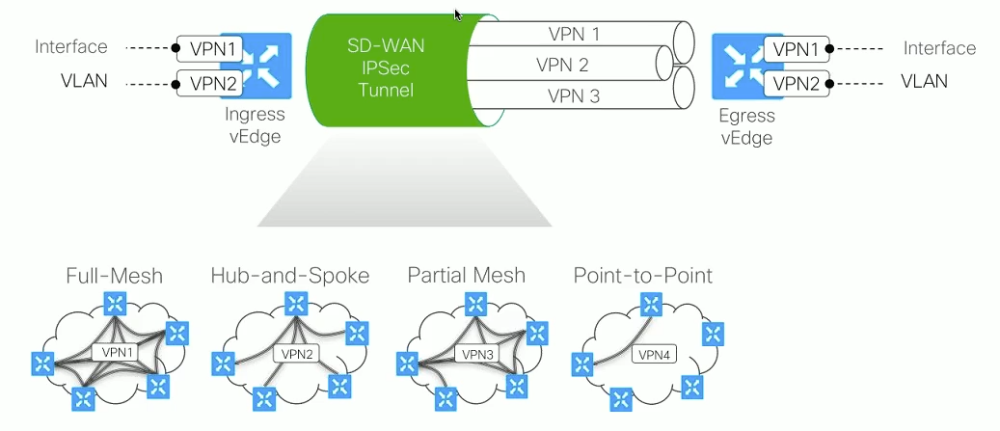

## Cisco SD WAN

### Cisco SD WAN Pillars

- #### Secure Elastic Connectivity
  - Provide Secure and Easy to manage connectivity between sites.
- #### Application Quality of Experience
  - How can we facilitate a better application quality of experience.
- #### For and by Cloud
  - Enablign the cloud transformation for IAAS (AWS , Google) and SAAS App (Office 365 , Box , etc)
- #### Agile Operations
  - Make s Easy to Consume and not require lot of effort to operate and manage.

#### SD-WAN Solution Elements

- **Edge** : The Edge router is the only component that goes to the site. Everything else (Control Plane) is on the cloud. The Control Plane can be hosted privately , publically or at Viptela Managed Cloud.
- **vSmart Controller** : The vSmart controller is the brains of the Viptela control plane. It maintains a centralized routing table and the routing policies to program the forwarding behavior of the data plane. The controller effects control by maintaining a direct TLS/DTLS control plane connection to each vEdge router. The vSmart controller provisions, maintains, and secures the entire overlay network.
 
  >**vSmart Controllers** have a TLS/DTSL (TCP/UDP Based) Connection to the vEdges or Edges.

  > The **vEdge router** have a TPM Chip (Read Only) on which a certificate is stored.This is used for validation when it tried to connect to the Control Plane system. (The Valididty and Serial Number is checked before being trusted by vSmart Controllers). This is the Manufacturing Identity.

  *If the customer has their own PKI infrastructure the same could be used as well.*

**Once the session is established between the `vSmart Controllers` and the `vEdge` a control plane protocol starts running between them know as the `OMP protocol`**

**Data Plane:** The Data plane gets establsihed directly between the vEdges .

**Fabric:** A Fabric is colection of IP Sec Tunnels established between the vEdge devices.

**vManage:** Is the Managment solution to consume the system. Device Configuration , Visibility , Software Upgrades , How the tunnels are performing . Its a Single Plane of Glass solution.

> vManage though provides a GUI to the system , when things break a CLI is required for deep troubleshooting. That is why **all the devices have a full CLI** (user space and kernel space) availaible and has not been intentionally locked down. **It is not a Black Box**

**vBond**
 - Discovery to the vManage and vSmart Controllers so that the vEdge can reach out to them. The vEdge router learn the IP Address of the Controllers via the vBond.
 - Customer want to use Boradband as the ISP link on the vEdge. In this case the addresses could be NAT'ed or translated. vBond in this case faciliates the NAT tranversal.

 **vAnalytics** This is optional components which can help you with trending , historical analysis and future scaling and sizing decision making.

#### Overlay Management Protcol (OMP)

- Unfied extensible control plabe protocol
- **Distributed and security context** (distrbute the Ike like paramneters as there is no Ike `ikeless`)
- **Advertise Fabric Policies**
- Dramatically lowers control plane complexity and raises overall scalability.

> IKE has been the biggest inhibitor in  wider VPN deployment turning into a `n square` problem.

### Policy Orchestration

- The **vManage** *sends* Policy updates (Centralized Policy) to the **vSmart Controllers** which is then distributed to the vEdge devices.

- The **vManage** *sends* Locallized policy updates to the **vEdge** devices directly.

### SD WAN Fabric Communication

The following shows a summary of all the flow types possible with SD WAN .

Also show in the other half is the type of fabric which cab ne formed between the vEdges.

### SD WAN VPNs and Security Zoning

### End to End Segmentation

Control Policies can be defined in a way that it changes the VPN topology formed between the vEdges.

### Enforicing Security Policies

**Figure 1** shows that If needed a a firewall can be deployed at the LAN side of the vEdge to help with security.

vEdge also has the capability to do ACLs and allow/deny traffic based on build in application filters. Though it may not be as powerfull as the firewall.

| Fig 1   | Fig 2  |
|---|---|
|   | 

**Figure 2** shows a more interesting option with service chaining. The traffic being sent to the firewalls for inspection.

                  
