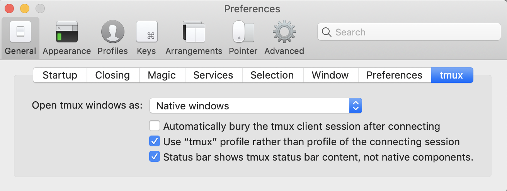
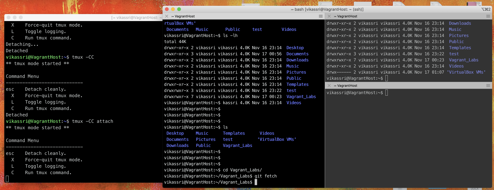

### Error while deploying CSR 1000v directly on  ESXi

### A Required Disk Image Was Missing

```sh
$ ovftool --name="CSR1"  --acceptAllEulas -ds="datastore1" --net:"GigabitEthernet1"="VM Network"  --net:"GigabitEthernet2"="VM Network" --net:"GigabitEthernet3"="VM Network"  /filepath/csr1000v-universalk9.16.03.06\ \(1\)\ copy.ova vi://192.168.1.13/
Opening OVA source: /filepath/Downloads/csr1000v-universalk9.16.03.06 (1) copy.ova
The manifest validates
Enter login information for target vi://192.168.1.13/
Username: root
Password: *********
Opening VI target: vi://root@192.168.1.13:443/
Deploying to VI: vi://root@192.168.1.13:443/
Disk progress: 4%

ovftool --name="KISE"  --acceptAllEulas -ds="datastore1" --net:"GigabitEthernet1"="VM Network"  --net:"GigabitEthernet2"="VM Network" --net:"GigabitEthernet3"="VM Network"  /filepath/csr1000v-universalk9.16.03.06\ \(1\)\ copy.ova vi://192.168.1.13/

Opening OVA source: /filepath/Downloads/csr1000v-universalk9.16.03.06 (1) copy.ova
The manifest validates
Enter login information for target vi://192.168.1.13/
Username: root
Password: *********
Opening VI target: vi://root@192.168.1.13:443/
Deploying to VI: vi://root@192.168.1.13:443/
Disk progress: 4%
```


```sh
./ovftool --noSSLVerify \
        --name="KISE"  \
        --acceptAllEulas \
        -ds="datastore1" \
        --diskMode=thick \
        --network="VM Network"  \
        /Users/vikassri/Downloads/ISE-2.1.0.474-mini.ova \
        vi://192.168.1.13/

./ovftool --noSSLVerify \
          --name="KISE"  \
          --acceptAllEulas \
          -ds="datastore1" \
          --diskMode=thin \
          --network="VM Network"  \
          /Users/vikassri/Downloads/Cisco_Firepower_Management_Center_Virtual_VMware-6.2.3-83/Cisco_Firepower_Management_Center_Virtual_VMware-ESXi-6.2.3-83.ovf \
          vi://192.168.1.13/


qemu-img convert -c -O qcow2 /opt/unetlab/tmp/0/c06281a8-161c-4aa5-aea4-4d304b13b6d4/1/megasasa.qcow2 /opt/unetlab/addons/qemu/vwlc-8.7.102/megasasa.qcow2


qemu-img convert -c -O qcow2 /opt/unetlab/tmp/0/c06281a8-161c-4aa5-aea4-4d304b13b6d4/1/virtioa.qcow2  /opt/unetlab/addons/qemu/win-7test/virtioa.qcow2
```

##### Ovftool with thin provision

./ovftool --acceptAllEulas **-dm=thin**  -ds="datastore1" --net:"External"="VM Network" --net:"Internal"="VM Network" --net:"Management"="VM Network" Cisco_Firepower_NGIPSv_VMware-ESXi-6.2.0-362.ovf  vi://192.168.1.13/


##### Downloading from Datastore to local machine

wget --no-check-certificate --http-user=root --http-password=********** 'https://192.168.1.13/folder/OS_ISOs/W10X64.1709.ENU.DEC2017.iso?dcPath=ha%2ddatacenter&dsName=datastore1'  -O  Windows.iso


ESXi

https://talesfromthedatacenter.com/2016/02/esxi-6-install-stuck-on-relocating-modules-and-starting-up-the-kernel/


### Re-arranging iTerm

Thanks to `http://azaleasays.com/2014/03/05/iterm2-merge-a-pane-back-to-window-or-tab-bar/`

The secret key combination to drag a pane back to a window or to the tab bar is: `command + shift + option`, while dragging the pane body (not its header!). View the screencast below and you’ll figure it out:


### Having iTerm handle the telnet:// URL


**ASA in Eve-NG**


**Java Issues**

On MAC Look for JavaAppletPlugin.plugin , Open in Atom and In tree view do the following:
Comment “jdk.jar.disabledAlgorithms” in the file of”lib/security/java.security”


**Adding Capability to Upgrade in EVE VM**

root@vagrant-eve:~# cat /etc/apt/sources.list | grep eve
deb [arch=amd64] http://www.eve-ng.net/repo xenial main
# deb-src [arch=amd64] http://www.eve-ng.net/repo xenial main

Delete or comment  the refrence to eve repo .

**X Window Forwarding**
ssh -Y vikassri@192.168.1.195

**TMUX Integration with iTerm**

`tmux` should be installed in the remote machine where we are sshing to.
Once Connected to the remote machine

`tmux -CC` to start the tmux session

`Cmnd + n` for New window
`Cmnd + Shift + Option` To rearragne the windows
`Esc` to dettach in the main window
`tmux -CC attach` to attach back the same arrangment.





# EVE Issues

/opt/unetlab/wrappers/unl_wrapper -a stopall
then run again
apt update
apt install --reinstall eve-ng-pro


<!DOCTYPE html>
<html>
<head>
<meta name="viewport" content="width=device-width, initial-scale=1">
<style>
.collapsible {
  background-color: #777;
  color: white;
  cursor: pointer;
  padding: 18px;
  width: 100%;
  border: none;
  text-align: left;
  outline: none;
  font-size: 15px;
}

.active, .collapsible:hover {
  background-color: #555;
}

.content {
  padding: 0 18px;
  display: none;
  overflow: hidden;
  background-color: #f1f1f1;
}
</style>
</head>
<body>

<h2>Collapsibles</h2>

<p>A Collapsible:</p>
<button type="button" class="collapsible">Open Collapsible</button>
<div class="content">
  <p>Lorem ipsum dolor sit amet, consectetur adipisicing elit, sed do eiusmod tempor incididunt ut labore et dolore magna aliqua. Ut enim ad minim veniam, quis nostrud exercitation ullamco laboris nisi ut aliquip ex ea commodo consequat.</p>
</div>


<script>
var coll = document.getElementsByClassName("collapsible");
var i;

for (i = 0; i < coll.length; i++) {
  coll[i].addEventListener("click", function() {
    this.classList.toggle("active");
    var content = this.nextElementSibling;
    if (content.style.display === "block") {
      content.style.display = "none";
    } else {
      content.style.display = "block";
    }
  });
}
</script>

######################## TEST


<div id="card" class="style-scope ytd-miniplayer">
        <div class="video style-scope ytd-miniplayer">
          <div id="player-container" class="style-scope ytd-miniplayer"><ytd-player id="ytd-player" context="WEB_PLAYER_CONTEXT_CONFIG_ID_KEVLAR_WATCH" class="style-scope ytd-watch-flexy"><!--css-build:shady-->

    <div id="container" class="style-scope ytd-player">

    <div class="html5-video-player ytp-transparent ytp-exp-marker-tooltip ytp-hide-info-bar ytp-menu-shown ytp-player-minimized ytp-small-mode ad-created playing-mode ytp-autohide" tabindex="-1" id="movie_player" data-version="/s/player/4fbb4d5b/player_ias.vflset/en_US/base.js" aria-label="YouTube Video Player"><div id="PlayBackRatePanel" class="PlayBackRatePanel" style="display: none; top: 2px; right: 0px; bottom: initial; left: initial;"><button id="SpeedUp" class="btn btn-right">&gt;&gt;</button><button id="PlayBackRate" class="btn">1.00</button><button id="SpeedDown" class="btn btn-left">&lt;&lt;</button></div><div class="html5-video-container" data-layer="0"><video tabindex="-1" class="video-stream html5-main-video" controlslist="nodownload" style="width: 400px; height: 225px; left: 0px; top: 0px;" src="blob:https://www.youtube.com/ee3c6f81-7f0b-400d-a133-cf9da9cd650e"></video></div><div class="ytp-gradient-top" data-layer="1" style="display: none;"></div><div class="ytp-chrome-top" data-layer="1" style="display: none;"><button class="ytp-playlist-menu-button ytp-button" aria-owns="ytp-id-2" aria-haspopup="true" aria-label="Playlist" style="display: none;"><div class="ytp-playlist-menu-button-icon"><svg height="100%" version="1.1" viewBox="0 0 36 36" width="100%"><use class="ytp-svg-shadow" xlink:href="#ytp-id-3"></use><path d="m 22.53,21.42 0,6.85 5.66,-3.42 -5.66,-3.42 0,0 z m -11.33,0 9.06,0 0,2.28 -9.06,0 0,-2.28 0,0 z m 0,-9.14 13.6,0 0,2.28 -13.6,0 0,-2.28 0,0 z m 0,4.57 13.6,0 0,2.28 -13.6,0 0,-2.28 0,0 z" fill="#fff" id="ytp-id-3"></path></svg></div><div class="ytp-playlist-menu-button-text"></div></button><div class="ytp-title-channel"><div class="ytp-title-beacon"></div><a class="ytp-title-channel-logo" target="_blank"></a><div class="ytp-title-expanded-overlay"><div class="ytp-title-expanded-heading"><h2 class="ytp-title-expanded-title"><a target="_blank" href="https://www.youtube.com"></a></h2><h3 class="ytp-title-expanded-subtitle"></h3></div></div></div><div class="ytp-title"><div class="ytp-title-text"><a class="ytp-title-link yt-uix-sessionlink ytp-title-fullerscreen-link" target="_blank" data-sessionlink="feature=player-title">Video &amp; audio: using JavaScript to control video</a><div class="ytp-title-subtext"><a class="ytp-title-channel-name" target="_blank" href=""></a></div></div></div><div class="ytp-chrome-top-buttons"><button class="ytp-button ytp-cards-button" aria-label="Show cards" aria-owns="iv-drawer" aria-haspopup="true" data-tooltip-opaque="false" style="display: none;"><span class="ytp-cards-button-icon-default"><div class="ytp-cards-button-icon"><svg height="100%" version="1.1" viewBox="0 0 36 36" width="100%"><use class="ytp-svg-shadow" xlink:href="#ytp-id-9"></use><path class="ytp-svg-fill" d="M18,8 C12.47,8 8,12.47 8,18 C8,23.52 12.47,28 18,28 C23.52,28 28,23.52 28,18 C28,12.47 23.52,8 18,8 L18,8 Z M17,16 L19,16 L19,24 L17,24 L17,16 Z M17,12 L19,12 L19,14 L17,14 L17,12 Z" id="ytp-id-9"></path></svg></div><div class="ytp-cards-button-title">Info</div></span><span class="ytp-cards-button-icon-shopping"><div class="ytp-cards-button-icon"><svg height="100%" version="1.1" viewBox="0 0 36 36" width="100%"><path class="ytp-svg-shadow" d="M 27.99,18 A 9.99,9.99 0 1 1 8.00,18 9.99,9.99 0 1 1 27.99,18 z"></path><path class="ytp-svg-fill" d="M 18,8 C 12.47,8 8,12.47 8,18 8,23.52 12.47,28 18,28 23.52,28 28,23.52 28,18 28,12.47 23.52,8 18,8 z m -4.68,4 4.53,0 c .35,0 .70,.14 .93,.37 l 5.84,5.84 c .23,.23 .37,.58 .37,.93 0,.35 -0.13,.67 -0.37,.90 L 20.06,24.62 C 19.82,24.86 19.51,25 19.15,25 c -0.35,0 -0.70,-0.14 -0.93,-0.37 L 12.37,18.78 C 12.13,18.54 12,18.20 12,17.84 L 12,13.31 C 12,12.59 12.59,12 13.31,12 z m .96,1.31 c -0.53,0 -0.96,.42 -0.96,.96 0,.53 .42,.96 .96,.96 .53,0 .96,-0.42 .96,-0.96 0,-0.53 -0.42,-0.96 -0.96,-0.96 z" fill-opacity="1"></path><path class="ytp-svg-shadow-fill" d="M 24.61,18.22 18.76,12.37 C 18.53,12.14 18.20,12 17.85,12 H 13.30 C 12.58,12 12,12.58 12,13.30 V 17.85 c 0,.35 .14,.68 .38,.92 l 5.84,5.85 c .23,.23 .55,.37 .91,.37 .35,0 .68,-0.14 .91,-0.38 L 24.61,20.06 C 24.85,19.83 25,19.50 25,19.15 25,18.79 24.85,18.46 24.61,18.22 z M 14.27,15.25 c -0.53,0 -0.97,-0.43 -0.97,-0.97 0,-0.53 .43,-0.97 .97,-0.97 .53,0 .97,.43 .97,.97 0,.53 -0.43,.97 -0.97,.97 z" fill="#000" fill-opacity="0.15"></path></svg></div><div class="ytp-cards-button-title">Shopping</div></span></button><div class="ytp-cards-teaser" style="display: none;"><div class="ytp-cards-teaser-box"></div><div class="ytp-cards-teaser-text"><span class="ytp-cards-teaser-label"></span></div></div><button class="ytp-button ytp-overflow-button ytp-overflow-button-visible" title="More" aria-haspopup="true" aria-owns="ytp-id-10" aria-label="More"><div class="ytp-overflow-icon"><svg height="100%" viewBox="-5 -5 36 36" width="100%"><path d="M12 8c1.1 0 2-.9 2-2s-.9-2-2-2-2 .9-2 2 .9 2 2 2zm0 2c-1.1 0-2 .9-2 2s.9 2 2 2 2-.9 2-2-.9-2-2-2zm0 6c-1.1 0-2 .9-2 2s.9 2 2 2 2-.9 2-2-.9-2-2-2z" fill="#fff"></path></svg></div></button></div></div><button class="ytp-unmute ytp-popup ytp-button ytp-unmute-animated ytp-unmute-shrink" data-layer="2" style="display: none;"><div class="ytp-unmute-inner"><div class="ytp-unmute-icon"><svg height="100%" version="1.1" viewBox="0 0 36 36" width="100%"><use class="ytp-svg-shadow" xlink:href="#ytp-id-1"></use><path class="ytp-svg-fill" d="m 21.48,17.98 c 0,-1.77 -1.02,-3.29 -2.5,-4.03 v 2.21 l 2.45,2.45 c .03,-0.2 .05,-0.41 .05,-0.63 z m 2.5,0 c 0,.94 -0.2,1.82 -0.54,2.64 l 1.51,1.51 c .66,-1.24 1.03,-2.65 1.03,-4.15 0,-4.28 -2.99,-7.86 -7,-8.76 v 2.05 c 2.89,.86 5,3.54 5,6.71 z M 9.25,8.98 l -1.27,1.26 4.72,4.73 H 7.98 v 6 H 11.98 l 5,5 v -6.73 l 4.25,4.25 c -0.67,.52 -1.42,.93 -2.25,1.18 v 2.06 c 1.38,-0.31 2.63,-0.95 3.69,-1.81 l 2.04,2.05 1.27,-1.27 -9,-9 -7.72,-7.72 z m 7.72,.99 -2.09,2.08 2.09,2.09 V 9.98 z" id="ytp-id-1"></path></svg></div><div class="ytp-unmute-text">Tap to unmute</div><div class="ytp-unmute-box"></div></div></button><div class="video-ads ytp-ad-module" data-layer="4"></div><div class="ytp-cued-thumbnail-overlay" data-layer="4" style="display: none;"><div class="ytp-cued-thumbnail-overlay-image"></div><button class="ytp-large-play-button ytp-button" aria-label="Play"><svg height="100%" version="1.1" viewBox="0 0 68 48" width="100%"><path class="ytp-large-play-button-bg" d="M66.52,7.74c-0.78-2.93-2.49-5.41-5.42-6.19C55.79,.13,34,0,34,0S12.21,.13,6.9,1.55 C3.97,2.33,2.27,4.81,1.48,7.74C0.06,13.05,0,24,0,24s0.06,10.95,1.48,16.26c0.78,2.93,2.49,5.41,5.42,6.19 C12.21,47.87,34,48,34,48s21.79-0.13,27.1-1.55c2.93-0.78,4.64-3.26,5.42-6.19C67.94,34.95,68,24,68,24S67.94,13.05,66.52,7.74z" fill="#212121" fill-opacity="0.8"></path><path d="M 45,24 27,14 27,34" fill="#fff"></path></svg></button></div><div class="ytp-spinner" data-layer="4" style="display: none;"><div class="ytp-spinner-container"><div class="ytp-spinner-rotator"><div class="ytp-spinner-left"><div class="ytp-spinner-circle"></div></div><div class="ytp-spinner-right"><div class="ytp-spinner-circle"></div></div></div></div><div class="ytp-spinner-message" style="display: none;">If playback doesn't begin shortly, try restarting your device.</div></div><div class="ytp-paid-content-overlay" aria-live="assertive" aria-atomic="true" data-layer="4"><div class="ytp-button ytp-paid-content-overlay-text" style="display: none;"></div></div><div data-layer="4" style="display: none;"><div class="ytp-bezel-text-wrapper"><div class="ytp-bezel-text"></div></div><div class="ytp-bezel" role="status"><div class="ytp-bezel-icon"></div></div></div><div class="ytp-doubletap-ui" data-layer="4" style="display: none;"><div class="ytp-doubletap-static-circle"><div class="ytp-doubletap-ripple"></div></div><div class="ytp-doubletap-overlay-a11y"></div><div class="ytp-doubletap-seek-info-container"><div class="ytp-doubletap-arrows-container"><span class="ytp-doubletap-base-arrow"></span><span class="ytp-doubletap-base-arrow"></span><span class="ytp-doubletap-base-arrow"></span></div><div class="ytp-doubletap-tooltip"><div class="ytp-doubletap-tooltip-label"></div></div></div></div><div data-layer="4" aria-live="polite" style="max-width: 300px; top: 645px; left: 1131px; display: none;" class="ytp-tooltip ytp-bottom"><div class="ytp-tooltip-text-wrapper"><div class="ytp-tooltip-image"></div><div class="ytp-tooltip-title"></div><span class="ytp-tooltip-text ytp-tooltip-text-no-title">Miniplayer (i)</span></div><div class="ytp-tooltip-bg" style="width: 158px; height: 90px;"><div class="ytp-tooltip-duration"></div></div></div><div class="ytp-storyboard-framepreview" data-layer="4" style="display: none;" aria-hidden="true"><div class="ytp-storyboard-framepreview-img" style="width: 1279.75px; height: 720px; margin: 0px 1px 0px 0px; background: url(&quot;https://i9.ytimg.com/sb/KTkkXphS0f4/storyboard3_L2/M3.jpg?sqp=ovOX_wMGCPHzra8F&amp;sigh=rs%24AOn4CLCgKd2NjWvBfBytYYRMZZeMdfhXfw&quot;) -3840px -1440px / 6400px 3600px;"></div></div><div class="ytp-ad-persistent-progress-bar-container" data-layer="4" style="display: none;"><div class="ytp-ad-persistent-progress-bar" style="width: 7.54659%;"></div></div><div class="ytp-remote" data-layer="4" style="display: none;"><div class="ytp-remote-display-status"><div class="ytp-remote-display-status-icon"><svg height="100%" version="1.1" viewBox="0 0 36 36" width="100%"><use class="ytp-svg-shadow" xlink:href="#ytp-id-32"></use><path d="M7,24 L7,27 L10,27 C10,25.34 8.66,24 7,24 L7,24 Z M7,20 L7,22 C9.76,22 12,24.24 12,27 L14,27 C14,23.13 10.87,20 7,20 L7,20 Z M25,13 L11,13 L11,14.63 C14.96,15.91 18.09,19.04 19.37,23 L25,23 L25,13 L25,13 Z M7,16 L7,18 C11.97,18 16,22.03 16,27 L18,27 C18,20.92 13.07,16 7,16 L7,16 Z M27,9 L9,9 C7.9,9 7,9.9 7,11 L7,14 L9,14 L9,11 L27,11 L27,25 L20,25 L20,27 L27,27 C28.1,27 29,26.1 29,25 L29,11 C29,9.9 28.1,9 27,9 L27,9 Z" fill="#fff" id="ytp-id-32"></path></svg></div><div class="ytp-remote-display-status-text"></div></div></div><div class="ytp-mdx-popup-dialog" role="dialog" data-layer="4" style="display: none;"><div class="ytp-mdx-popup-dialog-inner-content"><div class="ytp-mdx-popup-title">You're signed out</div><div class="ytp-mdx-popup-description">Videos you watch may be added to the TV's watch history and influence TV recommendations. To avoid this, cancel and sign in to YouTube on your computer.</div><div class="ytp-mdx-privacy-popup-buttons"><button class="ytp-button ytp-mdx-privacy-popup-cancel">Cancel</button><button class="ytp-button ytp-mdx-privacy-popup-confirm">Confirm</button></div></div></div><div class="ytp-miniplayer-ui" data-layer="4" style=""><div class="ytp-miniplayer-scrim"><button class="ytp-miniplayer-close-button ytp-button" aria-label="Close"><svg height="100%" viewBox="0 0 24 24" width="100%"><path d="M19 6.41L17.59 5 12 10.59 6.41 5 5 6.41 10.59 12 5 17.59 6.41 19 12 13.41 17.59 19 19 17.59 13.41 12z" fill="#fff"></path></svg></button><button class="ytp-miniplayer-expand-watch-page-button ytp-button ytp-miniplayer-button-top-left" data-tooltip-target-id="ytp-miniplayer-expand-watch-page-button" title="Expand (i)"><svg height="24px" version="1.1" viewBox="0 0 24 24" width="24px"><g fill="none" fill-rule="evenodd" stroke="none" stroke-width="1"><g transform="translate(12.000000, 12.000000) scale(-1, 1) translate(-12.000000, -12.000000) "><path d="M19,19 L5,19 L5,5 L12,5 L12,3 L5,3 C3.89,3 3,3.9 3,5 L3,19 C3,20.1 3.89,21 5,21 L19,21 C20.1,21 21,20.1 21,19 L21,12 L19,12 L19,19 Z M14,3 L14,5 L17.59,5 L7.76,14.83 L9.17,16.24 L19,6.41 L19,10 L21,10 L21,3 L14,3 Z" fill="#fff" fill-rule="nonzero"></path></g></g></svg></button><div class="ytp-miniplayer-controls"><div class="ytp-miniplayer-button-container"><a class="ytp-prev-button ytp-button" role="button" aria-disabled="true" style="display: none;"><svg height="100%" version="1.1" viewBox="0 0 36 36" width="100%"><use class="ytp-svg-shadow" xlink:href="#ytp-id-116"></use><path class="ytp-svg-fill" d="m 12,12 h 2 v 12 h -2 z m 3.5,6 8.5,6 V 12 z" id="ytp-id-116"></path></svg></a></div><div class="ytp-miniplayer-play-button-container"><button class="ytp-play-button ytp-button" title="Pause (k)" aria-label="Pause (k)"><svg height="100%" version="1.1" viewBox="0 0 36 36" width="100%"><use class="ytp-svg-shadow" xlink:href="#ytp-id-137"></use><path class="ytp-svg-fill" d="M 12,26 16,26 16,10 12,10 z M 21,26 25,26 25,10 21,10 z" id="ytp-id-137"></path></svg></button></div><div class="ytp-miniplayer-button-container"><a class="ytp-next-button ytp-button" role="button" aria-disabled="false" aria-label="Next (SHIFT+n)" title="Next (SHIFT+n)" data-duration="24:34" data-preview="https://i.ytimg.com/vi/yx-HYerClEA/hqdefault.jpg?sqp=-oaymwEZCNACELwBSFXyq4qpAwsIARUAAIhCGAFwAQ==&amp;rs=AOn4CLAcQgXcg-kXC9thVXktwjOTBn8iLA" data-tooltip-text="Custom HTML5 Video Player - #JavaScript30 11/30" href="https://www.youtube.com/watch?v=yx-HYerClEA"><svg height="100%" version="1.1" viewBox="0 0 36 36" width="100%"><use class="ytp-svg-shadow" xlink:href="#ytp-id-118"></use><path class="ytp-svg-fill" d="M 12,24 20.5,18 12,12 V 24 z M 22,12 v 12 h 2 V 12 h -2 z" id="ytp-id-118"></path></svg></a></div></div><div class="ytp-time-display notranslate"><span class="ytp-time-current">0:07</span><span class="ytp-time-separator"> / </span><span class="ytp-time-duration">3:48</span><button class="ytp-live-badge ytp-button" disabled="true">Live</button></div></div></div><div data-layer="4" style="top: 126px; left: 121.5px; max-width: 180px; display: none;" class="ytp-tooltip ytp-bottom ytp-preview"><div class="ytp-tooltip-text-wrapper"><div class="ytp-tooltip-image"></div><div class="ytp-tooltip-title"></div><span class="ytp-tooltip-text ytp-tooltip-text-no-title">1:30</span></div><div class="ytp-tooltip-bg" style="width: 92.6667px; height: 54px; background: url(&quot;https://i9.ytimg.com/sb/KTkkXphS0f4/storyboard3_L2/M1.jpg?sqp=ovOX_wMGCPHzra8F&amp;sigh=rs%24AOn4CLCgKd2NjWvBfBytYYRMZZeMdfhXfw&quot;) 0px -216px / 480px 270px;"><div class="ytp-tooltip-duration">3:49</div></div></div><div class="ytp-progress-bar-container" data-layer="4" style="height: 5px;"><div class="ytp-progress-bar " tabindex="0" role="slider" aria-label="Seek slider" draggable="true" aria-valuemin="0" aria-valuemax="228" aria-valuenow="7" aria-valuetext="0 Minutes 7 Seconds of 3 Minutes 48 Seconds" style="touch-action: none;"><div class="ytp-chapters-container"><div class="ytp-chapter-hover-container" style="width: 100%;"><div class="ytp-progress-bar-padding"></div><div class="ytp-progress-list"><div class="ytp-play-progress ytp-swatch-background-color" style="left: 0px; transform: scaleX(0.0314934);"></div><div class="ytp-load-progress" style="left: 0px; transform: scaleX(0.131162);"></div><div class="ytp-hover-progress ytp-hover-progress-light" style="left: 12.5974px; transform: scaleX(0.393507);"></div><div class="ytp-ad-progress-list"></div></div></div></div><div class="ytp-marker-crenellation-list"></div><div class="ytp-clip-start-exclude" style="width: 0%;"></div><div class="ytp-clip-end-exclude" style="left: 100%; width: 0%;"></div><div class="ytp-scrubber-container" style="transform: translateX(12.5974px);"><div class="ytp-scrubber-button ytp-swatch-background-color" style="height: 13px;"><div class="ytp-scrubber-pull-indicator"></div></div></div></div><div class="ytp-bound-time-left">0:00</div><div class="ytp-bound-time-right">3:48</div><div class="ytp-clip-start" draggable="true" title="Watch entire video" style="touch-action: none; left: 0%;"><svg height="100%" version="1.1" viewBox="0 0 14 14" width="100%"><use class="ytp-svg-shadow" xlink:href="#ytp-id-119"></use><path d="M12,14 L9,11 L9,3 L12,0 L5,0 L5,14 L12,14 Z" fill="#eaeaea" id="ytp-id-119"></path></svg></div><div class="ytp-clip-end" draggable="true" title="Watch entire video" style="touch-action: none; left: 100%;"><svg height="100%" version="1.1" viewBox="0 0 14 14" width="100%"><use class="ytp-svg-shadow" xlink:href="#ytp-id-120"></use><path d="M2,14 L5,11 L5,3 L2,0 L9,0 L9,14 L2,14 L2,14 Z" fill="#eaeaea" id="ytp-id-120"></path></svg></div></div><div class="ytp-miniplayer-buttons" data-layer="4"><button class="ytp-miniplayer-close-button ytp-button" aria-label="Close"><svg height="100%" viewBox="0 0 24 24" width="100%"><path d="M19 6.41L17.59 5 12 10.59 6.41 5 5 6.41 10.59 12 5 17.59 6.41 19 12 13.41 17.59 19 19 17.59 13.41 12z" fill="#fff"></path></svg></button><button class="ytp-miniplayer-replay-button ytp-button" aria-label="Close"><svg height="100%" version="1.1" viewBox="0 0 36 36" width="100%"><use class="ytp-svg-shadow" xlink:href="#ytp-id-121"></use><path class="ytp-svg-fill" d="M 18,11 V 7 l -5,5 5,5 v -4 c 3.3,0 6,2.7 6,6 0,3.3 -2.7,6 -6,6 -3.3,0 -6,-2.7 -6,-6 h -2 c 0,4.4 3.6,8 8,8 4.4,0 8,-3.6 8,-8 0,-4.4 -3.6,-8 -8,-8 z" id="ytp-id-121"></path></svg></button></div><div class="ytp-upnext ytp-player-content ytp-upnext-autoplay-paused" data-layer="4" style="display: none;"><div class="ytp-cued-thumbnail-overlay-image" style=""></div><span class="ytp-upnext-top"><span class="ytp-upnext-header">Up Next</span><span class="ytp-upnext-title"></span><span class="ytp-upnext-author"></span></span><a class="ytp-upnext-autoplay-icon" role="button" aria-label="Play next video"><svg height="100%" version="1.1" viewBox="0 0 72 72" width="100%"><circle class="ytp-svg-autoplay-circle" cx="36" cy="36" fill="#fff" fill-opacity="0.3" r="31.5"></circle><circle class="ytp-svg-autoplay-ring" cx="-36" cy="36" fill-opacity="0" r="33.5" stroke="#FFFFFF" stroke-dasharray="211" stroke-dashoffset="-211.00012878417968" stroke-width="4" transform="rotate(-90)"></circle><path class="ytp-svg-fill" d="M 24,48 41,36 24,24 V 48 z M 44,24 v 24 h 4 V 24 h -4 z"></path></svg></a><span class="ytp-upnext-bottom"><span class="ytp-upnext-cancel"><button class="ytp-upnext-cancel-button ytp-button" tabindex="0" aria-label="Cancel autoplay">Cancel</button></span><span class="ytp-upnext-paused">Autoplay is paused</span></span></div><div class="html5-endscreen ytp-player-content videowall-endscreen" data-layer="4" style="display: none;"><button class="ytp-button ytp-endscreen-previous" aria-label="Previous"><svg height="100%" version="1.1" viewBox="0 0 32 32" width="100%"><path d="M 19.41,20.09 14.83,15.5 19.41,10.91 18,9.5 l -6,6 6,6 z" fill="#fff"></path></svg></button><div class="ytp-endscreen-content"></div><button class="ytp-button ytp-endscreen-next" aria-label="Next"><svg height="100%" version="1.1" viewBox="0 0 32 32" width="100%"><path d="m 12.59,20.34 4.58,-4.59 -4.58,-4.59 1.41,-1.41 6,6 -6,6 z" fill="#fff"></path></svg></button></div><div class="ytp-player-content ytp-iv-player-content" data-layer="4" style=""></div><div class="ytp-playlist-menu" role="dialog" id="ytp-id-2" data-layer="5" style="display: none;"><div class="ytp-playlist-menu-header"><div class="ytp-playlist-menu-title"><a class="ytp-playlist-menu-title-name"></a><button class="ytp-playlist-menu-close ytp-button" aria-label="Close"><svg height="100%" viewBox="0 0 24 24" width="100%"><path d="M19 6.41L17.59 5 12 10.59 6.41 5 5 6.41 10.59 12 5 17.59 6.41 19 12 13.41 17.59 19 19 17.59 13.41 12z" fill="#fff"></path></svg></button></div><div class="ytp-playlist-menu-subtitle"></div></div><div class="ytp-playlist-menu-items" role="menu"></div></div><div class="ytp-share-panel" id="ytp-id-6" role="dialog" aria-labelledby="ytp-id-5" data-layer="5" style="display: none;"><div class="ytp-share-panel-inner-content"><div class="ytp-share-panel-title" id="ytp-id-5">Share</div><a class="ytp-share-panel-link ytp-no-contextmenu" target="_blank" title="Share link" aria-label="Share link"></a><label class="ytp-share-panel-include-playlist"><input class="ytp-share-panel-include-playlist-checkbox" type="checkbox" checked="true">Include playlist</label><div class="ytp-share-panel-loading-spinner"><div class="ytp-spinner-container"><div class="ytp-spinner-rotator"><div class="ytp-spinner-left"><div class="ytp-spinner-circle"></div></div><div class="ytp-spinner-right"><div class="ytp-spinner-circle"></div></div></div></div></div><div class="ytp-share-panel-service-buttons"></div><div class="ytp-share-panel-error">An error occurred while retrieving sharing information. Please try again later.</div></div><button class="ytp-share-panel-close ytp-button" title="Close" aria-label="Close"><svg height="100%" viewBox="0 0 24 24" width="100%"><path d="M19 6.41L17.59 5 12 10.59 6.41 5 5 6.41 10.59 12 5 17.59 6.41 19 12 13.41 17.59 19 19 17.59 13.41 12z" fill="#fff"></path></svg></button></div><div class="ytp-overflow-panel" id="ytp-id-10" role="dialog" data-layer="5" style="display: none;"><div class="ytp-overflow-panel-content"><div class="ytp-overflow-panel-action-buttons"><button class="ytp-watch-later-button ytp-button" data-tooltip-opaque="false" title="Watch later as devopssimplified" data-tooltip-image="https://lh3.googleusercontent.com/a-/AOh14Gg7V133L0-dm5kZUXSKm4foBzDbzDgQvti5jci7=s20-c" aria-label="Watch later as devopssimplified" style=""><div class="ytp-watch-later-icon"><svg height="100%" version="1.1" viewBox="0 0 36 36" width="100%"><use class="ytp-svg-shadow" xlink:href="#ytp-id-4"></use><path class="ytp-svg-fill" d="M18,8 C12.47,8 8,12.47 8,18 C8,23.52 12.47,28 18,28 C23.52,28 28,23.52 28,18 C28,12.47 23.52,8 18,8 L18,8 Z M16,19.02 L16,12.00 L18,12.00 L18,17.86 L23.10,20.81 L22.10,22.54 L16,19.02 Z" id="ytp-id-4"></path></svg></div><div class="ytp-watch-later-title">Watch later</div></button><button class="ytp-button ytp-share-button ytp-share-button-visible" title="Share" aria-haspopup="true" aria-owns="ytp-id-6" data-tooltip-opaque="false" aria-label="Share" style=""><div class="ytp-share-icon"><svg height="100%" version="1.1" viewBox="0 0 36 36" width="100%"><use class="ytp-svg-shadow" xlink:href="#ytp-id-142"></use><path class="ytp-svg-fill" d="m 20.20,14.19 0,-4.45 7.79,7.79 -7.79,7.79 0,-4.56 C 16.27,20.69 12.10,21.81 9.34,24.76 8.80,25.13 7.60,27.29 8.12,25.65 9.08,21.32 11.80,17.18 15.98,15.38 c 1.33,-0.60 2.76,-0.98 4.21,-1.19 z" id="ytp-id-142"></path></svg></div><div class="ytp-share-title">Share</div></button><button class="ytp-button ytp-copylink-button" data-tooltip-opaque="false" title="Copy link" style="display: none;"><div class="ytp-copylink-icon"><svg height="100%" version="1.1" viewBox="0 0 36 36" width="100%"><use class="ytp-svg-shadow" xlink:href="#ytp-id-143"></use><path class="ytp-svg-fill" d="M21.9,8.3H11.3c-0.9,0-1.7,.8-1.7,1.7v12.3h1.7V10h10.6V8.3z M24.6,11.8h-9.7c-1,0-1.8,.8-1.8,1.8v12.3  c0,1,.8,1.8,1.8,1.8h9.7c1,0,1.8-0.8,1.8-1.8V13.5C26.3,12.6,25.5,11.8,24.6,11.8z M24.6,25.9h-9.7V13.5h9.7V25.9z" id="ytp-id-143"></path></svg></div><div class="ytp-copylink-title" aria-hidden="true">Copy link</div></button></div></div><button class="ytp-overflow-panel-close ytp-button" title="Close" aria-label="Close"><svg height="100%" viewBox="0 0 24 24" width="100%"><path d="M19 6.41L17.59 5 12 10.59 6.41 5 5 6.41 10.59 12 5 17.59 6.41 19 12 13.41 17.59 19 19 17.59 13.41 12z" fill="#fff"></path></svg></button></div><div class="ytp-multicam-menu" role="dialog" data-layer="5" style="display: none;"><div class="ytp-multicam-menu-header"><div class="ytp-multicam-menu-title">Switch camera<button class="ytp-multicam-menu-close ytp-button" aria-label="Close"><svg height="100%" viewBox="0 0 24 24" width="100%"><path d="M19 6.41L17.59 5 12 10.59 6.41 5 5 6.41 10.59 12 5 17.59 6.41 19 12 13.41 17.59 19 19 17.59 13.41 12z" fill="#fff"></path></svg></button></div></div><div class="ytp-multicam-menu-items"></div></div><div class="ytp-popup ytp-settings-menu" data-layer="6" id="ytp-id-21" style="display: none;"><div class="ytp-panel"><div class="ytp-panel-menu" role="menu"></div></div></div><div class="ytp-gradient-bottom" data-layer="8" style="height: 92px; background-image: url(&quot;data:image/png;base64,iVBORw0KGgoAAAANSUhEUgAAAAEAAABcCAYAAACvBd+gAAAAt0lEQVQoU03H0UYDAABA0ZU0JaWZZpOySZOmSbPMpszSTMmYRJKRiSSRxCQjE8mMJCYzJpE+cs5b9+FwA4H/jZlxTGASQUxhGjOYxRzmEUIYC4ggihgWsYRlxJHAClaRxBrWkcIG0tjEFjLIYhs55FHADnZRRAl72EcZFRzgEEeoooZjnOAUZzhHHRdo4BJXuMYNbnGHezygiUc8oYVntPGCV7yhgy7e8YFP9PCFPgYY4hs/+MXfCFvjG7tBo5nBAAAAAElFTkSuQmCC&quot;); display: none;"></div><div class="ytp-chrome-bottom" data-layer="8" style="width: 376px; left: 12px; display: none;"><div class="ytp-progress-bar-container" style="height: 5px;"><div class="ytp-progress-bar " tabindex="0" role="slider" aria-label="Seek slider" aria-valuemin="0" aria-valuemax="228" aria-valuenow="2" aria-valuetext="0 Minutes 2 Seconds of 3 Minutes 48 Seconds" draggable="true" style="touch-action: none;"><div class="ytp-chapters-container"><div class="ytp-chapter-hover-container" style="width: 100%;"><div class="ytp-progress-bar-padding"></div><div class="ytp-progress-list"><div class="ytp-play-progress ytp-swatch-background-color" style="left: 0px; transform: scaleX(0.0126595);"></div><div class="ytp-load-progress" style="left: 0px; transform: scaleX(0.131162);"></div><div class="ytp-hover-progress ytp-hover-progress-light" style="left: 4.75997px; transform: scaleX(0.98734);"></div><div class="ytp-ad-progress-list"></div></div></div></div><div class="ytp-marker-crenellation-list"></div><div class="ytp-clip-start-exclude" style="width: 0%;"></div><div class="ytp-clip-end-exclude" style="left: 100%; width: 0%;"></div><div class="ytp-scrubber-container" style="transform: translateX(4.75997px);"><div class="ytp-scrubber-button ytp-swatch-background-color" style="height: 13px;"><div class="ytp-scrubber-pull-indicator"></div></div></div></div><div class="ytp-bound-time-left">0:00</div><div class="ytp-bound-time-right">3:48</div><div class="ytp-clip-start" draggable="true" title="Watch entire video" style="touch-action: none; left: 0%;"><svg height="100%" version="1.1" viewBox="0 0 14 14" width="100%"><use class="ytp-svg-shadow" xlink:href="#ytp-id-11"></use><path d="M12,14 L9,11 L9,3 L12,0 L5,0 L5,14 L12,14 Z" fill="#eaeaea" id="ytp-id-11"></path></svg></div><div class="ytp-clip-end" draggable="true" title="Watch entire video" style="touch-action: none; left: 100%;"><svg height="100%" version="1.1" viewBox="0 0 14 14" width="100%"><use class="ytp-svg-shadow" xlink:href="#ytp-id-12"></use><path d="M2,14 L5,11 L5,3 L2,0 L9,0 L9,14 L2,14 L2,14 Z" fill="#eaeaea" id="ytp-id-12"></path></svg></div></div><div class="ytp-chrome-controls"><div class="ytp-left-controls"><a class="ytp-prev-button ytp-button" role="button" aria-disabled="true" style="display: none;"><svg height="100%" version="1.1" viewBox="0 0 36 36" width="100%"><use class="ytp-svg-shadow" xlink:href="#ytp-id-13"></use><path class="ytp-svg-fill" d="m 12,12 h 2 v 12 h -2 z m 3.5,6 8.5,6 V 12 z" id="ytp-id-13"></path></svg></a><button class="ytp-play-button ytp-button" title="Pause (k)" aria-label="Pause (k)"><svg height="100%" version="1.1" viewBox="0 0 36 36" width="100%"><use class="ytp-svg-shadow" xlink:href="#ytp-id-136"></use><path class="ytp-svg-fill" d="M 12,26 16,26 16,10 12,10 z M 21,26 25,26 25,10 21,10 z" id="ytp-id-136"></path></svg></button><a class="ytp-next-button ytp-button" role="button" title="Next (SHIFT+n)" aria-disabled="false" aria-label="Next (SHIFT+n)" data-duration="24:34" data-preview="https://i.ytimg.com/vi/yx-HYerClEA/hqdefault.jpg?sqp=-oaymwEZCNACELwBSFXyq4qpAwsIARUAAIhCGAFwAQ==&amp;rs=AOn4CLAcQgXcg-kXC9thVXktwjOTBn8iLA" data-tooltip-text="Custom HTML5 Video Player - #JavaScript30 11/30" href="https://www.youtube.com/watch?v=yx-HYerClEA"><svg height="100%" version="1.1" viewBox="0 0 36 36" width="100%"><use class="ytp-svg-shadow" xlink:href="#ytp-id-15"></use><path class="ytp-svg-fill" d="M 12,24 20.5,18 12,12 V 24 z M 22,12 v 12 h 2 V 12 h -2 z" id="ytp-id-15"></path></svg></a><span><button class="ytp-mute-button ytp-button" aria-label="Mute (m)" title="Mute (m)"><svg height="100%" version="1.1" viewBox="0 0 36 36" width="100%"><use class="ytp-svg-shadow" xlink:href="#ytp-id-17"></use><use class="ytp-svg-shadow" xlink:href="#ytp-id-18"></use><defs><clipPath id="ytp-svg-volume-animation-mask"><path d="m 14.35,-0.14 -5.86,5.86 20.73,20.78 5.86,-5.91 z"></path><path d="M 7.07,6.87 -1.11,15.33 19.61,36.11 27.80,27.60 z"></path><path class="ytp-svg-volume-animation-mover" d="M 9.09,5.20 6.47,7.88 26.82,28.77 29.66,25.99 z" transform="translate(0, 0)"></path></clipPath><clipPath id="ytp-svg-volume-animation-slash-mask"><path class="ytp-svg-volume-animation-mover" d="m -11.45,-15.55 -4.44,4.51 20.45,20.94 4.55,-4.66 z" transform="translate(0, 0)"></path></clipPath></defs><path class="ytp-svg-fill ytp-svg-volume-animation-speaker" clip-path="url(#ytp-svg-volume-animation-mask)" d="M8,21 L12,21 L17,26 L17,10 L12,15 L8,15 L8,21 Z M19,14 L19,22 C20.48,21.32 21.5,19.77 21.5,18 C21.5,16.26 20.48,14.74 19,14 Z" fill="#fff" id="ytp-id-17"></path><path class="ytp-svg-fill ytp-svg-volume-animation-hider" clip-path="url(#ytp-svg-volume-animation-slash-mask)" d="M 9.25,9 7.98,10.27 24.71,27 l 1.27,-1.27 Z" fill="#fff" id="ytp-id-18" style="display: none;"></path></svg></button><div class="ytp-volume-panel" role="slider" aria-valuemin="0" aria-valuemax="100" tabindex="0" aria-valuenow="41" aria-valuetext="41% volume"><div class="ytp-volume-slider" draggable="true" style="touch-action: none;"><div class="ytp-volume-slider-handle" style="left: 16.4px;"></div></div></div></span><div class="ytp-time-display notranslate"><span class="ytp-time-current">0:02</span><span class="ytp-time-separator"> / </span><span class="ytp-time-duration">3:48</span><button class="ytp-live-badge ytp-button" disabled="true">Live</button></div></div><div class="ytp-right-controls"><button class="ytp-fullerscreen-edu-button ytp-button ytp-fullerscreen-edu-button-subtle" style="display: none;" title="Scroll for details" aria-label="Scroll for details"><div class="ytp-fullerscreen-edu-text">Scroll for details</div><div class="ytp-fullerscreen-edu-chevron"><svg height="100%" viewBox="0 0 24 24" width="100%"><path d="M7.41,8.59L12,13.17l4.59-4.58L18,10l-6,6l-6-6L7.41,8.59z" fill="#fff"></path></svg></div></button><button class="ytp-subtitles-button ytp-button" title="Subtitles/closed captions (c)" aria-label="Subtitles/closed captions (c)" style="" aria-pressed="false"><svg height="100%" version="1.1" viewBox="0 0 36 36" width="100%"><use class="ytp-svg-shadow" xlink:href="#ytp-id-20"></use><path d="M11,11 C9.89,11 9,11.9 9,13 L9,23 C9,24.1 9.89,25 11,25 L25,25 C26.1,25 27,24.1 27,23 L27,13 C27,11.9 26.1,11 25,11 L11,11 Z M17,17 L15.5,17 L15.5,16.5 L13.5,16.5 L13.5,19.5 L15.5,19.5 L15.5,19 L17,19 L17,20 C17,20.55 16.55,21 16,21 L13,21 C12.45,21 12,20.55 12,20 L12,16 C12,15.45 12.45,15 13,15 L16,15 C16.55,15 17,15.45 17,16 L17,17 L17,17 Z M24,17 L22.5,17 L22.5,16.5 L20.5,16.5 L20.5,19.5 L22.5,19.5 L22.5,19 L24,19 L24,20 C24,20.55 23.55,21 23,21 L20,21 C19.45,21 19,20.55 19,20 L19,16 C19,15.45 19.45,15 20,15 L23,15 C23.55,15 24,15.45 24,16 L24,17 L24,17 Z" fill="#fff" id="ytp-id-20"></path></svg></button><button class="ytp-button ytp-settings-button" aria-haspopup="true" aria-owns="ytp-id-21" title="Settings" data-tooltip-target-id="ytp-settings-button" aria-label="Settings"><svg height="100%" version="1.1" viewBox="0 0 36 36" width="100%"><use class="ytp-svg-shadow" xlink:href="#ytp-id-22"></use><path d="m 23.94,18.78 c .03,-0.25 .05,-0.51 .05,-0.78 0,-0.27 -0.02,-0.52 -0.05,-0.78 l 1.68,-1.32 c .15,-0.12 .19,-0.33 .09,-0.51 l -1.6,-2.76 c -0.09,-0.17 -0.31,-0.24 -0.48,-0.17 l -1.99,.8 c -0.41,-0.32 -0.86,-0.58 -1.35,-0.78 l -0.30,-2.12 c -0.02,-0.19 -0.19,-0.33 -0.39,-0.33 l -3.2,0 c -0.2,0 -0.36,.14 -0.39,.33 l -0.30,2.12 c -0.48,.2 -0.93,.47 -1.35,.78 l -1.99,-0.8 c -0.18,-0.07 -0.39,0 -0.48,.17 l -1.6,2.76 c -0.10,.17 -0.05,.39 .09,.51 l 1.68,1.32 c -0.03,.25 -0.05,.52 -0.05,.78 0,.26 .02,.52 .05,.78 l -1.68,1.32 c -0.15,.12 -0.19,.33 -0.09,.51 l 1.6,2.76 c .09,.17 .31,.24 .48,.17 l 1.99,-0.8 c .41,.32 .86,.58 1.35,.78 l .30,2.12 c .02,.19 .19,.33 .39,.33 l 3.2,0 c .2,0 .36,-0.14 .39,-0.33 l .30,-2.12 c .48,-0.2 .93,-0.47 1.35,-0.78 l 1.99,.8 c .18,.07 .39,0 .48,-0.17 l 1.6,-2.76 c .09,-0.17 .05,-0.39 -0.09,-0.51 l -1.68,-1.32 0,0 z m -5.94,2.01 c -1.54,0 -2.8,-1.25 -2.8,-2.8 0,-1.54 1.25,-2.8 2.8,-2.8 1.54,0 2.8,1.25 2.8,2.8 0,1.54 -1.25,2.8 -2.8,2.8 l 0,0 z" fill="#fff" id="ytp-id-22"></path></svg></button><button class="ytp-multicam-button ytp-button" title="Switch camera" aria-haspopup="true" aria-label="Switch camera" style="display: none;"><svg height="100%" version="1.1" viewBox="0 0 36 36" width="100%"><use class="ytp-svg-shadow" xlink:href="#ytp-id-23"></use><path d="M 26,10 22.83,10 21,8 15,8 13.17,10 10,10 c -1.1,0 -2,.9 -2,2 l 0,12 c 0,1.1 .9,2 2,2 l 16,0 c 1.1,0 2,-0.9 2,-2 l 0,-12 c 0,-1.1 -0.9,-2 -2,-2 l 0,0 z m -5,11.5 0,-2.5 -6,0 0,2.5 -3.5,-3.5 3.5,-3.5 0,2.5 6,0 0,-2.5 3.5,3.5 -3.5,3.5 0,0 z" fill="#fff" id="ytp-id-23"></path></svg></button><button class="ytp-miniplayer-button ytp-button" data-tooltip-target-id="ytp-miniplayer-button" aria-label="Miniplayer (i)" title="Miniplayer (i)"><svg height="100%" version="1.1" viewBox="0 0 36 36" width="100%"><use class="ytp-svg-shadow" xlink:href="#ytp-id-24"></use><path d="M25,17 L17,17 L17,23 L25,23 L25,17 L25,17 Z M29,25 L29,10.98 C29,9.88 28.1,9 27,9 L9,9 C7.9,9 7,9.88 7,10.98 L7,25 C7,26.1 7.9,27 9,27 L27,27 C28.1,27 29,26.1 29,25 L29,25 Z M27,25.02 L9,25.02 L9,10.97 L27,10.97 L27,25.02 L27,25.02 Z" fill="#fff" id="ytp-id-24"></path></svg></button><button class="ytp-pip-button ytp-button" data-tooltip-target-id="ytp-pip-button" title="Picture in Picture" aria-label="Picture in Picture" style="display: none;"><svg height="100%" version="1.1" viewBox="0 0 36 36" width="100%"><use class="ytp-svg-shadow" xlink:href="#ytp-id-25"></use><path d="M25,17 L17,17 L17,23 L25,23 L25,17 L25,17 Z M29,25 L29,10.98 C29,9.88 28.1,9 27,9 L9,9 C7.9,9 7,9.88 7,10.98 L7,25 C7,26.1 7.9,27 9,27 L27,27 C28.1,27 29,26.1 29,25 L29,25 Z M27,25.02 L9,25.02 L9,10.97 L27,10.97 L27,25.02 L27,25.02 Z" fill="#fff" id="ytp-id-25"></path></svg></button><button class="ytp-size-button ytp-button" title="Theater mode (t)" aria-label="Theater mode (t)" style="display: none;"><svg height="100%" version="1.1" viewBox="0 0 36 36" width="100%"><use class="ytp-svg-shadow" xlink:href="#ytp-id-26"></use><path d="m 28,11 0,14 -20,0 0,-14 z m -18,2 16,0 0,10 -16,0 0,-10 z" fill="#fff" fill-rule="evenodd" id="ytp-id-26"></path></svg></button><button class="ytp-button" title="Play on TV" aria-haspopup="true" aria-label="Play on TV" style="display: none;"><svg height="100%" version="1.1" viewBox="0 0 36 36" width="100%"><use class="ytp-svg-shadow" xlink:href="#ytp-id-27"></use><path d="M27,9 L9,9 C7.9,9 7,9.9 7,11 L7,14 L9,14 L9,11 L27,11 L27,25 L20,25 L20,27 L27,27 C28.1,27 29,26.1 29,25 L29,11 C29,9.9 28.1,9 27,9 L27,9 Z M7,24 L7,27 L10,27 C10,25.34 8.66,24 7,24 L7,24 Z M7,20 L7,22 C9.76,22 12,24.24 12,27 L14,27 C14,23.13 10.87,20 7,20 L7,20 Z M7,16 L7,18 C11.97,18 16,22.03 16,27 L18,27 C18,20.92 13.07,16 7,16 L7,16 Z" fill="#fff" id="ytp-id-27"></path></svg></button><button class="ytp-fullscreen-button ytp-button" title="Full screen (f)"><svg height="100%" version="1.1" viewBox="0 0 36 36" width="100%"><g class="ytp-fullscreen-button-corner-0"><use class="ytp-svg-shadow" xlink:href="#ytp-id-28"></use><path class="ytp-svg-fill" d="m 10,16 2,0 0,-4 4,0 0,-2 L 10,10 l 0,6 0,0 z" id="ytp-id-28"></path></g><g class="ytp-fullscreen-button-corner-1"><use class="ytp-svg-shadow" xlink:href="#ytp-id-29"></use><path class="ytp-svg-fill" d="m 20,10 0,2 4,0 0,4 2,0 L 26,10 l -6,0 0,0 z" id="ytp-id-29"></path></g><g class="ytp-fullscreen-button-corner-2"><use class="ytp-svg-shadow" xlink:href="#ytp-id-30"></use><path class="ytp-svg-fill" d="m 24,24 -4,0 0,2 L 26,26 l 0,-6 -2,0 0,4 0,0 z" id="ytp-id-30"></path></g><g class="ytp-fullscreen-button-corner-3"><use class="ytp-svg-shadow" xlink:href="#ytp-id-31"></use><path class="ytp-svg-fill" d="M 12,20 10,20 10,26 l 6,0 0,-2 -4,0 0,-4 0,0 z" id="ytp-id-31"></path></g></svg></button></div><div class="ytp-chapter-container" style="display: none;"><div class="ytp-chapter-title"><span class="ytp-chapter-title-prefix" aria-hidden="true">•</span><span></span></div></div></div></div></div></div>
  </ytd-player></div>
        </div>
        <div id="info-bar" class="style-scope ytd-miniplayer">
          <div class="metadata style-scope ytd-miniplayer">
            <h1 class="title meta style-scope ytd-miniplayer" role="heading" aria-label="Video &amp; audio: using JavaScript to control video">
              <a tabindex="0" class="style-scope ytd-miniplayer">
                <yt-formatted-string class="miniplayer-title style-scope ytd-miniplayer" ellipsis-truncate="" title="Video &amp; audio: using JavaScript to control video">Video &amp; audio: using JavaScript to control video</yt-formatted-string>
              </a>
            </h1>
            <div class="channel style-scope ytd-miniplayer">
              <yt-formatted-string id="owner-name" no-endpoints="" class="style-scope ytd-miniplayer">Thomas Bradley</yt-formatted-string>
            </div>
          </div>
          <div class="expander style-scope ytd-miniplayer" hidden="">
            <yt-icon-button class="style-scope ytd-miniplayer">


    <button id="button" class="style-scope yt-icon-button" aria-label="Expand">

              <yt-icon class="style-scope ytd-miniplayer"><svg viewBox="0 0 24 24" preserveAspectRatio="xMidYMid meet" focusable="false" class="style-scope yt-icon" style="pointer-events: none; display: block; width: 100%; height: 100%;"><g class="style-scope yt-icon"><path d="M7.41 15.41L12 10.83l4.59 4.58L18 14l-6-6-6 6z" class="style-scope yt-icon"></path></g></svg><!--css-build:shady-->


  </yt-icon>

    </button>

  </yt-icon-button>
          </div>
        </div>
        <ytd-playlist-panel-renderer id="playlist" hide-header-text="" class="style-scope ytd-miniplayer" js-panel-height_="" hidden=""><!--css-build:shady--><div id="container" class="style-scope ytd-playlist-panel-renderer"><div class="header style-scope ytd-playlist-panel-renderer"><div id="header-contents" class="style-scope ytd-playlist-panel-renderer"><div id="header-top-row" class="style-scope ytd-playlist-panel-renderer"><div id="header-description" class="style-scope ytd-playlist-panel-renderer"><h3 class="style-scope ytd-playlist-panel-renderer"><yt-formatted-string class="title style-scope ytd-playlist-panel-renderer"><!--css-build:shady--></yt-formatted-string></h3><div id="publisher-container" class="style-scope ytd-playlist-panel-renderer"><ytd-badge-supported-renderer class="style-scope ytd-playlist-panel-renderer" disable-upgrade="" hidden=""></ytd-badge-supported-renderer><yt-formatted-string class="publisher style-scope ytd-playlist-panel-renderer" ellipsis-truncate="" title=""><!--css-build:shady--></yt-formatted-string><div class="index-message-wrapper style-scope ytd-playlist-panel-renderer"><span class="index-message style-scope ytd-playlist-panel-renderer">NaN / undefined</span><yt-formatted-string class="index-message style-scope ytd-playlist-panel-renderer" respecthtmldir="" hidden=""><!--css-build:shady--></yt-formatted-string></div></div></div><div id="top-row-buttons" class="style-scope ytd-playlist-panel-renderer"></div><yt-icon-button id="expand-button" toggleable="" class="style-scope ytd-playlist-panel-renderer">


    <button id="button" class="style-scope yt-icon-button" aria-pressed="true" aria-label="Expand">
      <yt-icon id="expand-icon" class="style-scope ytd-playlist-panel-renderer"><svg viewBox="0 0 24 24" preserveAspectRatio="xMidYMid meet" focusable="false" class="style-scope yt-icon" style="pointer-events: none; display: block; width: 100%; height: 100%;"><g class="style-scope yt-icon">

        <path d="M12 8l-6 6 1.41 1.41L12 10.83l4.59 4.58L18 14z" class="style-scope yt-icon"></path>
      </g></svg><!--css-build:shady-->


  </yt-icon>
    </button>

  </yt-icon-button></div><div id="playlist-actions" class="style-scope ytd-playlist-panel-renderer"><div id="start-actions" class="style-scope ytd-playlist-panel-renderer"><div id="playlist-action-menu" class="style-scope ytd-playlist-panel-renderer"></div><div id="save-button" class="style-scope ytd-playlist-panel-renderer"></div></div><div id="end-actions" class="style-scope ytd-playlist-panel-renderer"><div id="overflow-menu" class="style-scope ytd-playlist-panel-renderer"></div></div></div></div></div><div id="items" class="playlist-items yt-scrollbar-dark style-scope ytd-playlist-panel-renderer"></div></div></ytd-playlist-panel-renderer>
        <ytd-miniplayer-toast id="toast" class="style-scope ytd-miniplayer"><!--css-build:shady-->

    <ytd-thumbnail width="78" class="style-scope ytd-miniplayer-toast"><!--css-build:shady-->

    <a id="thumbnail" class="yt-simple-endpoint inline-block style-scope ytd-thumbnail" aria-hidden="true" tabindex="-1">
      <yt-img-shadow class="style-scope ytd-thumbnail no-transition"><!--css-build:shady--></yt-img-shadow>

      <div id="overlays" class="style-scope ytd-thumbnail"></div>
      <div id="mouseover-overlay" class="style-scope ytd-thumbnail"></div>
      <div id="hover-overlays" class="style-scope ytd-thumbnail"></div>
    </a>
  </ytd-thumbnail>
    <div id="info" class="style-scope ytd-miniplayer-toast">
      <div id="label" class="style-scope ytd-miniplayer-toast"> </div>
      <div id="title" class="style-scope ytd-miniplayer-toast"> </div>
    </div>
    <div id="button" class="style-scope ytd-miniplayer-toast"></div>
  </ytd-miniplayer-toast>
      </div>


</body>
</html>
