# Notes on "Your First Seven Days Of ACI" - BRKACI-1001 Ciscolive! Session

---

# Day 1 - Why ACI
---

### ACI Advantages

 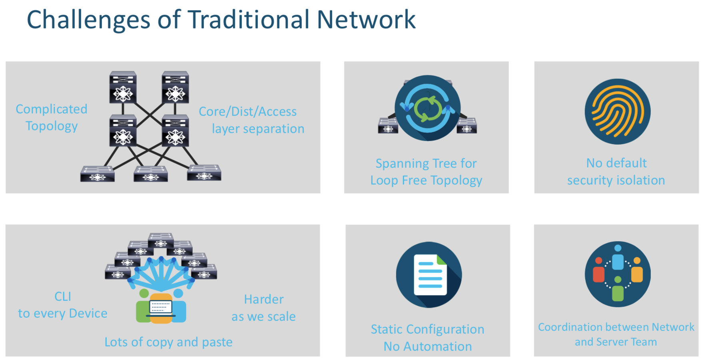

>**ACI solves the above challenges by providing a simple Leaf/Spine Topology, ECMP which removes the dependency on STP and so on an so forth .**

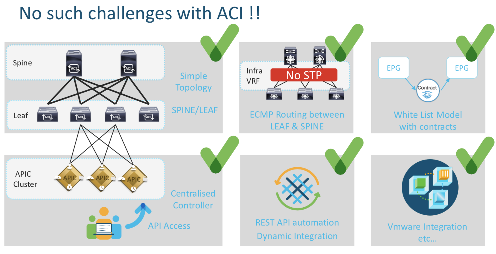

---

### ACI Fabric Discovery Basics

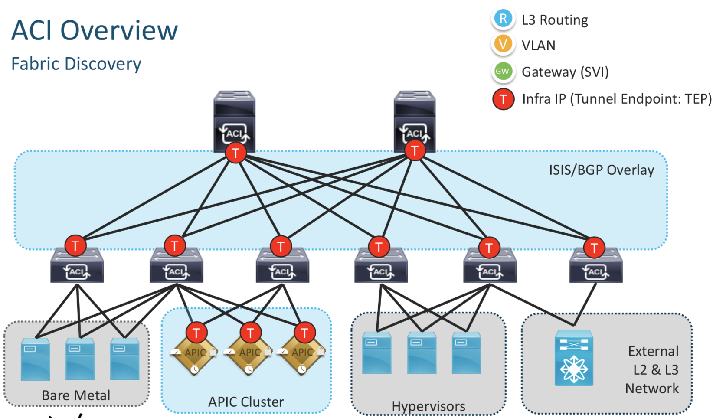

All the internal communication betweek the Spines,Leafs and the APIC happens on the Infra IP Address denoted by red T in the picture above. The reachability provided by this Infra Network is then used to deploy the required L2/L2 config wherever needed on the leafs.

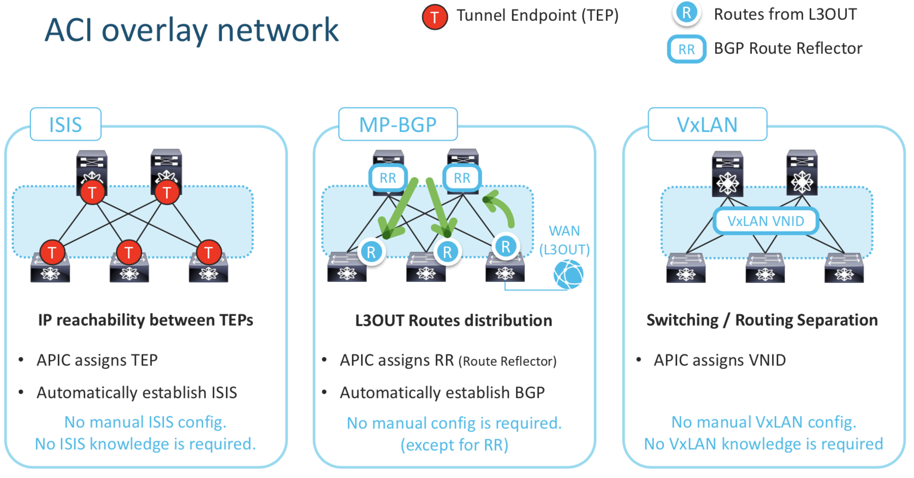

`ISIS` : This enables IP reachability between TEPs , the APIC assigns the TEP address. ISIS is automatically established and requires no configuration.

`MP-BGP` : This is L3 Out Configuration . The routes learned via the WAN (L3 Out in the above pic) needs to be "reflected" / "learnt" by other Leafs. Hence the MP-BGP config.  Note that the no manual config is required except for the the assignment of RR (Route Reflector)

Using the above two components we build the `Underlay Network` which builds as the foundation for the overlay network.

---

### APIC Controlled Basics

**Basic Details about the Ports on the APIC and the the Leafs/Spine**

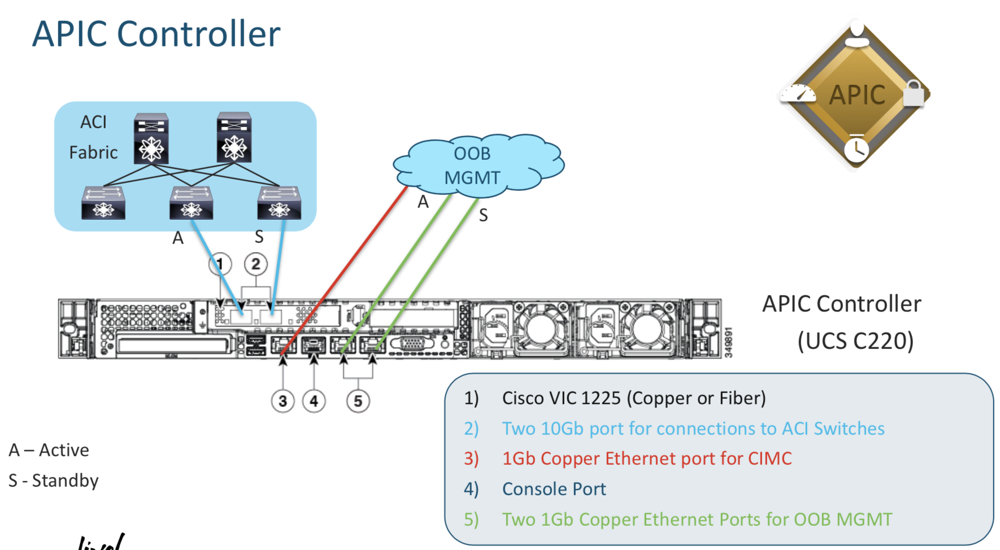

- The Blue cables connect to the Leafs
- The Red cables is the CIMC connection (MGMT)
- The Green Ones are the interfaces on which the Managment Interface of the APIC resides.

> **Irrespective of what APIC IP Address you connect to via HTTP you see the same data**

> Its a good idea to ensure all the controller status are in healthy status while troubleshooting an APIC issue 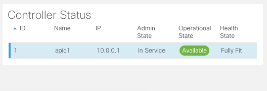

---

# Day 2 - Infrastructure and Policies

---

### Managment Access to Switches

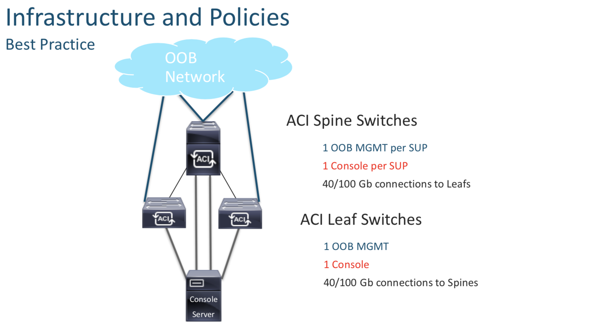

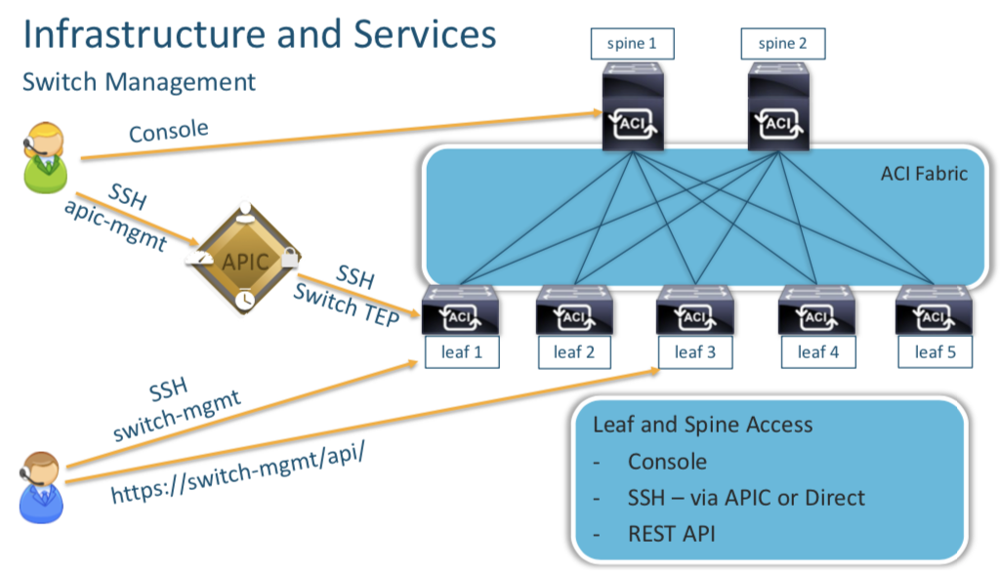

You can access the the Leafs and the Spines using their Console ports on via the APIC (which in turn connects via VTEP addreses). BUT it is advisable to have individual Management IP Addreses assigned to these devices directly (config done after discovery) , so that inc ase we need to access them.

**Each device needs their individual mgmt IP (Oulined above) rechability for AAA and NTP**

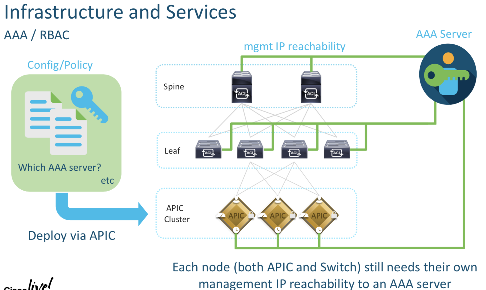

---

### ACI Backups

**There are two ways to do backups**

- Full Backup
- Snapshots

**Capability to compare configuration (Snapshots)**

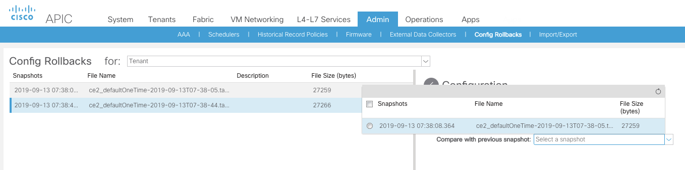

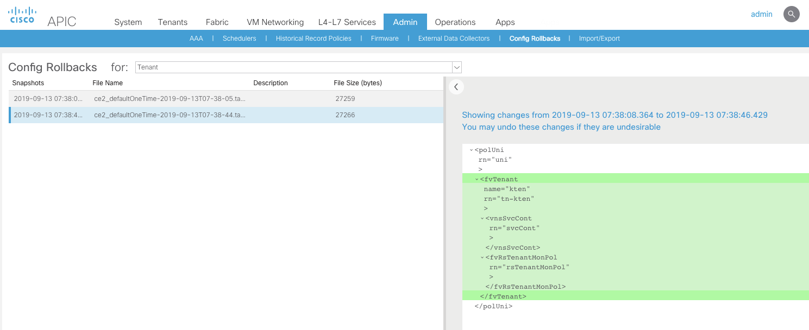

**Full Backup**

Note in the picture below that when , this setting is disabled during the backup ; the passwords stored for VMWare Integration or any third part integration are NOT exported. If its enabled , the password is exported in an encrypted fashion.

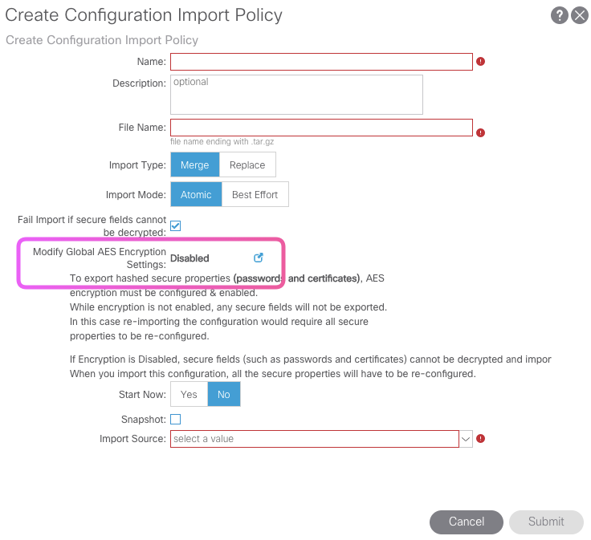

---

**Fabric Policies vs Tenant Policies**

`Fabric Policies` : More about Interfaces , Speeds , LLDP
`Tenant Policies` : Its is more about configuration related to EPG/BD/VRF etc

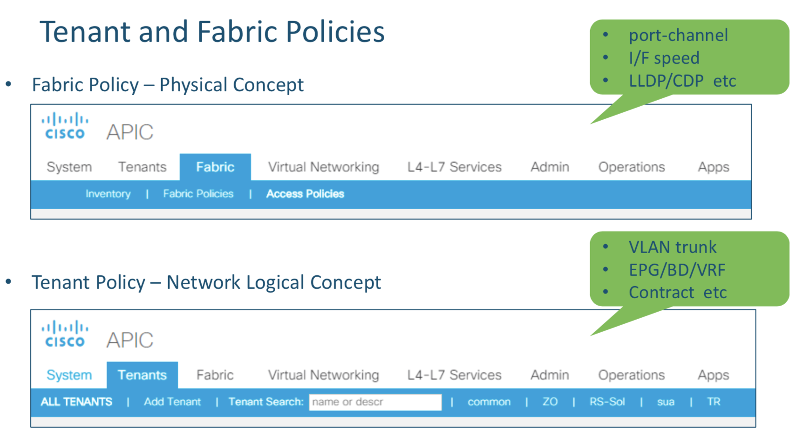

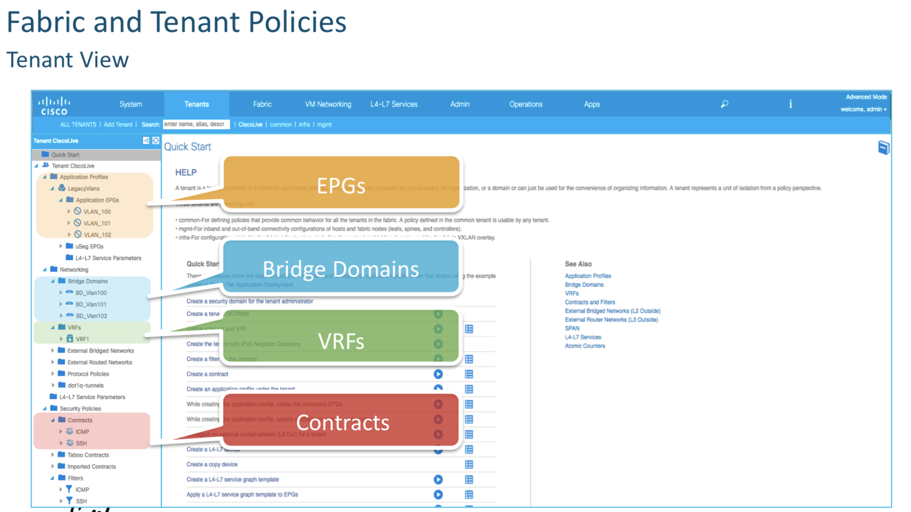

---
## Endpoint
---
**What is an endpoint ?**

It's a combination of MAC address and IP Address.

We can see it on the APIC
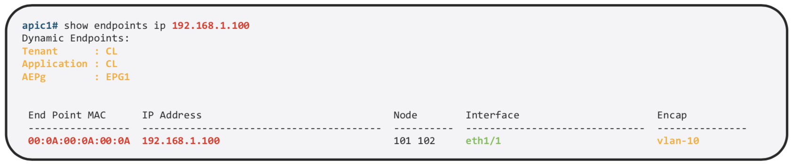

We can find more details about the same on the specific Leaf

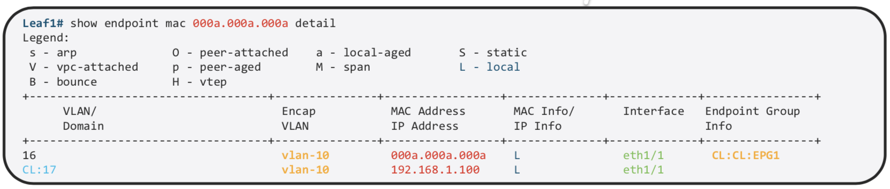

MAC and /32 IP Address are stored in the `Endpoint Table`
Exception is L3 Out , If we use the same mechanism of learnign all the IP Address , on the MAC address on Nexus router we would have thousand of /32.  Other IP Information is used int he Ip Table just as the normal routing. That is the reason why we use arp table for L3 out.

**ACI Leafs Can Learn via ARP via 2 Methods**

ACI Learns the :

- Source MAC and Source IP during ARP
- A routed frame triggers a Source IP and MAC Address Learning

**Pervasive Gateway**

Pervasive gateway means a local gateway residing on every switch for each subnet on that switch.

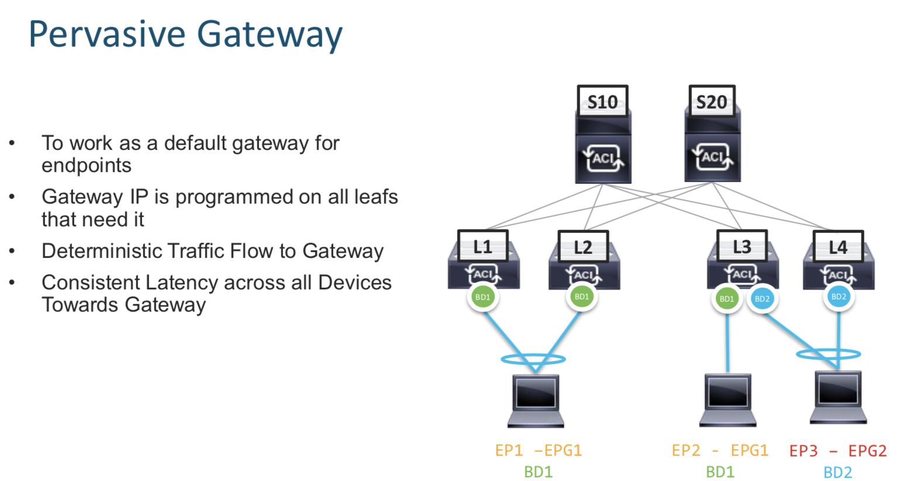

**Proxy Routing**

Every endpoint learn by a Leaf is informed to every spine using multicast. This way every SPINE knows about every endpoint in the network.

When Leafs do not know a path to a remote endpoint , they can query the Spine for the same.

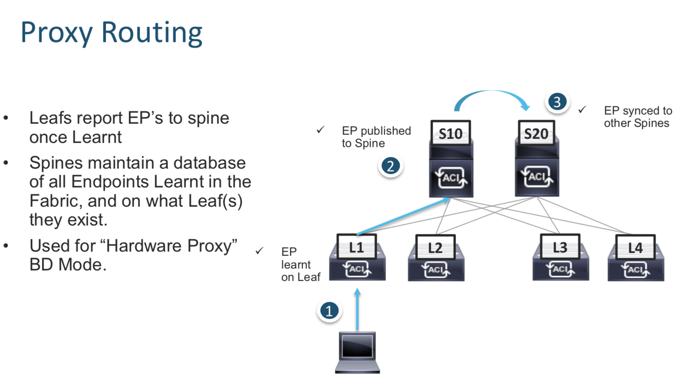

---

---

# Day 3 - Forwarding Overview

---

---

# Day 4 - Network Centric Migrations

---

---

# Day 5 - Multi Location Deployments

---

---

# Day 6 - Troubleshooting Tools

---

---

# Day 7 - Additional Resources

---
