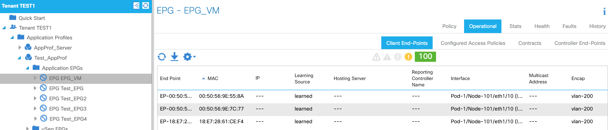
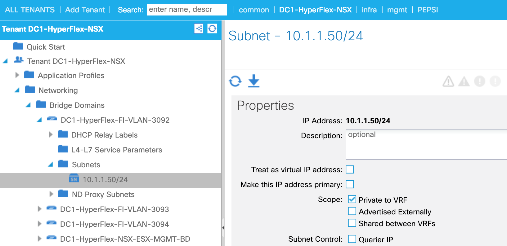
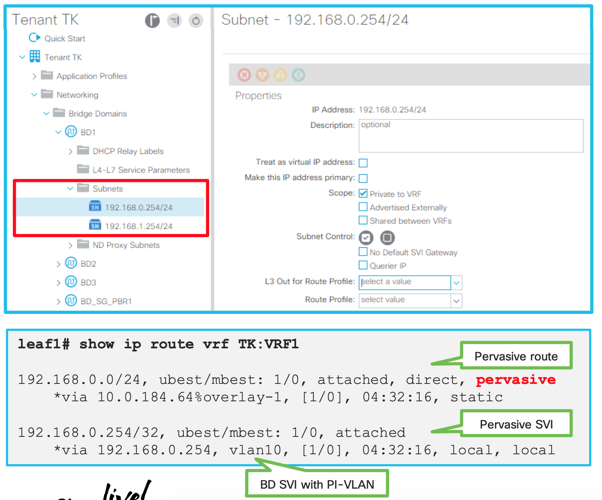
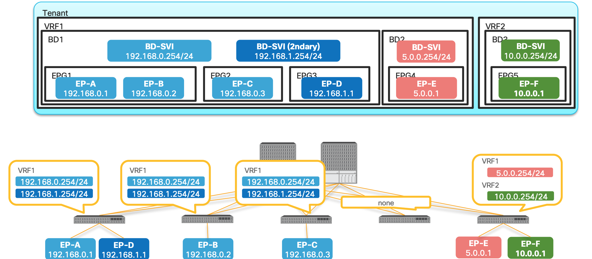
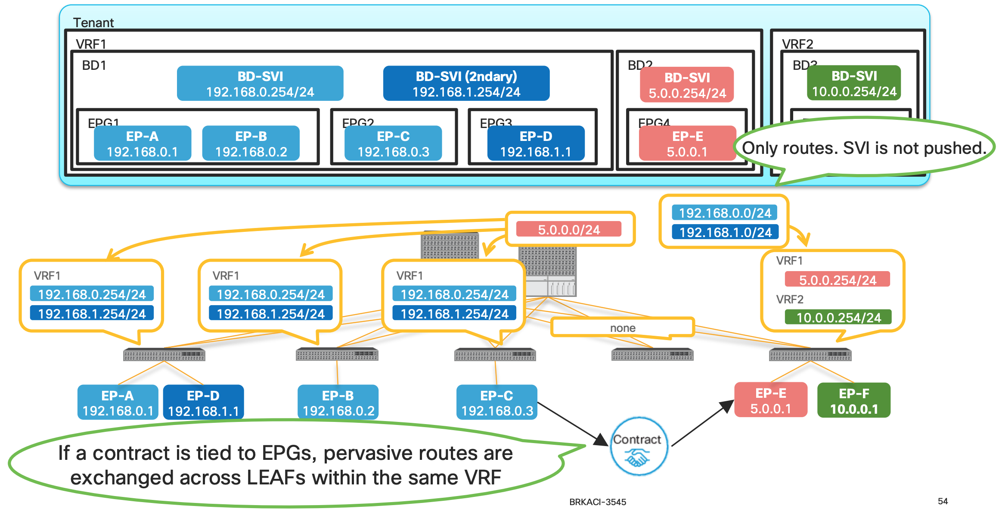

## Endpoint

**What is an endpoint ?**

It's a combination of MAC address and IP Address.

```
##  An example showing a MAC and IP Entry for an endpoint.

LEAF1# show endpoint ip 10.10.217.20
Legend:
 s - arp              O - peer-attached    a - local-aged       S - static
 V - vpc-attached     p - peer-aged        M - span             L - local
 B - bounce           H - vtep
+-----------------------------------+---------------+-----------------+--------------+-------------+
      VLAN/                           Encap           MAC Address       MAC Info/       Interface
      Domain                          VLAN            IP Address        IP Info
+-----------------------------------+---------------+-----------------+--------------+-------------+
31                                           vlan-1    2cd0.2dbd.f242 LaV                       po3
DC2-UCS-N5K-NSX:DC2-ISCSI-VLAN1-VRF          vlan-1     10.10.217.20 LV                        po3
```

MAC and /32 IP Address are stored in the `Endpoint Table`
Exception is L3 Out , If we use the same mechanism of learnign all the IP Address , on the MAC address on Nexus router we would have thousand of /32.  Other IP Information is used int he Ip Table just as the normal routing. That is the reason why we use arp table for L3 out.

**Forwarding Table Lookup Order**

- First : Endpoint Table (`show endpoint`)
- Second : RIB (`show ip route`)


## End Point Group

Endpoint Group is a logical grouping of hosts (EPs). Each EPG belongs to a bridge domain (BD)

EPG is used to implement the filtering with a contract.

EPG is basically a security domain , but EPG is still using VLAN.
So what is VLAN being used for.
VLAN is just an identifier for the EPG

**EPG is not a forwarding domain**.
Bridge Domain is the L2 Forwarding Domain
If its L3 , its the VRF.

**How to check endpoints**

**GUI**



**CLI**

```sh
LEAF1# show endpoint ip 192.168.1.23
Legend:
 s - arp              O - peer-attached    a - local-aged       S - static
 V - vpc-attached     p - peer-aged        M - span             L - local
 B - bounce           H - vtep
+-----------------------------------+---------------+-----------------+--------------+-------------+
      VLAN/                           Encap           MAC Address       MAC Info/       Interface
      Domain                          VLAN            IP Address        IP Info
+-----------------------------------+---------------+-----------------+--------------+-------------+
16                                        vlan-3091    0050.5669.c00b L                        po19
DC1-HyperFlex-NSX:DC1-HyperFlex           vlan-3091      192.168.1.23 L                        po19


LEAF1# show vlan id 16,31 extended

 VLAN Name                             Status    Ports
 ---- -------------------------------- --------- -------------------------------
 16   DC1-HyperFlex-NSX:DC1-HyperFlex- active    Eth1/7, Eth1/21, Eth1/22,
      NSX-AP:DC1-HyperFlex-FI-ESX-               Eth1/40, Po3, Po19, Po21
      MGMT-VLAN-3091
 31   DC2-UCS-N5K-NSX:DC2-UCS-N5K-NSX- active    Eth1/21, Eth1/22, Po3
      AP:DC2-ISCSI-VLAN-1

 VLAN Type  Vlan-mode  Encap
 ---- ----- ---------- -------------------------------
 16   enet  CE         vlan-3091
 31   enet  CE         vlan-1
LEAF1#
```


## VLAN types in ACI

## Endpoint Type

---

## Pervasive Gateway

### **What is pervasive GW for?**
 - **To be a default GW for EPs in the Fabric** , All EPs can have consistent
 gateway IP address one hop away

 - To represent subnets (IP ranges) for a BD.






### **How is pervasive GW deployed? (When no contracts associated)**

- PI-VLAN for BD is used to represent a pervasive GW SVI

- A pervasive SVI has secondary IP when multiple pervasive GWs are configured on
the same BD





1. In the above picture Bridge Domain has multiple EPGs in it.
2. Both Primary and Secondary SVIs are installed on the switches which has EPGs
or Endpoints assigned on those leafs.
3. Leaf 4 does not have any EPs , hence no SVIs
4. EP-E and EP-F are only on 5th Leaf hence the SVIs are only there.

### **How is pervasive GW deployed? (When a contract is associated)**





1. When a contract is associated , the pervasive routes are exchanged.
2. In the above example since the contract are between Endpoint-C and Endpoint-E the Pervasive routes of the Bridge Domain are exchanged between the BD1 and BD2.
3. In this example , the pervasive route `5.0.0.254` is shared to the BD1 and same from BD1 (192.168.0.254 and 192.168.1.254) is shared to the BD2.

**Why are we doing the above exchange of routes ?**


<BR><BR><BR><BR><BR><BR><BR><BR><BR><BR><BR><BR><BR><BR><BR><BR><BR><BR><BR><BR><BR><BR><BR><BR><BR><BR><BR><BR><BR><BR><BR><BR><BR><BR><BR><BR><BR><BR><BR><BR><BR><BR><BR><BR><BR><BR><BR><BR><BR><BR><BR><BR><BR><BR><BR><BR><BR>
