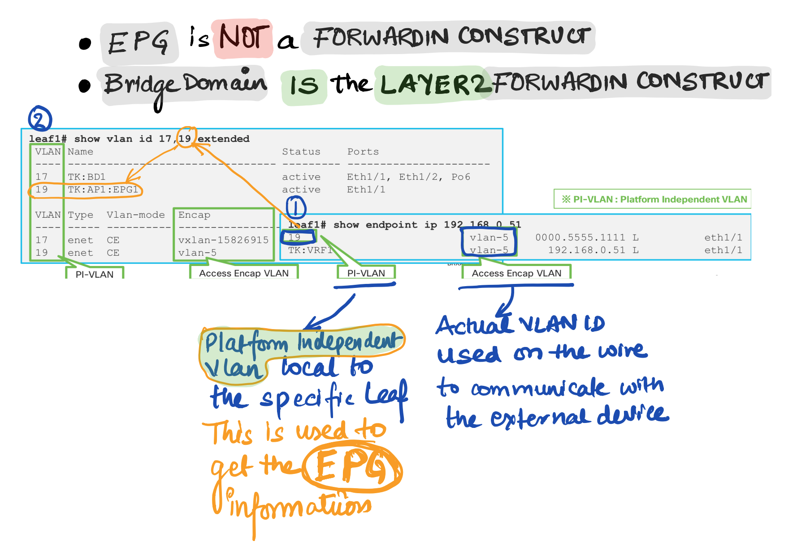
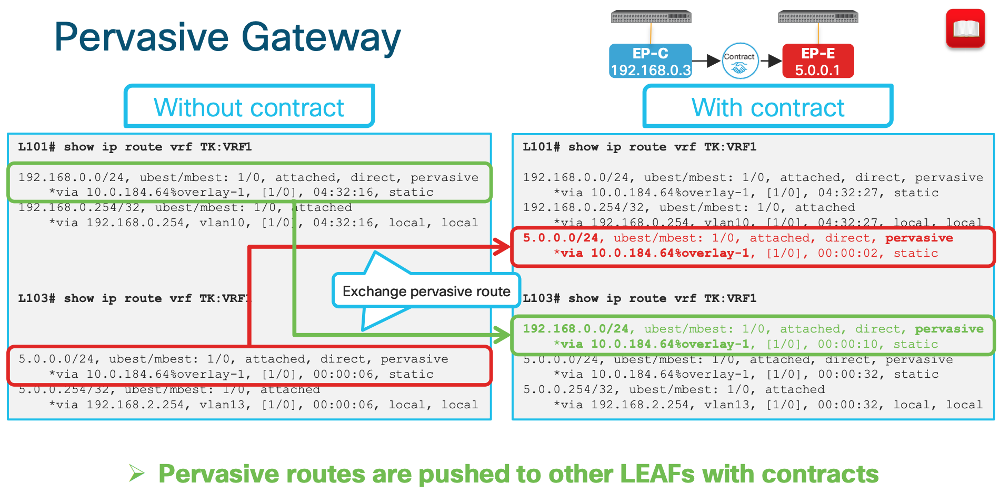
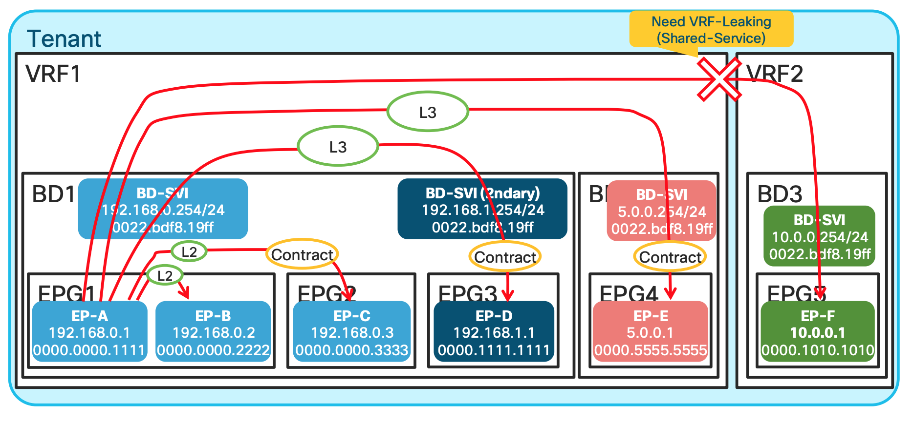

# Write an overall learning summary and path here.

1. **Learning notes from BRKACI-3545 Ciscolive Session**
2. Read `https://www.cisco.com/c/en/us/solutions/collateral/data-center-virtualization/application-centric-infrastructure/white-paper-c11-739989.html`

---
## Endpoint
---
**What is an endpoint ?**

It's a combination of MAC address and IP Address.

```
##  An example showing a MAC and IP Entry for an endpoint.

LEAF1# show endpoint ip 10.10.217.20
Legend:
 s - arp              O - peer-attached    a - local-aged       S - static
 V - vpc-attached     p - peer-aged        M - span             L - local
 B - bounce           H - vtep
+-----------------------------------+---------------+-----------------+--------------+-------------+
      VLAN/                           Encap           MAC Address       MAC Info/       Interface
      Domain                          VLAN            IP Address        IP Info
+-----------------------------------+---------------+-----------------+--------------+-------------+
31                                           vlan-1    2cd0.2dbd.f242 LaV                       po3
DC2-UCS-N5K-NSX:DC2-ISCSI-VLAN1-VRF          vlan-1     10.10.217.20 LV                        po3
```

MAC and /32 IP Address are stored in the `Endpoint Table`
Exception is L3 Out , If we use the same mechanism of learnign all the IP Address , on the MAC address on Nexus router we would have thousand of /32.  Other IP Information is used int he Ip Table just as the normal routing. That is the reason why we use arp table for L3 out.

**Forwarding Table Lookup Order**

- First : Endpoint Table (`show endpoint`)
- Second : RIB (`show ip route`)




---
## End Point Group
---

Endpoint Group is a logical grouping of hosts (EPs). Each EPG belongs to a bridge domain (BD)

EPG is used to implement the filtering with a contract.

EPG is basically a security domain , but EPG is still using VLAN.
So what is VLAN being used for.
VLAN is just an identifier for the EPG

**EPG is not a forwarding domain**.
Bridge Domain is the L2 Forwarding Domain
If its L3 , its the VRF.

**How to check endpoints**

**GUI**


**CLI**

```sh
LEAF1# show endpoint ip 192.168.1.23
Legend:
 s - arp              O - peer-attached    a - local-aged       S - static
 V - vpc-attached     p - peer-aged        M - span             L - local
 B - bounce           H - vtep
+-----------------------------------+---------------+-----------------+--------------+-------------+
      VLAN/                           Encap           MAC Address       MAC Info/       Interface
      Domain                          VLAN            IP Address        IP Info
+-----------------------------------+---------------+-----------------+--------------+-------------+
16                                        vlan-3091    0050.5669.c00b L                        po19
DC1-HyperFlex-NSX:DC1-HyperFlex           vlan-3091      192.168.1.23 L                        po19


LEAF1# show vlan id 16,31 extended

 VLAN Name                             Status    Ports
 ---- -------------------------------- --------- -------------------------------
 16   DC1-HyperFlex-NSX:DC1-HyperFlex- active    Eth1/7, Eth1/21, Eth1/22,
      NSX-AP:DC1-HyperFlex-FI-ESX-               Eth1/40, Po3, Po19, Po21
      MGMT-VLAN-3091
 31   DC2-UCS-N5K-NSX:DC2-UCS-N5K-NSX- active    Eth1/21, Eth1/22, Po3
      AP:DC2-ISCSI-VLAN-1

 VLAN Type  Vlan-mode  Encap
 ---- ----- ---------- -------------------------------
 16   enet  CE         vlan-3091
 31   enet  CE         vlan-1
LEAF1#
```

---
## VLAN types in ACI
---

---
## Endpoint Type
---


<BR><BR>

---
## PERVASIVE GATEWAY
---


### **What is pervasive GW for?**
 - **To be a default GW for EPs in the Fabric** , All EPs can have consistent
 gateway IP address one hop away

 - To represent subnets (IP ranges) for a BD.


### **How is pervasive GW deployed? (When no contracts associated)**

- PI-VLAN for BD is used to represent a pervasive GW SVI

- A pervasive SVI has secondary IP when multiple pervasive GWs are configured on
the same BD


1. In the above picture Bridge Domain has multiple EPGs in it.
2. Both Primary and Secondary SVIs are installed on the switches which has EPGs
or Endpoints assigned on those leafs.
3. Leaf 4 does not have any EPs , hence no SVIs
4. EP-E and EP-F are only on 5th Leaf hence the SVIs are only there.

### **How is pervasive GW deployed? (When a contract is associated)**


1. When a contract is associated , the pervasive routes are exchanged.
2. In the above example since the contract are between Endpoint-C and Endpoint-E the Pervasive routes of the Bridge Domain are exchanged between the BD1 and BD2.
3. In this example , the pervasive route `5.0.0.254` is shared to the BD1 and same from BD1 (192.168.0.254 and 192.168.1.254) is shared to the BD2.

**Why are we doing the above exchange of routes ?**

This is the key to understand how the ACI is doing **Spine-Proxy**
**Why does ACI push pervasive routes to other LEAFs after a contract?**
Pervasive routes are required for Spine-Proxy

Let's understand it better :

  **What is a Spine Proxy**


  

A leaf switch has two types of endpoints: `local endpoints` and `remote endpoints`. Local endpoints for LEAF1 reside directly on LEAF1 (For example, directly attached), whereas remote endpoints for LEAF1 reside on other leaf endpoints (picture above).

Although both local and remote endpoints are learned from the data plane, remote endpoints are merely a cache, local to each leaf. Local endpoints are the main source of endpoint information for the entire Cisco ACI fabric. **Each leaf is responsible for reporting its local endpoints to the Council Of Oracle Protocol (COOP) database, located on each spine switch**, which implies that all endpoint information in the Cisco ACI fabric is stored in the spine COOP database. **Because this database is accessible, each leaf does not need to know about all the remote endpoints to forward packets to the remote leaf endpoints**. Instead, **a leaf can forward packets to spine switches, even if the leaf does not know about a particular remote endpoint. This forwarding behavior is called `S P I N E - P R O X Y`.**

Now coming back to the question of **Why does ACI push pervasive routes to other LEAFs after a contract?**

###Without the pervasive route:


| WITHOUT Pervasive Route | WITH Pervasive Route   |
|---|---|
| In the below example since there is no pervasive route the communication will not happen with EP-E from EP-C | In this case with the SPINE Proxy route EP-C can send the traffice to SPINE since it knows the path is via SPINE   |
|   |   |


###This is what the outputs looks like in CLI when the contract is applied:



---
## ACI Forwarding Scope Concepts
---

This is one of the best slides showing the communication scenarios and whether its switched or routed. Look at the detailed explanation below:



1. `EP-A talking to EP-B` : In this scenario , since both EPGs are in the same subnet and same L2 domain the traffic is Layer 2 Switched.
2. `EP-A talking to EP-C` : Same Bridge domain but differen EPG , and has a contract , still L2 switched.
3. `EP-A talking to EP-D` : Same BD , but different subnet ; hence L3 routed.
4. `EP-A talking to EP-E` : Different BD and different network hence L3 switched.
5. `EP-A talking to EP-F` : Differen VRF , unless route leaking is implemented no traffic communication happens.


<BR><BR><BR><BR><BR><BR><BR><BR><BR><BR><BR><BR><BR><BR><BR><BR><BR><BR><BR><BR><BR><BR><BR><BR><BR><BR><BR><BR><BR><BR><BR><BR><BR><BR><BR><BR><BR><BR><BR><BR><BR><BR><BR><BR><BR><BR><BR><BR><BR><BR><BR><BR><BR><BR><BR><BR><BR>
---
END
---
