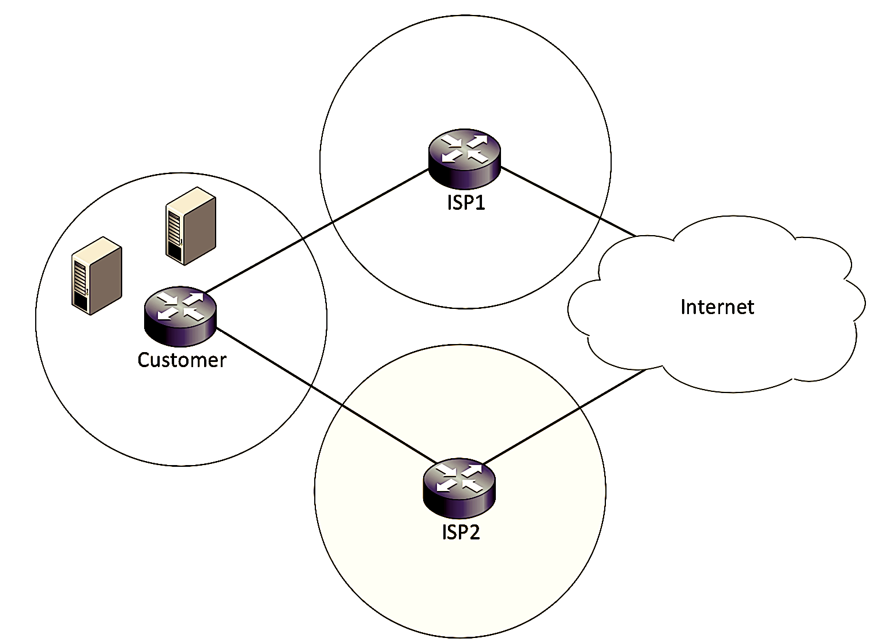
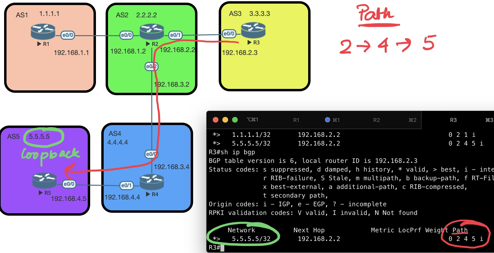
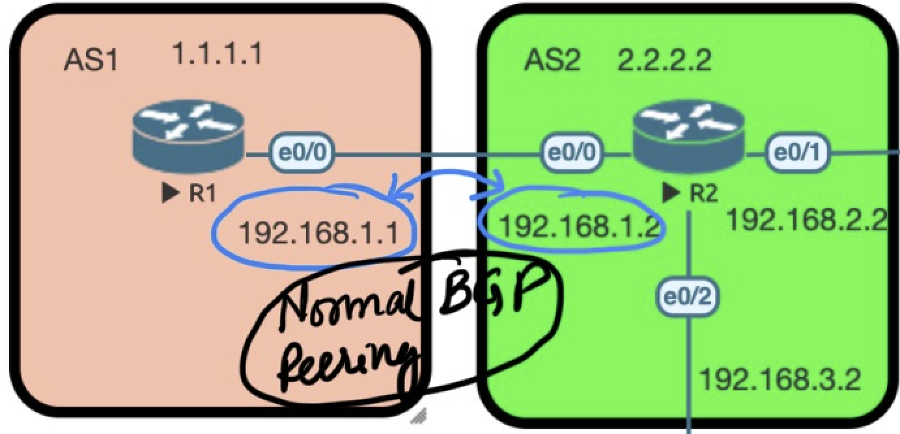
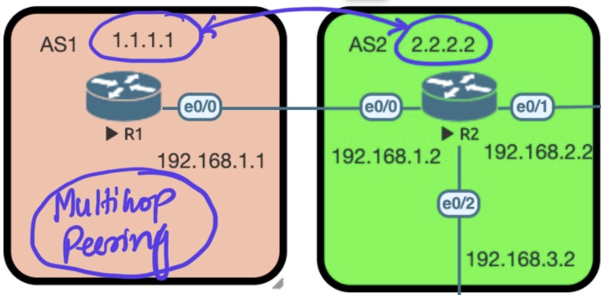
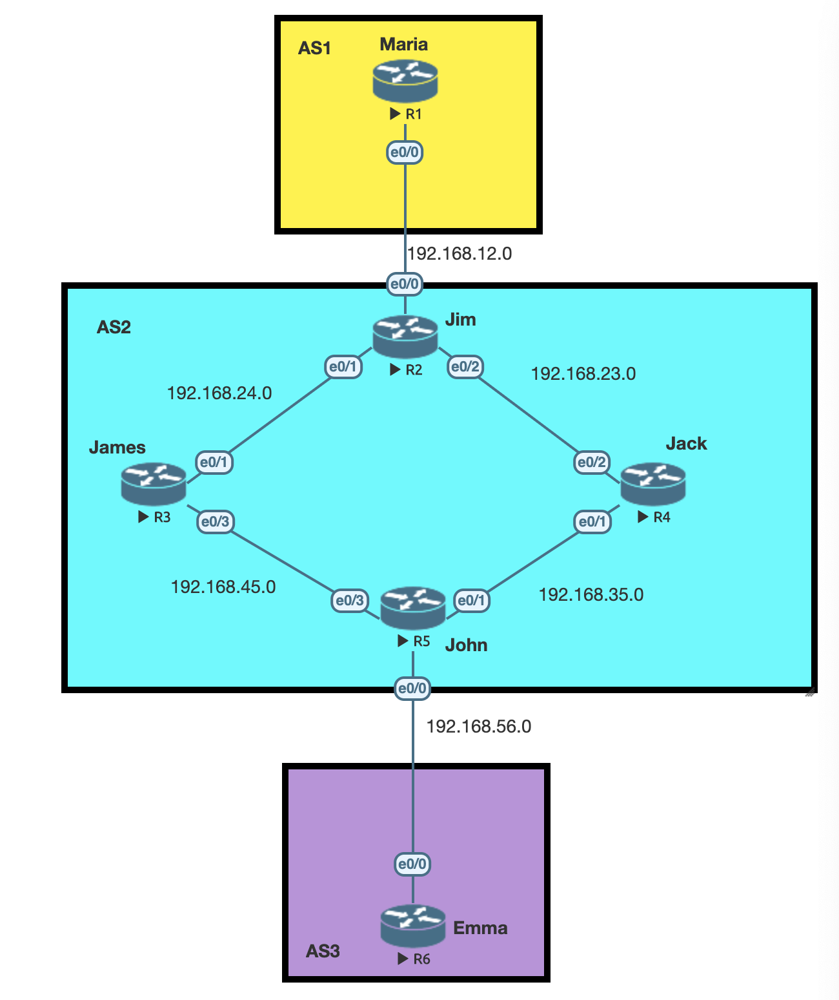
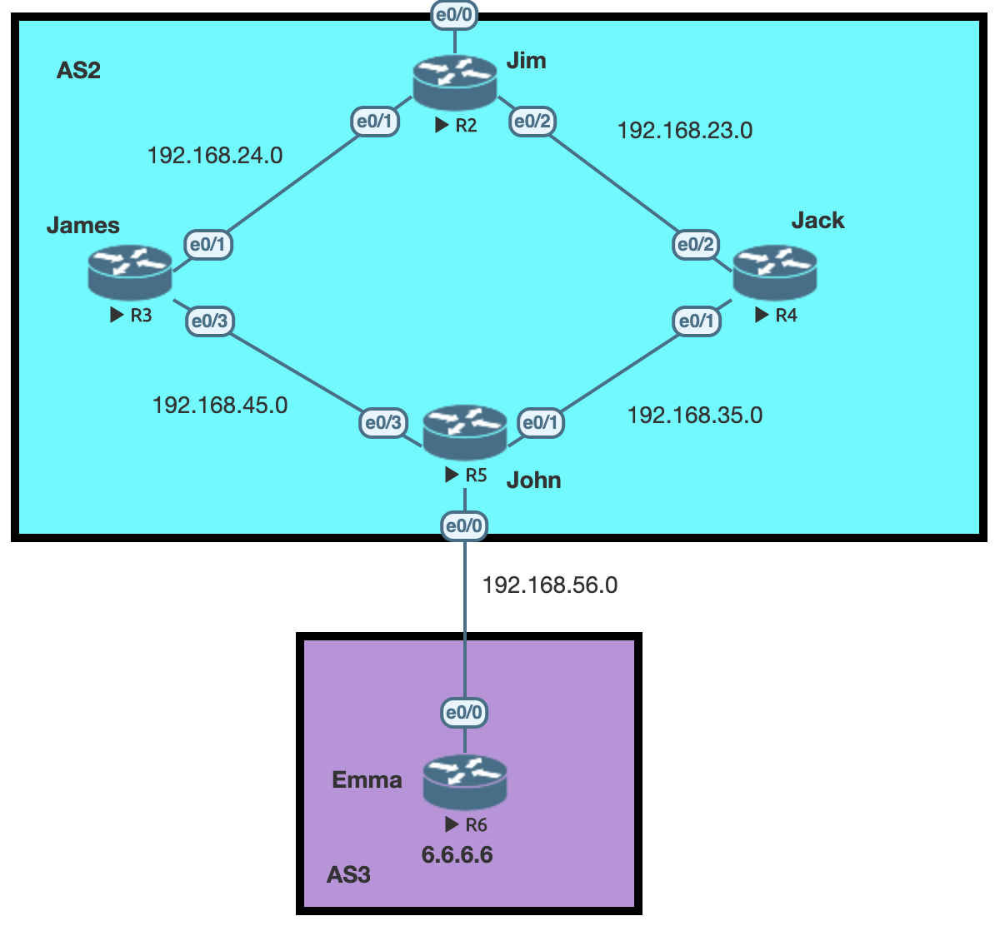
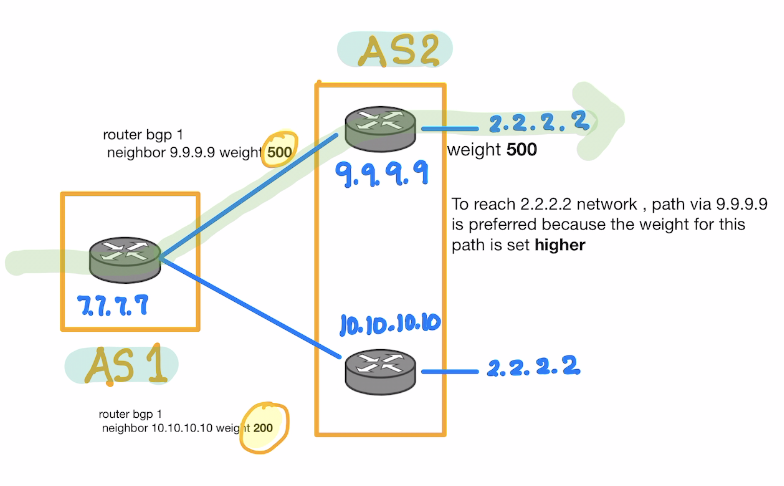
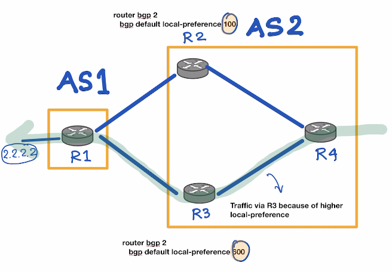

- [About BGP](#about-bgp)
		- [Why do we call BGP a path-vector routing protocol?](#why-do-we-call-bgp-a-path-vector-routing-protocol)

	- [BGP States during Connection](#bgp-states-during-connection)
- [What is ebgp-multihop](#what-is-ebgp-multihop)

- [Why do we need Internal BGP (iBGP) !](#why-do-we-need-internal-bgp-ibgp)
	- [How to Debug Interesting Packet :](#how-to-debug-interesting-packet-)


> `RIP`, `OSPF` and `EIGRP` are all different but they have one thing in common; they want to find the shortest path to the destination
> <span style="color:blue">There is only one routing protocol we currently use on the Internet which is BGP.


  > **`BGP` unlike other protocols , is about how the world reaches out to us.**

Take a look at the picture below.


**Lets say we `CUSTOMER` has a few Web servers which are accessible on Public IP Addresses.**
- This Public IP Address if allocated by `ISP1` will make the traffic always come via `ISP1`
- The above holds true for `ISP2`
- We have no control on how people on the internet come to us.

>**This is where we have our `OWN IP Address` space allocated a `BGP` ASN which can be `advertised` to both ISPs**


## About BGP


An `AS` is a collection of networks under a **single administrative** domain. The Internet is nothing more but a bunch of autonomous systems that are connected to each other. Within an autonomous system we use an IGP like OSPF or EIGRP. For routing between the different autonomous systems we use an EGP (external gateway protocol). The only EGP we use nowadays is BGP.

> `Autonomous system` numbers are 16-bit which means we have AS 1 up to 65535. There’s also a **private range (64512 – 65535)** you can use for non-internet usage. Since January 2009 we can also use 32-bit numbers for autonomous systems.

`BGP` has two flavors:
- **`External BGP`**: between autonomous systems
- **`Internal BGP`**: within the autonomous system.

External BGP is to exchange routing information between the different autonomous

Again, in the above picture ; the ISPs (ISP1 and ISP2) can provide us one of the following :

- `Default Route`: A default route to the customer pointing it to the ISP router. In this case customer network has zero visibility of what's on the internet and cannot take intelligent routing decisions itself.
- `Default Route and Partial Routing Table` : A default route along with the the networks know to the ISP are advertised to the `Customer`. This case is better than the `Default Route` only option as we know little more than before.
- `Full Routing Table`: This is the best case option , but know that this requires a lot of CPU and power on the customer router.

### Why do we call BGP a path-vector routing protocol?

<span style="color:blue">In the BGP routing table , instead of just the next hop for a specific network like other protocol (EIGRP, OSPF) we have the path (denoted by AS numbers).

Lets take a look at what the above statement means :

In the example below ; we are on `R3` and looking at the routing table on how to reach `1.1.1.1` which is on `R1`. As you can see the `PATH` on `R3` lists out the `AS` numbers in sequence it is going through for `1.1.1.1`


Lets look at another example below ; we are on again `R3` and looking at the routing table on how to reach `5.5.5.5` which is on `R5`. As you can see the `PATH` on `R3` lists out the `AS` numbers in sequence it is going through for `5.5.5.5`



```sh
#R1
router bgp 1
 neighbor 192.168.1.2 remote-as 2 # First you configure the Remote AS
 network 1.1.1.1 mask 255.255.255.255 # Second you adverstise the Route into BGP

#R2
router bgp 2
 bgp log-neighbor-changes
 neighbor 192.168.1.1 remote-as 1
 neighbor 192.168.2.3 remote-as 3
 neighbor 192.168.3.4 remote-as 4

...

```


> BGP uses TCP port 179


### BGP States during Connection
Here are all the **BGP states** that we have:

- `Idle`: BGP process has been shutdown or it is waiting for the next retry.
- `Connect`: BGP is waiting for the TCP connection to complete.
- `Active`: TCP connection is ready but no BGP messages have been sent yet.
- `Opensent`: Open message has been sent but we didn’t receive one yet from the
neighbor.
- `Openconfirm`: Open message has been sent and received from the other side.
- `Established`: All parameters match, we have a working BGP peering and we can
exchange update messages with routing information.


### What is ebgp-multihop

| Direct Peering   |  EBGP Multihop Peering |
|---|---|
|      |    |

> BGP by defauly has a TTL of 1 becuase of which we have to increase it when the number of hops increase. **<span style="color:blue">Notice that the increase in TTL is only required in `eBGP` and NOT required in `iBGP`**

You know from the above exercises that peering between `R1` and `R2` can be directly done with the following:

```sh
# R1
router bgp 1
 neighbor 192.168.1.2 remote-as 2 # First you configure the Remote AS
 network 1.1.1.1 mask 255.255.255.255 # Second you adverstise the Route into BGP

# R2
router bgp 2
 neighbor 192.168.1.1 remote-as 1
...

```

**But instead of using the directly connected interface IP address for neighbors , you can alternatively use the loopback address of the router** as the neighbor address. Lets see in the below example how.

```sh
# R1

ip route 2.2.2.2 255.255.255.255 192.168.1.2 # First point how to reach to 2.2.2.2

router bgp 1
 neighbor 2.2.2.2 remote-as 2 # Second you configure the Remote AS
 neighbor 2.2.2.2 update-source loopback 0 # Third you define the source interface where the packets would originate from
 neighbor 2.2.2.2 ebgp-multihp 2 # Fourth you increase the TTL to 2
 network 1.1.1.1 mask 255.255.255.255 # FInally you adverstise the Route into BGP

# R2

ip route 1.1.1.1 255.255.255.255 192.168.1.1 # First point how to reach to 1.1.1.1


router bgp 2
 neighbor 1.1.1.1 remote-as 2 # Second you configure the Remote AS
 neighbor 1.1.1.1 update-source loopback 0 # Third you define the source interface where the packets would originate from
 neighbor 1.1.1.1 ebgp-multihp 2 # Fourth you increase the TTL to 2
...

```


### Why do we need Internal BGP (iBGP)!




**Step 1.** eBGP (Between two different AS) is configured between `AS1 and AS2`  AND `AS3 and AS2`.

**Step 2.** A local route 6.6.6.6 is created on R6 and the goal is for this route to show up in R1's routing table.

**Step 3.** For that we need to configure iBGP between R5 and R2.

**Step 4.** Cant configure direct iBGP neighbourship between R5 and R2 as they can reach each other yet (no routing)

**Step 5.** OSPF between R2 , R3 , R4 , R5 is configured to get the path set between R5 and R2.

**Step 6.** Now instead of BGP peering on physical interfaces we create loopback interfaces on R5 and R2 for peering.

- **Step a.** When we do the above it look like the following:
  Notice the **`BGP AS number`** and the **`remote-as`** are same! (iBGP!)
	```sh
	R2(config)#router bgp 2
	R2(config-router)#neighbor 5.5.5.5 remote-as 2

	R5(config)#router bgp 2
	R5(config-router)#neighbor 2.2.2.2 remote-as 2
	```

- **Step b.** Configure the main settings when you source bgp via a loopback interface

	```sh
	 neighbor x.x.x.x update-source loopback 0 # You define the source interface where the packets would originate from
	```

- **Step 7.** After Step 6 is completed the path of 6.6.6.6 is visible in the BGP table of R2 **BUT** it cannot reach it. Notice the difference below with `* i` and `*>`

	- **`* i`** Mean's that BGP is aware of the route but it is not installed in the routing table ; so it cann't be reached. In R2's case look that the next-hop its `192.168.56.6` , R2 does not know the path to `192.168.56.6` (The OSPF we configure earlier wasn't for this anyway)

	- **`*>`** Means's that the route is known and it is installed in the routing table and CAN be reached ! R5 knows about `192.168.56.6` as its was advertised via the prior eBGP configuration .

	```sh
	R2#sh ip bgp
	BGP table version is 1, local router ID is 2.2.2.2
	     Network          Next Hop            Metric LocPrf Weight Path
	 * i  6.6.6.6/32       192.168.56.6             0    100      0 3 i
	```

	```sh
	R5#sh ip bgp
	BGP table version is 2, local router ID is 5.5.5.5
	     Network          Next Hop            Metric LocPrf Weight Path
	 *>   6.6.6.6/32       192.168.56.6             0             0 3 i
	```

- **Step 8.** Now we will add the networks `192.168.56.6` and `192.168.12.0` in to the BGP for AS2

	```sh
	R2(config)#router bgp 2
	R2(config-router)#network 192.168.12.0 mask 255.255.255.0

	R5(config)#router bgp 2
	R5(config-router)#network 192.168.56.0 mask 255.255.255.0
	```

- **Step 9.** Righ after we configure the above the route to 6.6.6.6 becomes active on R2!

	```sh
	R2#sh ip bgp
	BGP table version is 7, local router ID is 2.2.2.2
	Status codes: s suppressed, d damped, h history, * valid, > best, i - internal,
	              r RIB-failure, S Stale, m multipath, b backup-path, f RT-Filter,
	              x best-external, a additional-path, c RIB-compressed,
	              t secondary path,
	Origin codes: i - IGP, e - EGP, ? - incomplete
	RPKI validation codes: V valid, I invalid, N Not found

	     Network          Next Hop            Metric LocPrf Weight Path
	 *>i  6.6.6.6/32       192.168.56.6             0    100      0 3 i
	 *>   192.168.12.0     0.0.0.0                  0         32768 i
	 *>i  192.168.56.0     5.5.5.5                  0    100      0 i
	```

- **Step 10.** Now , at this stage the output says that `6.6.6.6` can be reached via the next hop `192.168.56.6` ; so how do we reach `192.168.56.6` ?

	```sh
	R2#sh ip route  | inc 56.0
	B     192.168.56.0/24 [200/0] via 5.5.5.5, 00:04:29
	R2#sh ip route 5.5.5.5
	Routing entry for 5.5.5.5/32
	  Known via "ospf 1", distance 110, metric 21, type intra area
	  Last update from 192.168.23.4 on Ethernet0/2, 00:54:34 ago
	  Routing Descriptor Blocks:
	  * 192.168.24.3, from 5.5.5.5, 00:54:34 ago, via Ethernet0/1
	      Route metric is 21, traffic share count is 1
	    192.168.23.4, from 5.5.5.5, 00:54:34 ago, via Ethernet0/2
	      Route metric is 21, traffic share count is 1
	```

- **Step 11.** As we can see in the above output the path to reach 6.6.6.6 is via R3 or R4 . Now lets say the packet reaches R3 or R4 ; do R3 or R4 know about the destination `6.6.6.6`.

	```sh
	R3#sh ip route 6.6.6.6
	% Network not in table
	```

	```sh
	R4#sh ip route 6.6.6.6
	% Network not in table
	```

> **Key Learning Objective with this : Even if the path is known and is in the routing table its NOT reachable , this is unlike other routing protocols!**

---
### BGP Loop Prevention
**`BGP Loop Prevention`** : *<span style="color:blue">If you see your own AS number in the AS path you don’t accept it since <span style="color:red">it means there is a loop.*

Ok so ; with the **above logic** how would loop be prevented in case of `iBGP` **?**

```sh
R2(config)#router bgp 2
R2(config-router)#neighbor 5.5.5.5 remote-as 2
```

**We have all the routers in the the same AS!** The solution is simple:

> <span style="color:blue">When a BGP router receives an update from another internal BGP router **<span style="color:red">it will not forward this information to another internal BGP router**. This is called BGP **<span style="color:blue">`split-horizon`**.

---




**Continuing the topic of loop prevention** , lets understand the same in our example :

1. `R5` knows about the network `6.6.6.6` as it learned it from eBGP ( between two different AS)
2. An `iBGP` session was set between `R2` and `R5` so that network behind `R2` can reach `6.6.6.6`
3. `R2` learn about `6.6.6.6` , but never installs it in the routing table as th next hop `192.168.56.0` network isn't reachable (no distributed in the OSPF area intentionally)
4. Now if we set `iBGP` relationship between `R2` - `R3` OR `R2` -`R4` .  Neither `R3` nor `R4` will learn the `6.6.6.6` route from `R2` and `R2` is not going to advertise it to them [Becuase of split-horizon]

**<span style="color:blue">So, basically a full mesh have to be configured in iBGP peers</span>**

---

### next-hop-self

The default next hop behavior of BGP is different than any IGP. **Internal BGP does not change the next hop IP address.**

In the above example for `R5` , 6.6.6.6 is reachable via 192.168.56.6 ; **Now when `R5` advertises this route to `R3` ; it <span style="color:red">DOES NOT</span> change the next hop!**

As long as `R5` knows about the path to the advertised next-hop in this case 192.168.56.6 ; its fine.

**But** , if you would like to change this behaviour ; you use the command :

```sh
R5(config)#router bgp 2
R5(config-router)#neighbor 4.4.4.4 next-hop-self
R5(config-router)#neighbor 3.3.3.3 next-hop-self
```
With the above configuration

```sh
R3#show ip route bgp | include 6.6.6.0
B 6.6.6.0 [200/0] via 5.5.5.5, 00:00:37
```

Notice how the next hop has changed to R5 itself ; which looked like the following before the change:

```sh
R3#show ip route bgp | include 6.6.6.0
B 6.6.6.0 [200/0] via 192.168.56.6, 00:00:37
```

### BGP Attribute and Path Selection

In the BGP table we see multiple path to the same destination.

> In the example below we have multiple paths to the 6.6.6.6 network shown


	R2#sh ip bgp
	BGP table version is 7, local router ID is 2.2.2.2
	Status codes: s suppressed, d damped, h history, * valid, > best, i - internal,
	              r RIB-failure, S Stale, m multipath, b backup-path, f RT-Filter,
	              x best-external, a additional-path, c RIB-compressed,
	              t secondary path,
	Origin codes: i - IGP, e - EGP, ? - incomplete
	RPKI validation codes: V valid, I invalid, N Not found

	     Network          Next Hop            Metric LocPrf Weight Path
	 *i  6.6.6.6/32        192.168.56.6             0    100      0 3 i
	 *   		       192.168.12.0             0         32768 i
	 *>i       	       192.168.56.0             0    100      0 i

As a reminder **only the path with the `>` is entered in the routing table**. As per BGP that is the best path. Other routes staty in the BGP table.

Why did BGP select the above path as the the best one :

|  **Priority** | **Attrribute**   |
|---|---|
| 1  |  `Weight (highest)` |
| 2  |  `Local Preference (Highest)` |
| 3 | `Originate (Local Originate)`  |
| 4  | `AS Path (shortest)`  |
| 5  | `Origin Code (IGP < EGP < Incomplete)`  |
| 6  | `MED (lowest)`  |
| 7  | `Paths (External preffered over internal)`  |
| 8 |  `Router ID` |

### Weight

In the example below , we configure different weights on the router `7.7.7.7` to the path `2.2.2.2` reachable via 2 different paths.  The path via `9.9.9.9` is choosed becase the weight toward this neighbor is set to `500` which more than the other link :



```sh
router bgp 1
 neighbor 9.9.9.9 weight 500
```

#### route-maps

Now in the above example lets say with 2.2.2.2 network there were more networks behind AS2 , example 3.3.3.3 or 4.4.4.4.
How do we selectively increase choose the path for a specific network prefix ?

```sh
router bgp 1
 no neighbor 9.9.9.9 weight 500
```

```sh

!Create route-map to selectively set the weight for interested traffic

route-map SETWEIGHT permit 10
 match ip address 10
 set weight 400
 exit
route-map SETWEIGHT permit 20
 set weight 0
 exit
access-list 10 permit 3.3.3.3 0.0.0.255

!BGP Config
router bgp 1
 neightbor 9.9.9.9 route-map SETWEIGHT in
```

### Local Preference

A  `local-prefrence` is respected within an AS (iBGP)
It is exhnaged between all iBGP routers.

In the example below for the path from R4 to 2.2.2.2 we chnages the local-preference on R3 , which increase its local preference from a default of 100 to 600 and hence the path via it is preffered.





A local preference can be set at the BGP level


Or slectively via route-maps
```sh
route-map SETWEIGHT permit 10
 match ip address 10
 set local-preference 600
 exit
```


-------------------------------
