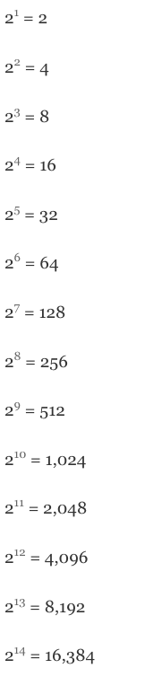
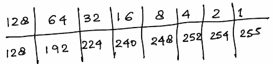
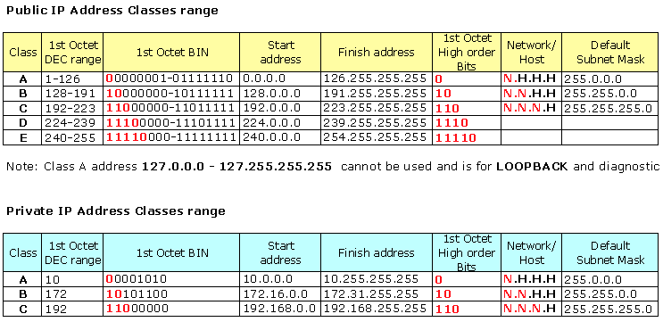
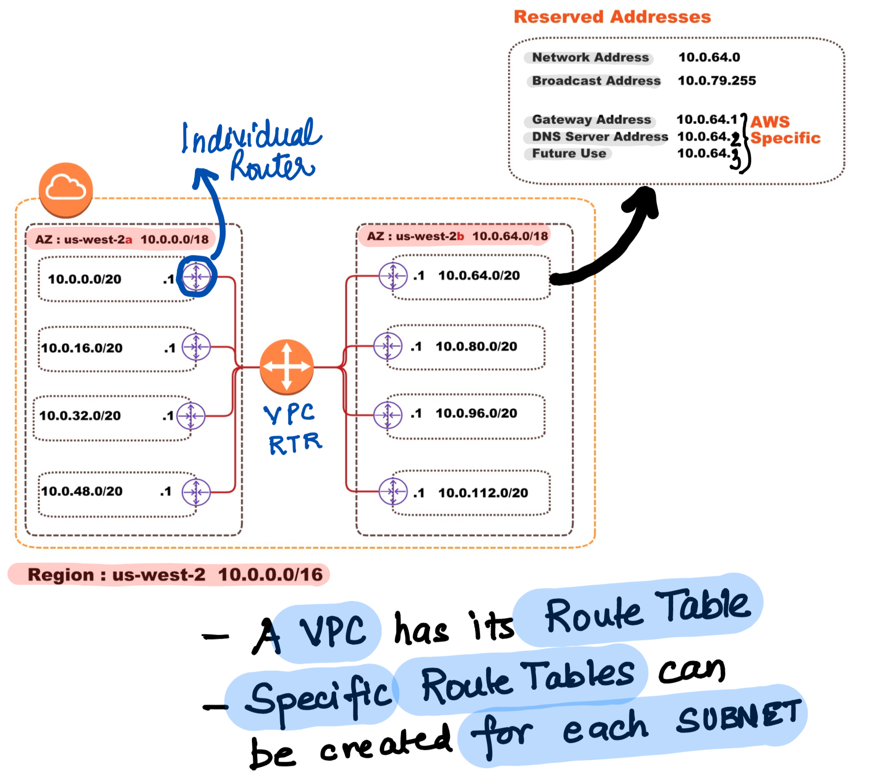
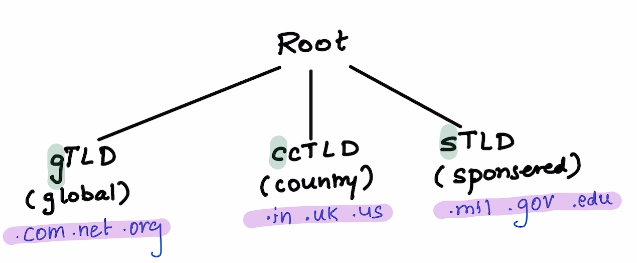
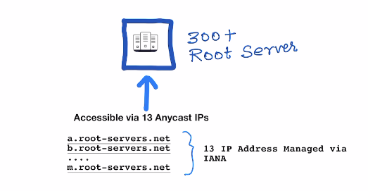

### To be done

> - Labbing VGW with Ubiquiti
> - Labbing NAT-G vs IGW (@ host in the same subnet with one host havin a Floating IP so that we can SSH in and then ssh to the other host to test.) . TO check if a Host can access internet without NAT-G

## Foundational Concepts

**This is a seven-layer model, which we show in Figure 1.14, along with the `approximate mapping` to the Internet protocol suite.**

### IPv4 Subnetting

#### How to Calculate Binary (Divide Method)

**Convert 75 to binary**

> Keep Dividing 75 by 2 and Write the number in Reverse
  75
  37 **1**
  18 **1**
  9  **0**
  4  **1**
  2  **0**
  **1**  **0**
Answer : **1001011**

Helpful Series of Numbers for Subnetting
> **128 64 32 16 8 4 2 1**

## Memorize the following
**Powers of 2**

--

--
## Practice Examples

----
**EXAMPLE 1** **Subnet: 255.255.255.128**

**Step 1.** Based on the Sequence `128 64 32 16 8 4 2 1` , the Subnet bit is `1` and there are `7` bits for host.

> Magic Number here is `128`

- **Network Bits** = $2^1$ = 2
- **Host Bits** = $2^7$ = 128 (-2 for network and broadcast)
- **Valid Subnet Ranges** = 256-128 = 128 `(0,128,256)`

----
**EXAMPLE 2** **Subnet: 255.255.255.192 (/26)**

> Magic Number here is `64`

**Step 1.** Based on the Sequence `128 64 32 16 8 4 2 1` , the Subnet bit is `2` and there are `6` bits for host.

- **Network Bits** = $2^2$ = 4
- **Host Bits** = $2^6$ = 64 (-2 for network and broadcast)
- **Valid Subnet Ranges** = 256-192 = 64 `(0,64,128,192....)`

----
**EXAMPLE 3** **Subnet: 255.255.255.248 (/29)**

> Magic Number here is `8`

**Step 1.** Based on the Sequence `128 64 32 16 8 4 2 1` , the Subnet bit is `5` and there are `3` bits for host.

- **Network Bits** = $2^5$ = 32
- **Host Bits** = $2^3$ = 8 (-2 for network and broadcast)
- **Valid Subnet Ranges** = 256-248 = 8 `(0,8,16,24,32,40....)`

> **Notes**

### DNS Basics

---

> **The 13 Anycast IP Address are operated by 12 Organisations**

> **Why there are only 13 root servers?**
At the time the DNS was designed, the IP address in use was IPv4, which contains 32 bits. For efficient networking and better performance, these IP addresses should fit into a single packet (using UDP, the DNS’s default protocol). Using IPv4, the DNS data that can fit into a single packet is limited to 512 bytes. **As each IPv4 address requires 32 bytes, having 13 servers uses 416 bytes, leaving up to 96 bytes for the remaining protocol information.**

As an IPv6 address is not limited by these constraints, it is possible new root servers may be established in the future.

----

### DNS History

Before DNS , there was a large HOSTS.TXT which has a mapping of all the ARPANETs hosts.

This file was managed and distrubuted by a single organisation (SRI-NIC) and hence the host name `sri-nic`

Here's what it looked like :

>  It was extremely difficult to manage and update hosts with this approach. Lookup on the file was seqeuntial , updates were slow and new host addition tool a lot of time.

### The Domain Name System

### Domains, Delegation and Zones

#### Domains

Domains are group of related nodes , thy are subtree of the the namespace they are in.

---

### Delegation

Delegation is a process allocation Sub-Domains to different companies for their management , MACD and upkeep.

  

### Internationalised Domain Names

Look at the example below , it shows how .gove is writtent in chinese , Google in Japanese and site in Arabic .

> 

Since DNS Native canot support such characters , enter the world of Punnycodes .

#### Punnycode

A punnycode is a mapping of the foreign language character to the DNS naming system. A punny code always starts with xn-- and the mapping is locally done from foreign language to punnycode in the browser before sending the query out to the DNS server.

> 

---

###  Name Servers , Zones and Authority

#### Name Server
A `name server` has the database of the names (DNS to IP Mappings).
Name servers load data in `zones` , the administrative units in DNS.

A name server may load thousands of zones , but anever loads the  entire namespace.

**A name server that loads an `entire zone` is AUTHORITATIVE for that zone; which means this name server can answer any quesry about any domain name in the zone**

Se below on how a typical DNS query looks like .

1. Recursive query is sent by client for `linux1.cisco.com`
2. The Name server in the middle (the companies local name server) does not know the answer and reaches out to the `root` name server
3. The `root` name servers send a `REFFERAL` to the `com` server since it does not know the answer
4. The `com` server sends a `REFERRAL` to the `cisco` zone since it does not know the answer
5. `cisco` replies back with the answer.

Notice above the amound of the work the server in the middle has to do with processing the `REFFERALS` and **recursing** through the DNS tree. It means this server has **recursion enabled**.

The name servers in the middle accepted a `recursive` query from the resolver. Accepting a recursive query obliges the name server to do all the work and retun the name.

Most resolvers send recursive name queries as they are not smart engough to follow refferals.

Most name servers are smart enough to follow refferals and send non recursive queries by default. It gives the name server and option to reply back with refferal. Its beneficial to receive refferals as it contains valuable information.

### DNS Query and Responses

DNS used UDP , the QUERY and RESPONSE are the same format.

The HEADER and the QUESTION section are always present! Even on the RESPONSE packet.

Whether the other sections above are present are not are dependedent on the type of response , depending on whenter its and ANSWER or REFFERAL.

**HEADER contains**

- **OPCODE** : `QUERY` (its the same for QUERY and RESPONSE)
- **qr bit** : `0` for query ; `1` response
- **rd bit** : `1` for recursive and `0` non-recursive

**QUESTION contains**

 - **Domain Name** : Domain which we are interested in .
 - **Class** : `IN` (Almost always IN for internet)
 - **TYPE** : Type of data record the queries is interested in , like `MX` .

**ANSWER , AUTHORITY and ADITIONAL**

Just to carry data in form of Resorce Records

> **`TTL` is how long the record is cached in the name server before it needs to be asked again**

> **Server Selection algorithm** is how the name server to be queries is choosen. BIND ( a variant of name server) chooses based on the response time.

### Authoritative , Recursive and Caching Name Servers

As we understood each concepts above about Authorty , Recursiveness and Caching ; lets look at the servers of these types.

**Authoritative Server** : A name server whose primary function is to answer non-recursive queries for data in its authoritative zones.

**Recursive Server** : A recursive name servers is the one who is willing to do all the work to resolve the  hostname doing multiple level of recursion. A recursive name server also caches the responses.

Authoritative name servers come into two categories :

- Primaries
- Secondaries

 **GOOD LINKS**
 - [X] https://engineering.purdue.edu/kak/compsec/NewLectures/Lecture17.pdf
 - [X] http://wiki.netkit.org/netkit-labs/netkit-labs_application-level/netkit-lab_dns/netkit-lab_dns.pdf

 - [X] https://seedsecuritylabs.org/Labs_16.04/PDF/DNS_Remote.pdf
 - [X] http://www.cis.syr.edu/~wedu/seed/Labs_12.04/Networking/DNS_Remote/DNS_Remote.pdf

                           
