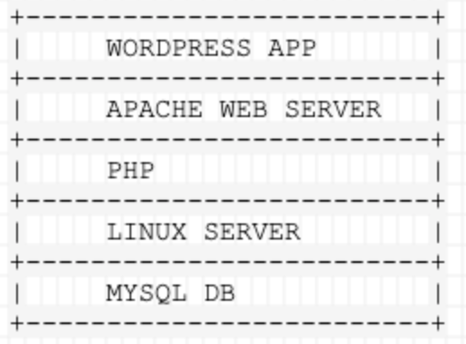
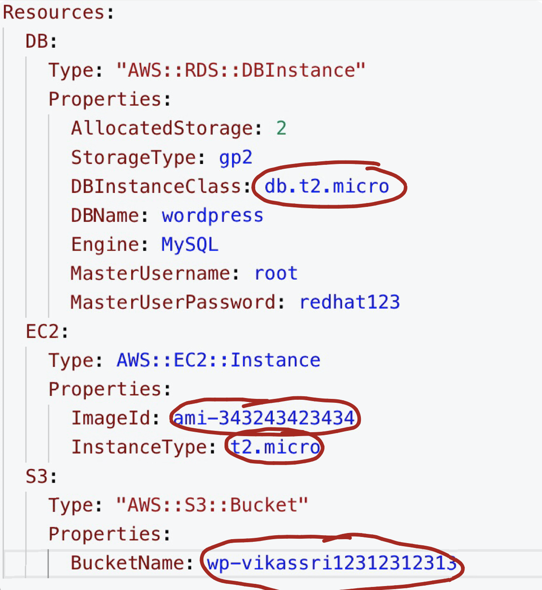
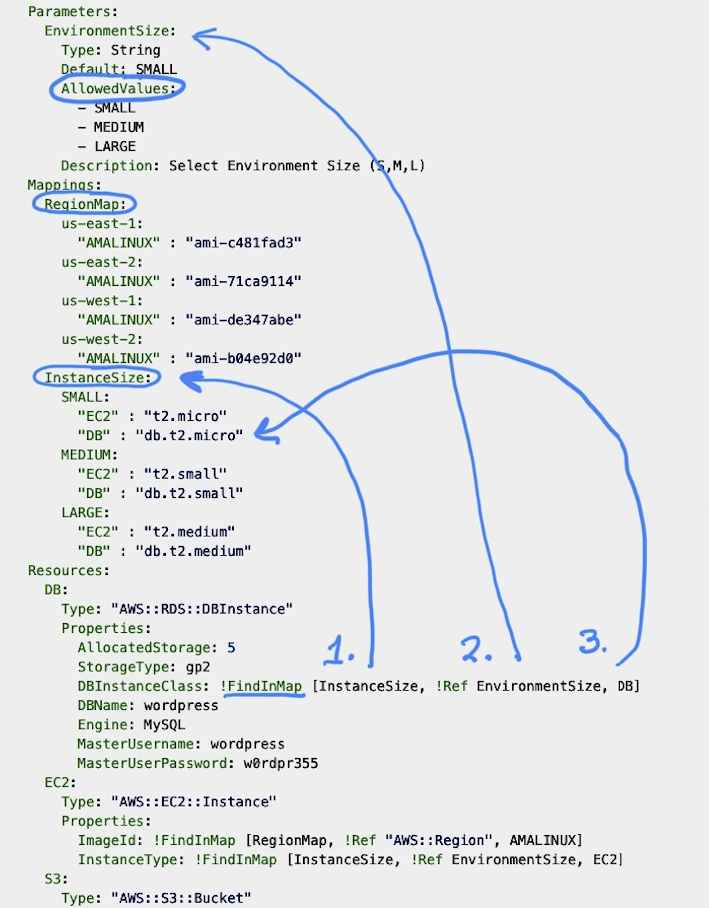

#### 1:33 Speed / kcfnuser / D

A wordpress stack typically consists of the following:




JSON stands for "JavaScript Object Notation"
Used heavility within the AWS Product set
JSON is constructd of name/value pair
Data is seperated by commas
Value can be strin,number,boolean,object,array or null
[] Square brackets holds arrays
Cury Braces {} Holds JSON

Null in its purest form is not used in CloudFormation.

> In the example below notice that the `ProductID` variable is used twice , which is fine since it is under two different JSON objects (Curly Brackets)
**Same variable cannot be used at the same JSON depth**

 ```json

{
"OrderID": 12345,
"ShopperName" : "Reyansh",
"Email": "email@gmail.com",
"OrderData" : [
    {
        "ProductID": "12",
        "Quantity": "1"
    },
    {
        "ProductID":"34",
        "Quantity": 2

    }
]
}

 ```

Below is an example of a YAML CloudFormation Template

> Notice that under `Listeners` we have 2 `-` ; which means  start of two different lists

```yaml
myELBname:
  Type: AWS::ElasticLoadBalancing::LoadBalancer
  Properties:
    Scheme: internal
    SecurityGroups:
      - sg-id
    Subnets:
      - subnet-id
    Instances:
      - instance-id
    Listeners:
      - LoadBalancerPort:
        InstancePort:
        Protocol: HTTP|HTTPS|TCP|SSL
        InstanceProtocol: HTTP|HTTPS|TCP|SSL
      - LoadBalancerPort: '443'
        InstancePort: '443'
        Protocol: HTTPS
        InstanceProtocol: HTTPS
        SSLCertificateId:
```

**Lets start our first cloudformation template with the following :**

```yaml
Resources:
  DB:
    Type: "AWS::RDS::DBInstance"
    Properties:
      AllocatedStorage: 2
      StorageType: gp2
      DBInstanceClass: db.t2.micro
      DBName: wordpress
      Engine: MySQL
      MasterUsername: root
      MasterUserPassword: redhat123
  EC2:
    Type: AWS::EC2::Instance
    Properties:
      ImageId: ami-343243423434
      InstanceType: t2.micro
  S3:
    Type: "AWS::S3::Bucket"
    Properties:
      BucketName: wp-vikassri12312312313
```

Thats a good start up template but lets look at the challenges in `re-use` of the template .

> - Everytime this template is used , `DBInstanceClass` and `InstanceType` has hardcoded values , which as per the customer requirement should be Small ,Medium , Large ; which cin this case is static.
> - The instance type is specific to a region and the CloudFormation template is not portable across regions.
> - Also the S3 bucket is static , so the name would conflict.



The way we fix the above issues is with the following script :

```yaml
Parameters:
  EnvironmentSize:
    Type: String
    Default: SMALL
    AllowedValues:
      - SMALL
      - MEDIUM
      - LARGE
    Description: Select Environment Size (S,M,L)
Mappings:
  RegionMap:
    us-east-1:
      "AMALINUX" : "ami-c481fad3"
    us-east-2:
      "AMALINUX" : "ami-71ca9114"
    us-west-1:
      "AMALINUX" : "ami-de347abe"
    us-west-2:
      "AMALINUX" : "ami-b04e92d0"
  InstanceSize:
    SMALL:
      "EC2" : "t2.micro"
      "DB" : "db.t2.micro"
    MEDIUM:
      "EC2" : "t2.small"
      "DB" : "db.t2.small"
    LARGE:
      "EC2" : "t2.medium"
      "DB" : "db.t2.medium"
Resources:
  DB:
    Type: "AWS::RDS::DBInstance"
    Properties:
      AllocatedStorage: 5
      StorageType: gp2
      DBInstanceClass: !FindInMap [InstanceSize, !Ref EnvironmentSize, DB]
      DBName: wordpress
      Engine: MySQL
      MasterUsername: wordpress
      MasterUserPassword: w0rdpr355
  EC2:
    Type: "AWS::EC2::Instance"
    Properties:
      ImageId: !FindInMap [RegionMap, !Ref "AWS::Region", AMALINUX]
      InstanceType: !FindInMap [InstanceSize, !Ref EnvironmentSize, EC2]
  S3:
    Type: "AWS::S3::Bucket"
```



- **In the above Code Template we used `Mapping` tables to reuse variables and make the template more dynamic**
- **The `!FindInMap` references the Table and looks for the value there in the table**
