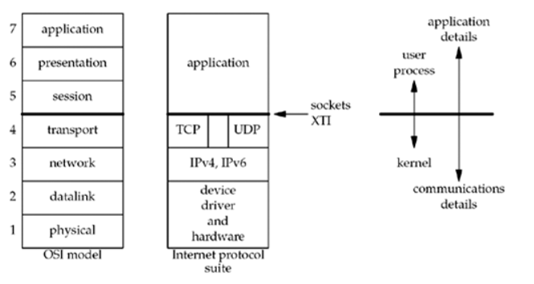
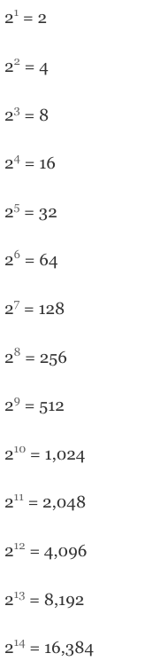
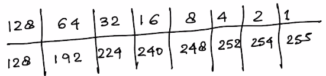
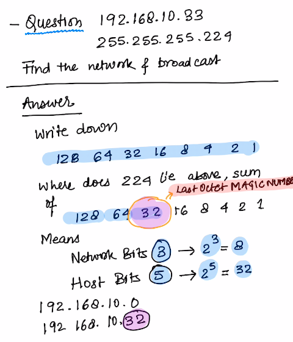
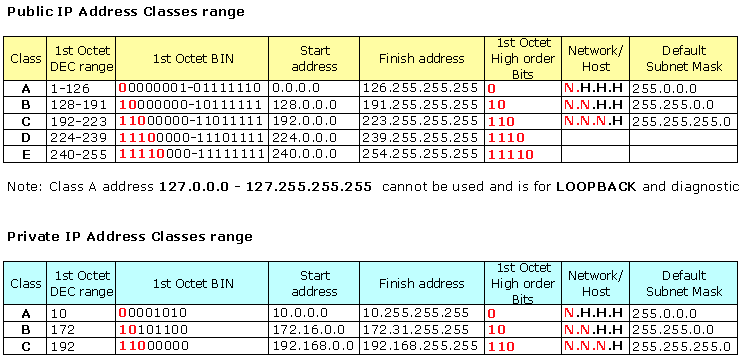
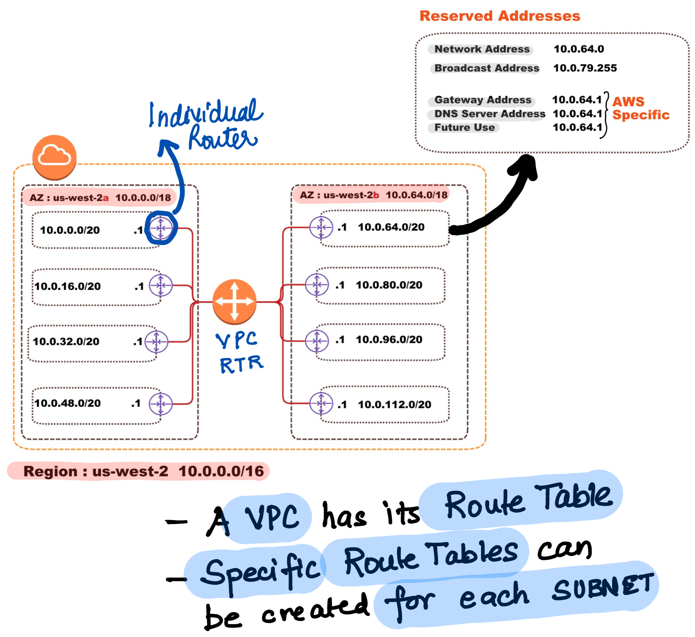

## Foundational Concepts

**This is a seven-layer model, which we show in Figure 1.14, along with the `approximate mapping` to the Internet protocol suite.**

### IPv4 Subnetting

#### How to Calculate Binary (Divide Method)

**Convert 75 to binary**

> Keep Dividing 75 by 2 and Write the number in Reverse
  75
  37 **1**
  18 **1**
  9  **0**
  4  **1**
  2  **0**
  **1**  **0**
Answer : **1001011**

Helpful Series of Numbers for Subnetting
> **128 64 32 16 8 4 2 1**

## Memorize the following
**Powers of 2**

--

--
## Practice Examples

----
**EXAMPLE 1** **Subnet: 255.255.255.128**

**Step 1.** Based on the Sequence `128 64 32 16 8 4 2 1` , the Subnet bit is `1` and there are `7` bits for host.

> Magic Number here is `128`

- **Network Bits** = $2^1$ = 2
- **Host Bits** = $2^7$ = 128 (-2 for network and broadcast)
- **Valid Subnet Ranges** = 256-128 = 128 `(0,128,256)`

----
**EXAMPLE 2** **Subnet: 255.255.255.192 (/26)**

> Magic Number here is `64`

**Step 1.** Based on the Sequence `128 64 32 16 8 4 2 1` , the Subnet bit is `2` and there are `6` bits for host.

- **Network Bits** = $2^2$ = 4
- **Host Bits** = $2^6$ = 64 (-2 for network and broadcast)
- **Valid Subnet Ranges** = 256-192 = 64 `(0,64,128,192....)`

----
**EXAMPLE 3** **Subnet: 255.255.255.248 (/29)**

> Magic Number here is `8`

**Step 1.** Based on the Sequence `128 64 32 16 8 4 2 1` , the Subnet bit is `5` and there are `3` bits for host.

- **Network Bits** = $2^5$ = 32
- **Host Bits** = $2^3$ = 8 (-2 for network and broadcast)
- **Valid Subnet Ranges** = 256-248 = 8 `(0,8,16,24,32,40....)`

> **Notes**

                            
