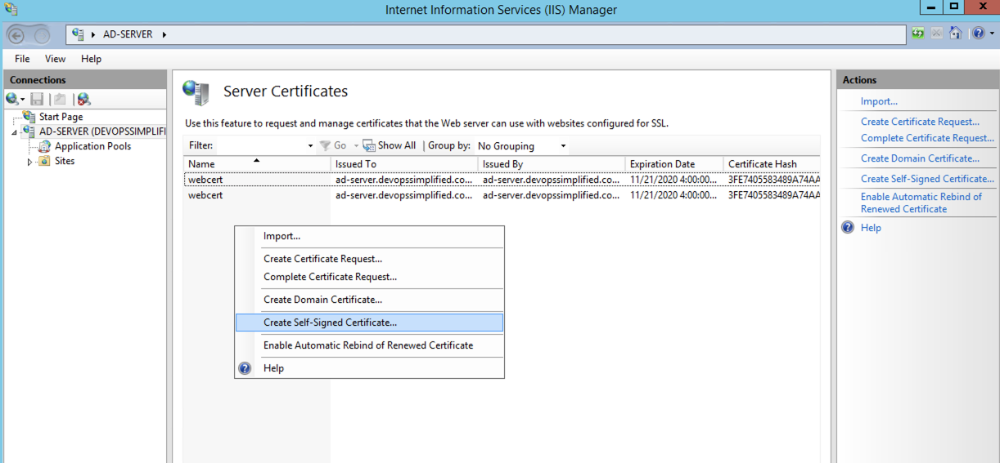
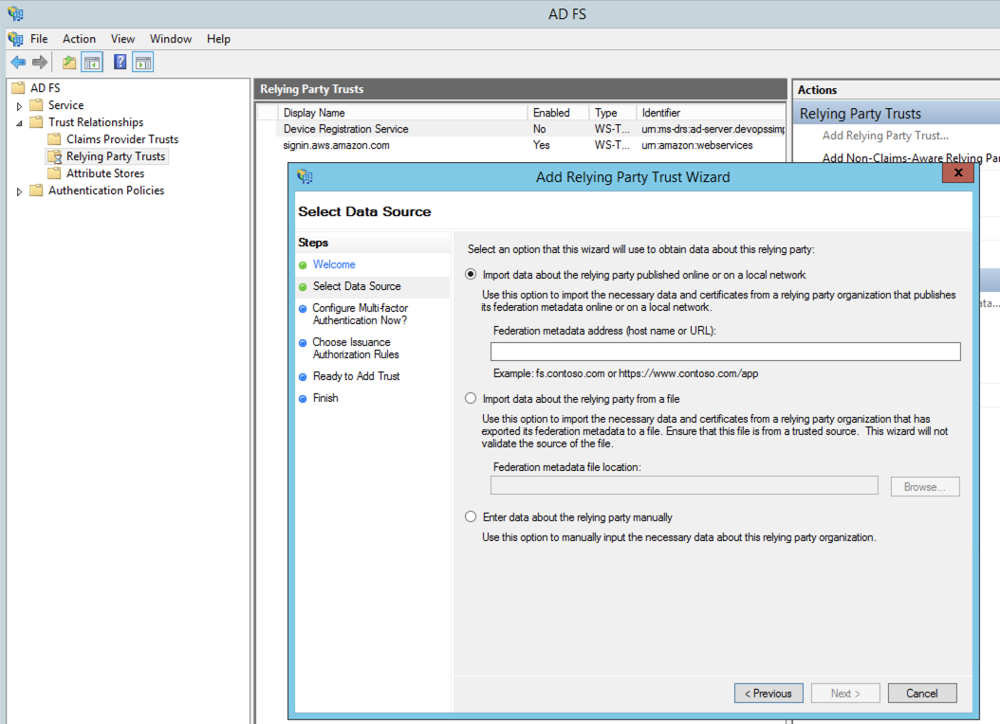
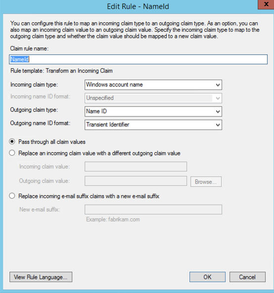
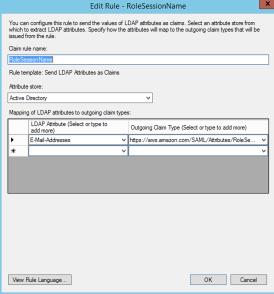
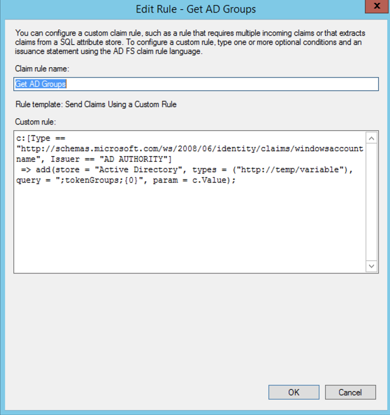
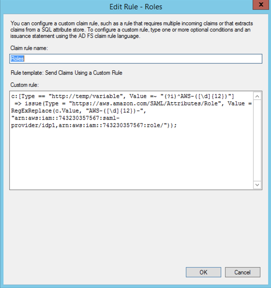

## Install the Required Services

- Install :  `IIS` , `Active Directory Domain Services` , `Active Directory Federation Services` and `DNS`

## Configure AD

- Setup : AD for devopssimplified.com
- Create Group : AWS-3443243287102-ADFS-AD-DevOps-Prod
- Create User : bob@devopssimplified.com and add to the group above
  - **Make sure email address is set**

- Create user : `adfssvc` and run `setspn - a host/localhost adfssvc`

## Configure Self Signed Cert

`webcert`



## Configure ADFS Service

`webcert` | `WebHosting` in the menu .

---


# Now Configure Trust Relation Ship

Go to https://localhost/federationmetadata/2007-06/federationmetadata.xml

# Import this file in AWS : Name it idp1

IAM --> Indentity Providers --> Creta provide --> SAML

**On AWS side of Trus relation ships is done .**

# Now go to ADFS managment Console (To setup trust from this side)

## Step 1

https://signin.aws.amazon.com/static/saml-metadata.xml


## Step 2



## Step 3

https://aws.amazon.com/SAML/Attributes/RoleSessionName


## Step 4

```
c:[Type == "http://schemas.microsoft.com/ws/2008/06/identity/claims/windowsaccountname", Issuer == "AD AUTHORITY"]
 => add(store = "Active Directory", types = ("http://temp/variable"), query = ";tokenGroups;{0}", param = c.Value);
```



## Step 5

```
c:[Type == "http://temp/variable", Value =~ "(?i)^AWS-([\d]{12})"]
 => issue(Type = "https://aws.amazon.com/SAML/Attributes/Role", Value = RegExReplace(c.Value, "AWS-([\d]{12})-", "arn:aws:iam::743230357567:saml-provider/idp1,arn:aws:iam::743230357567:role/"));
```




# Now in AWS IAM Create a SAML Role

ADFS-AWS-Admin

# Now login to ADFS Single Sighn on URL
https://localhost/adfs/ls/idpinitiatedsignon.aspx


**"Error: RoleSessionName is required in AuthnResponse (Service: AWSSecurityTokenService; Status Code: 400; Error Code: InvalidIdentityToken)"**

> **Solution** Email Address Under User was not configured !

```
Duo
https://help.duo.com/s/article/4045?language=en_US

distinguishedName
mail
sAMAccountName
userPrincipalName
```
