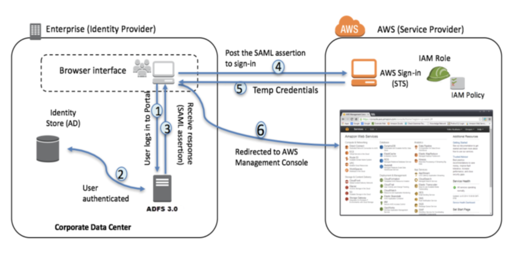

**This video is based on**

> **2018 AWS Federated Authentication with Active Directory Federation Services (AD FS)** https://aws.amazon.com/blogs/security/aws-federated-authentication-with-active-directory-federation-services-ad-fs/




1. Corporate user accesses the corporate Active Directory Federation Services portal sign-in page and provides Active Directory authentication credentials.
2. AD FS authenticates the user against Active Directory.
3. Active Directory returns the user’s information, including AD group membership information.
4. AD FS dynamically builds ARNs by using Active Directory group memberships for the IAM roles and user attributes for the AWS account IDs, and sends a signed assertion to the users browser with a redirect to post the assertion to AWS STS.
5. Temporary credentials are returned using STS `AssumeRoleWithSAML`.
6. The user is authenticated and provided access to the AWS management console.

## Install the Required Services

- Install these servcies , `Active Directory Domain Services` , `Active Directory Federation Services` and `DNS` , `IIS`

## Install Active Directory

- Setup : AD for the name `devopssimplified.com`
- Restart the Computer

## Configure Basic Active Directory

-  **Create Group** : `AWS-3443243287102-ADFS-AD-DevOps-Prod` - This naming conventions is best practices based , on the AWS documentation.

- Create User : bob@devopssimplified.com and **add to the group above**
  - **Make sure email address is set**

---
## ADFS Configuration Preparation
### While we are here we configure the user required for ADFS Services

- Create user : `adfssvc`
- This will be used by the ADFS Service which we will use later.and run
- Also set the `setspn - a host/localhost adfssvc` to mitigate an error received during the ADFS configuration. **COMPLAINS**


### Now lets Configure a Self Signed Cert

- Go to `IIS Configuration`
- Create **self** signed certificate `webcert`
- Export it to the desktop

---

## Now that the ADFS Confiration base work is done lets move on to Configuring  ADFS Service

`webcert` | `WebHosting` in the menu .

---


## Now We will Configure Trust Relation Ship between AWS and AD

Go to https://localhost/federationmetadata/2007-06/federationmetadata.xml

## Import this file in AWS, Name it `idp1`

- We name it `idp1` hust for follwign the guide we referenced earlier.

**IAM --> Indentity Providers --> Creta provide --> SAML**

**On AWS side of Trus relation ships is done .**

---
# Configuring Trust Relation ship and SAML
## Now go to ADFS managment Console (To setup trust from this side)

## Step 1


Download the File from https://signin.aws.amazon.com/static/saml-metadata.xml

## Step 2


## Step 3

https://aws.amazon.com/SAML/Attributes/RoleSessionName


## Step 4


```sh
c:[Type == "http://schemas.microsoft.com/ws/2008/06/identity/claims/windowsaccountname", Issuer == "AD AUTHORITY"]
 => add(store = "Active Directory", types = ("http://temp/variable"), query = ";tokenGroups;{0}", param = c.Value);
```
## Step 5

```sh
c:[Type == "http://temp/variable", Value =~ "(?i)^AWS-([\d]{12})"]
 => issue(Type = "https://aws.amazon.com/SAML/Attributes/Role", Value = RegExReplace(c.Value, "AWS-([\d]{12})-", "arn:aws:iam::743230357567:saml-provider/idp1,arn:aws:iam::743230357567:role/"));
```


## Now in AWS IAM Create a SAML Role

`ADFS-AWS-Admin`

## Now login to ADFS Single Sighn on URL
https://localhost/adfs/ls/idpinitiatedsignon.aspx


**"Error: RoleSessionName is required in AuthnResponse (Service: AWSSecurityTokenService; Status Code: 400; Error Code: InvalidIdentityToken)"**

> **Solution** Email Address Under User was not configured !

```
Duo
https://help.duo.com/s/article/4045?language=en_US

distinguishedName
mail
sAMAccountName
userPrincipalName
```
