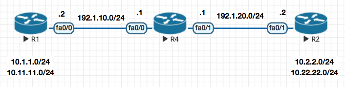
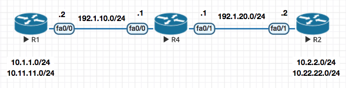
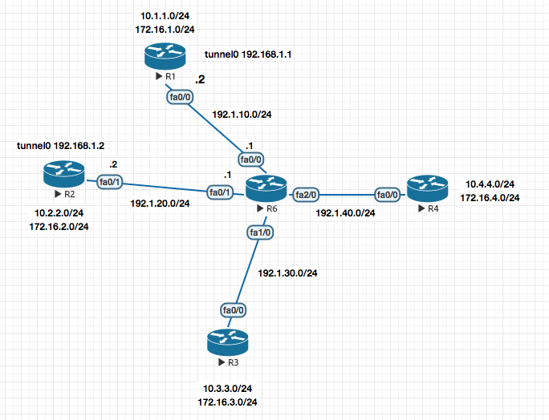
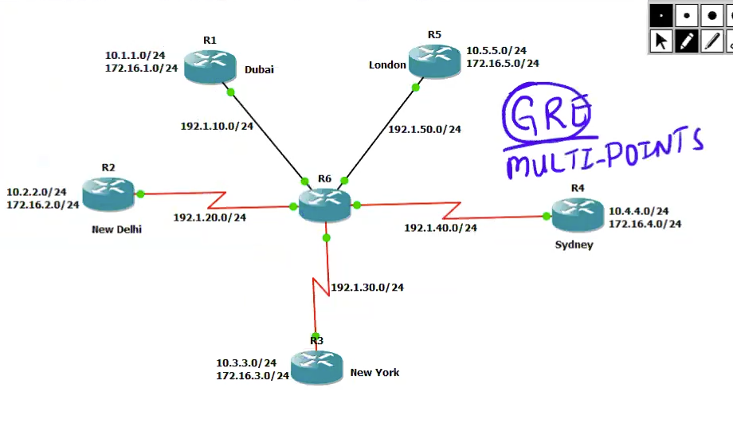

### VPN (Policy based )

#### Key Exchange Protocol

For two sides to encrypt or decrypt the traffic , a key needs to be shared between two endpoints.

You need the following to secure a Tunnel :

    - Key
    - Encryption
    - Hashing

> Diffie Hellman is the algorith that generates a `KEY` . Lifetime of a DH key is 3600 secs (1hr).

There are two tunnels :
1. `PHASE 1` The first tunnel is to exchange the KEY . `ISAKMP` Internet Security Association and Key Managment Protocol is used here .
2. `PHASE 2` The second tunnel is for Data transfer. `ESP` Encapsulation Security Payload is used in this phase .


> Though its not recommened , you can manually setup the `Phase 2` tunnel to use a manual key skipping the `Phase 1` negotiation (without using `ISAKMP`).


**Configuration example**

**1.  Configure the Parameters for `Phase 1`**
```sh
crypto isakmp policy 10
 auth pre-share   //KEY
 encryption 3des  //ENCRYTPION
 hash md5         //HASH
 group 2 // The group command actually generates the hey to be used in the second phase .

crytpto isakmp policy 20
 auth pre-share
 encrytption 3des
 hash sha
 group 2

crypto isakmp key cisco111 address 1.1.1.1
crypto isakmp key cisco111 address 2.2.2.2
```

**2.  Configure the Parameters for `Phase 2` (only encryption and hash , as we have already got the key from phase 1)**

```sh
crypto ipsec tranform-set TSET esp-3des esp-md5

```

**3.  Define traffic that will be encrypted over the Tunnel**

```sh
access-list 101 permit 10.1.1.0 0.0.0.255 10.2.2.0 0.0.0.255
```

**4. Finally Create a Crypto MAP to tie all of the above together**

```sh
crypto map CMAP 5 ipsec-isakmp ! (5 is sequence number , and isakmp means  (get the key from Diffie-Hellman))
match address 101  //access-list
set peer 192.168.1.10
set transform-set TSET // Configured above
```

**5. Apply on the interface**

int fa0/0
 crpypt map CMAP


Always ping with ping source field
show crypto ipsec sa
show crpto isakmp sa


THe tunnel will stay up for :

Phase 1  86400 sec 24 hrs
Phase 2 3600 sec 1 hr


> In the above VPN Configuration , the interesting traffic is define by an `ACL`. Such VPNS are called Policy based VPN.


### GRE Tunnel

GRE Tunnel basically creates a virtual point to point link between two routers which traditionally were establishing VPN based on interesting traffic define by ACLs . Which was a tedious process.



Here is the sample configuration of a GRE Tunnel. It is basically a two step process
1. Creat a virtual link between the two routers , in this example R1 and R2

2. Now since they are "virtually" directly connected , you can run a routing protocol to exchange routing information directly within them.

##### Step 1
R1

```sh
interface tun0
 ip add 192.168.1.1 255.255.255.0
 tunnel source 192.1.10.2
 tunnel destination 192.1.20.2

```

R2

```sh
interface tun0
 ip add 192.168.1.2 255.255.255.0
 tunnel source 192.1.20.2
 tunnel destination 192.1.10.2
```


##### Step 2
Now you can run a routing protocol of choice to make them talk

```sh
!
router eigrp 10
 network 10.0.0.0
 network 192.168.1.0
 no auto-summary
!
```

### GRE over IPSec - Tunnel Mode



In this mode once the GRE tunnel is up , we basically apply the Crypto Map configuration as a `profile` to the tunnel interface (in this e.g IPROF )

> Notice that there is not need define `match` for interesting traffic or `set-peer` as this is all taken care by the `tunnel0` interface by default as every traffic via the tunnel interface is interesting and the peer is known because of GRE. .


```sh
! R1
! Configure Phase I

crypto isakmp policy 10
 auth pre-share
 encryption 3des
 hash md5
 group 2

crypto isakmp key cisco123 address 192.1.20.2


! Configure Phase II

crypto ipsec transform-set TSET esp-3des esp-md5

! Configure an IPSec Profile and attach the transform-set to it

crypto ipsec profile IPROF
 set transform-set TSET

! Assign the IPSec Profile to the Tunnel interface

interface tunnel0
  tunnel protection ipsec profile IPROF

```

```sh
! R2
! Configure Phase I

crypto isakmp policy 10
 auth pre-share
 encryption 3des
 hash md5
 group 2

crypto isakmp key cisco123 address 192.1.10.2


! Configure Phase II

crypto ipsec transform-set TSET esp-3des esp-md5

! Configure an IPSec Profile and attach the transform-set to it

crypto ipsec profile IPROF
 set transform-set TSET

! Assign the IPSec Profile to the Tunnel interface

interface tunnel0
  tunnel protection ipsec profile IPROF

```


Now notice that in the plain simple GRE the packet looked like this , which totaled  **88 bytes**:

`GRE | 192.1.10.1 | 192.1.20.3 | EIGRP | 192.168.1.1 | 224.0.0.10 | Data |`

With IPSec enable on it (which we did in the config example above) the packet size increase to **140 bytes** because of the ESP header and now looks like this :

`ESP| 192.1.10.X | 192.1.20.X| GRE | 192.1.10.1 | 192.1.20.3 | EIGRP | 192.168.1.1 | 224.0.0.10 | Data |`

> In the above packet , the entire packet including GRE is just a `data` packet (encapsulated in the ESP).

So the **overhead** is that you have increased the size of the packet by 52 bytes (140 - 88 = 52 ) .

`Tunnel Mode` is the default mode for IPSec .

Notice the `tunnel ` in output
```sh
show crypto ipsec sa

outbound esp sas:
 spi: 0x99D47D47(2580839751)
   transform: esp-3des esp-md5-hmac ,
   in use settings ={Tunnel, }
```


Now if you GRE and ESP header are the same , you can run IPSec in `Tranport Mode`

In transport mode , it will remove the duplication of ESP and GRE header and make the packet **smaller** .

---

### GRE / IPSec - Transport Mode

> An efficient mode over Tunnel Mode and saves some overhead on encryption

So with above theory

`ESP| 192.1.10.X | 192.1.20.X| GRE | 192.1.10.1 | 192.1.20.3 | EIGRP | 192.168.1.1 | 224.0.0.10 | Data |`

Changes to

`ESP| 192.1.10.X | 192.1.20.X| GRE | EIGRP | 192.168.1.1 | 224.0.0.10 | Data |`

Above changes saves **16** bytes for  you , so now your packet size becomes 140 - 16 = **124**

#### Configuration

The configuration of the transport mode is similar to the tunnel mode , the only change is highlighted below (`mode transport`)

```sh

crypto ipsec transform-set TSET esp-3des esp-md5
 mode transport

clear crypto sa
```

### Native IPSec Tunnel [S-VTI]

> Also know as Static Virtual TUnnel Interface

Now continuing on to the above flow , is GRE required for the IPSec ? Cant we run the IPSec over the tunnel interface without GRE ?  The answer to that is yes and we basically


```sh
interface tunnel0
 tunnel mode ipsec ipv4
```

So what benefit did the above change provide ?

The packet changed from
`ESP| 192.1.10.X | 192.1.20.X| GRE | EIGRP | 192.168.1.1 | 224.0.0.10 | Data |`

to  (remove of GRE header , 8 bytes)

`ESP| 192.1.10.X | 192.1.20.X| EIGRP | 192.168.1.1 | 224.0.0.10 | Data |`


Above changes saves **8** bytes for  you , so now your packet size becomes 124 - 8 = **116**


### MGRE (Multipoint GRE)

The point to point configuration setting above does not scale with a lot of sites , that is where MGRE comes to rescue.

Now since in GRE we had to define the tunnel destination address: `tunnel destination X.X.X.X`

Since in this case , their could be multiple destinations we need to use a mapping table which maps destination to be reached to the next hop address to be used . This system is called NHRP (Next Hop Resolution Protocol)


`ip nhrp map 192.168.1.1 192.1.10.1`

The above command means that if I want to go to `192.168.1.1` the public IP address for the same is `192.1.10.1`

```sh
interface tunnel0
 ip address 192.168.1.1
 tunnel source 192.168.20.2
 tunnel mode gre multipoint
 ip nhrp network-id 1
 ip nhrp map 192.168.1.1 192.1.10.1
 ip nhrp map 192.168.1.2 192.1.20.2
 ip nhrp map 192.168.1.3 192.1.30.3
```

#### A Multipoint GRE Full Configuration Snippet



```sh
! R1

interface tunnel0
 ip address 192.168.1.1 255.255.255.0
 tunnel source 192.1.10.2
 tunnel mode gre multipoint
 ip nhrp network-id 1
 ip nhrp map 192.168.1.2 192.1.20.2
 ip nhrp map 192.168.1.3 192.1.30.2
 ip nhrp map 192.168.1.4 192.1.40.2


!R2

interface tunnel0
 ip address 192.168.1.2 255.255.255.0
 tunnel source 192.1.20.2
 tunnel mode gre multipoint
 ip nhrp network-id 1
 ip nhrp map 192.168.1.1  192.1.10.2
 ip nhrp map 192.168.1.3  192.1.30.2
 ip nhrp map 192.168.1.4  192.1.40.2


! R3

interface tunnel0
  ip address 192.168.1.3 255.255.255.0
  tunnel source 192.1.30.2
  tunnel mode gre multipoint
  ip nhrp network-id 1
  ip nhrp map 192.168.1.1 192.1.10.2
  ip nhrp map 192.168.1.2 192.1.20.2
  ip nhrp map 192.168.1.4 192.1.40.2


! R4

interface tunnel0
  ip address 192.168.1.4 255.255.255.0
  tunnel source 192.1.40.2
  tunnel mode gre multipoint
  ip nhrp network-id 1
  ip nhrp map 192.168.1.1 192.1.10.2
  ip nhrp map 192.168.1.2 192.1.20.2
  ip nhrp map 192.168.1.3 192.1.30.2

```

```sh
R1#show ip nhrp
192.168.1.2/32 via 192.168.1.2, Tunnel0 created 00:08:03, never expire
  Type: static, Flags: used
  NBMA address: 192.1.20.2
192.168.1.3/32 via 192.168.1.3, Tunnel0 created 00:08:03, never expire
  Type: static, Flags: used
  NBMA address: 192.1.30.2
192.168.1.4/32 via 192.168.1.4, Tunnel0 created 00:08:03, never expire
  Type: static, Flags: used
  NBMA address: 192.1.40.2
R1#
```


**DISADVANTAGES** In this type of NHRP Based name resolution you need to **statically** define the mapping which is not scalable and also requires all sites to have static IP Addressing.

Now this disadvantage was eliminiated by the use of a **Next Hop Server** like a DNS naming server.

**How does the `Next Hop Server` works ?**

Under the inteface configuration on the end routers , we define the Next Hop Servers IP Address. When these interfaces come up they register their information to the Next Hope Server.


### DMVPN (Dynamic Multipoint VPN)

**How does the `Next Hop Server` works ?**

Under the inteface configuration on the end routers , we define the Next Hop Servers IP Address. When these interfaces come up they register their information to the Next Hope Server.



Step 1. Enabling the Next Hop Server

```sh
! R1
interface tunnel0
 ip address 192.168.1.1
 tunnel source f0/0
 tunnel mode gre multipoint
 ip nhrp network-id 1
 ip nhrp map multicast dynamic // For sending the reply for EIGRP packets received from clients , the NHS Server knows who to send the reply by looking at the dynamic NHRP table.

router eigrp 100
 no auto
 network 10.0.0.0
 network 192.168.1.0
 network 172.16.0.0

```

That's all for configuring a NHS!

Step 2. Configuring the Next Hop Client

```sh
! R2
interface tunnel0
 ip address 192.168.1.2
 tunnel source ethernet0/0
 tunnel mode gre multipoint
 ip nhrp network-id 1
 ip nhrp nhs 192.168.1.1
 ip nhrp map 192.168.1.1 192.1.10.1 // This for Data Path mapping
 ip nhrp map multicast 192.1.10.1 // For the EIGRP Packets

 router eigrp 100
  no auto
  network 10.0.0.0
  network 192.168.1.0
  network 172.16.0.0
```
Repeat the above configuration for other Clients on the DMVPN.


> **Split Horizon**, dont send the update back on the same interface you learned the route on. So becuase of Split Horizon not all Spokes learn about each other. Hence it needs to be turned off.


### DMVPN - EIGRP - Phases [I,II,III]

**Phase I** - First order of operation is to turn off split-horizon on the hub.

```sh
interface tunnel0
 no ip split-horizon eigrp 100
```

**Phase II** - Second you would like the traffic to be point to point and not hoping thorough the NHS Router. For this you have to ensure that the `next-hop` isnt changed. On the HUB

```sh
interface tunnel0
 no ip next-hop-self eigrp 100
```


**Phase III** -

Use of summarisation for addressing.

```sh
! HUB
ip nhrp redirect
```

```sh
! SPOKES
ip nhrp shortcut
```


### Redundancy [Dual-Hub DMVPN Setup]

### OSPF As a routing protocol


<br><br><br><br><br><br><br><br><br><br><br><br><br><br><br><br><br><br><br><br><br><br><br><br><br><br><br><br><br><br><br><br><br><br><br><br><br>


<br>


#### Troubleshooting Commands and Outputs


```sh
R1#show crypto isakmp sa
IPv4 Crypto ISAKMP SA
dst             src             state          conn-id slot status
192.1.20.2      192.1.10.2      QM_IDLE           1001    0 ACTIVE

```

```sh
R1#show crypto ipsec sa

interface: FastEthernet0/0
    Crypto map tag: CMAP, local addr 192.1.10.2

   protected vrf: (none)
   local  ident (addr/mask/prot/port): (10.1.1.0/255.255.255.0/0/0)
   remote ident (addr/mask/prot/port): (10.2.2.0/255.255.255.0/0/0)
   current_peer 192.1.20.2 port 500
     PERMIT, flags={origin_is_acl,}
    #pkts encaps: 5, #pkts encrypt: 5, #pkts digest: 5
    #pkts decaps: 5, #pkts decrypt: 5, #pkts verify: 5
    #pkts compressed: 0, #pkts decompressed: 0
    #pkts not compressed: 0, #pkts compr. failed: 0
    #pkts not decompressed: 0, #pkts decompress failed: 0
    #send errors 5, #recv errors 0

     local crypto endpt.: 192.1.10.2, remote crypto endpt.: 192.1.20.2
     path mtu 1500, ip mtu 1500, ip mtu idb FastEthernet0/0
     current outbound spi: 0x99D47D47(2580839751)

     inbound esp sas:
      spi: 0x890A3034(2299146292)
        transform: esp-3des esp-md5-hmac ,
        in use settings ={Tunnel, }
        conn id: 1, flow_id: SW:1, crypto map: CMAP
        sa timing: remaining key lifetime (k/sec): (4415180/3433)
        IV size: 8 bytes
        replay detection support: Y
        Status: ACTIVE

     inbound ah sas:

     inbound pcp sas:

     outbound esp sas:
      spi: 0x99D47D47(2580839751)
        transform: esp-3des esp-md5-hmac ,
        in use settings ={Tunnel, }
        conn id: 2, flow_id: SW:2, crypto map: CMAP
        sa timing: remaining key lifetime (k/sec): (4415180/3433)
        IV size: 8 bytes
        replay detection support: Y
        Status: ACTIVE

     outbound ah sas:

     outbound pcp sas:
```

#### Error Messages and Resolution

```sh
*Mar  1 00:42:09.431: %CRYPTO-4-IKMP_BAD_MESSAGE: IKE message from 192.1.20.2 failed its sanity check or is malformed
```
The above warrants a key mismatch .
