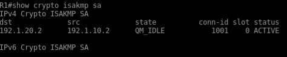
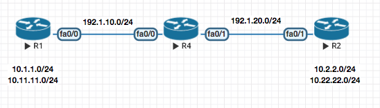

### VPN (Policy based )

#### Key Exchange Protocol

For two sides to encrypt or decrypt the traffic , a key needs to be shared between two endpoints.

You need the following to secure a Tunnel :

    - Key
    - Encryption
    - Hashing

> Diffie Hellman is the algorith that generates a `KEY` . Lifetime of a DH key is 3600 secs (1hr).

There are two tunnels :
1. `PHASE 1` The first tunnel is to exchange the KEY . `ISAKMP` Internet Security Association and Key Managment Protocol is used here .
2. `PHASE 2` The second tunnel is for Data transfer. `ESP` Encapsulation Security Payload is used in this phase .


> Though its not recommened , you can manually setup the `Phase 2` tunnel to use a manual key skipping the `Phase 1` negotiation (without using `ISAKMP`).


**Configuration example**

**1.  Configure the Parameters for Phase 1**
```sh
crypto isakmp policy 10
 auth pre-share   //KEY
 encryption 3des  //ENCRYTPION
 hash md5         //HASH
 group 2 // The group command actually generates the hey to be used in the second phase .

crytpto isakmp policy 20
 auth pre-share
 encrytption 3des
 hash sha
 group 2

crypto isakmp key cisco111 address 1.1.1.1
crypto isakmp key cisco111 address 2.2.2.2
```

**2.  Configure the Parameters for Phase 2 (only encryption and hash , as we have already got the key from phase 1)**

```sh
crypto ipsec tranform-set TSET esp-3des esp-md5

```

**3.  Define traffic that will be encrypted over the Tunnel**

```sh
access-list 101 permit 10.1.1.0 0.0.0.255 10.2.2.0 0.0.0.255
```

**4. Finally Create a Crypto MAP to tie all of the above together**

```sh
crypto map CMAP 5 ipsec-isakmp ! (5 is sequence number , and isakmp means  (get the key from Diffie-Hellman))
match address 101  //access-list
set peer 192.168.1.10
set transform-set TSET // Configured above
```

**5. Apply on the interface**

int fa0/0
 crpypt map CMAP


Always ping with ping source field
show crypto ipsec sa
show crpto isakmp sa


THe tunnel will stay up for :

Phase 1  86400 sec 24 hrs
Phase 2 3600 sec 1 hr



> In the above VPN Configuration , the interesting traffic is define by an `ACL`. Such VPNS are called Policy based VPN.


### GRE Tunnel

GRE Tunnel basically creates a virtual point to point link between two routers which traditionally were establishing VPN based on interesting traffic define by ACLs . Which was a tedious process.



Here is the sample configuration of a GRE Tunnel. It is basically a two step process
1. Creat a virtual link between the two routers , in this example R1 and R2

2. Now since they are "virtualy" directly connected , you can run a routing protocol to exchange routing information directly within them.

##### Step 1
R1

```sh
interface tun0
 ip add 192.168.1.1 255.255.255.0
 tunnel source 192.1.10.2
 tunnel destination 192.1.20.2
```

R2

```sh
interface tun0
 ip add 192.168.1.2 255.255.255.0
 tunnel source 192.1.20.2
 tunnel destination 192.1.10.2
```


##### Step 2
Now you can run a routing protocol of choice to make them talk

```sh
network 192.168.1.0
network 10.0.0.0
```


GRE / IPSec - Tunnel Mode
GRE / IPSec - Transparent Mode
Native IPSec Tunnel [S-VTI]
MGRE


<br><br><br><br><br><br><br><br><br><br><br><br><br><br><br><br><br><br><br><br><br><br><br><br><br><br><br><br><br><br><br><br><br><br><br><br><br>


<br>
