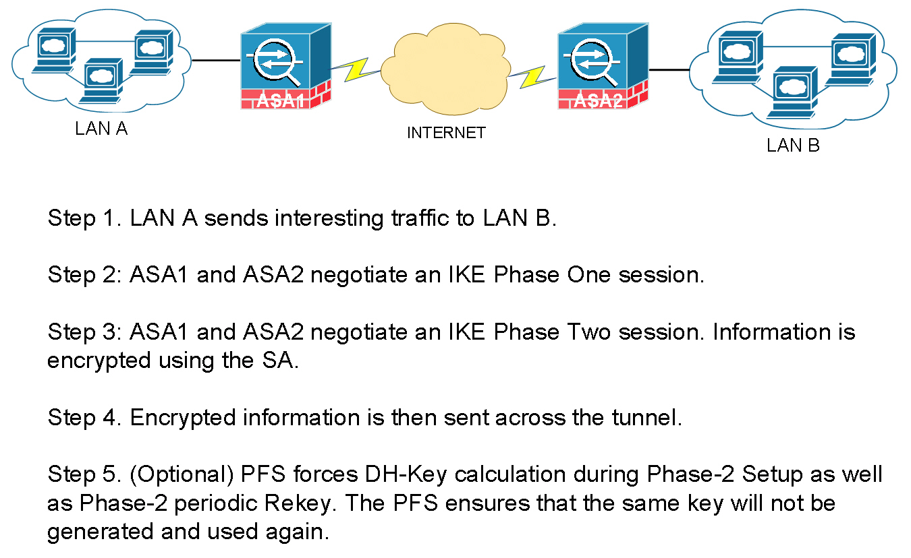

### VPN

#### Key Exchange Protocol

For two sides to encrypt or decrypt the traffic , a key needs to be shared between two endpoints.

You need the following to secure a Tunnel :

    - Key
    - Encryption
    - Hashing

> Diffie Hellman is the algorith that generates a `KEY` . Lifetime of a DH key is 3600 secs (1hr).

There are two tunnels :
1. `PHASE 1` The first tunnel is to exchange the KEY . `ISAKMP` Internet Security Association and Key Managment Protocol is used here .
2. `PHASE 2` The second tunnel is for Data transfer. `ESP` Encapsulation Security Payload is used in this phase .



> Though its not recommened , you can manually setup the `Phase 2` tunnel to use a manual key skipping the `Phase 1` negotiation (without using `ISAKMP`).


**Configuration example**

**1.  Configure the Parameters for Phase 1**
```sh
crypto isakmp policy 10
 auth pre-share   //KEY
 encryption 3des  //ENCRYTPION
 hash md5         //HASH
 group 2 // The group command actually generates the hey to be used in the second phase .

crytpto isakmp policy 20
 auth pre-share
 encrytption 3des
 hash sha
 group 2

crypto isakmp key cisco111 address 1.1.1.1
crypto isakmp key cisco111 address 2.2.2.2
```

**2.  Configure the Parameters for Phase 2 (only encryption and hash , as we have already got the key from phase 1)**

```sh
crypto ipsec tranform-set TSET esp-3des esp-md5

```

**3.  Define traffic that will be encrypted over the Tunnel**

```sh
access-list 101 permit 10.1.1.0 0.0.0.255 10.2.2.0 0.0.0.255
```

**4. Finally Create a Crypto MAP to tie all of the above together**

```sh
crypto map CMAP 5 ipsec-isakmp ! (5 is sequence number , and isakmp means  (get the key from Diffie-Hellman))
match address 101  //access-list
set peer 192.168.1.10
set transform-set TSET // Configured above
```

**5. Apply on the interface**

int fa0/0
 crpypt map CMAP


<br><br><br><br><br><br><br><br><br><br><br><br><br><br><br><br><br><br><br><br><br><br><br><br><br><br><br><br><br><br><br><br><br><br><br><br><br>


<br>
