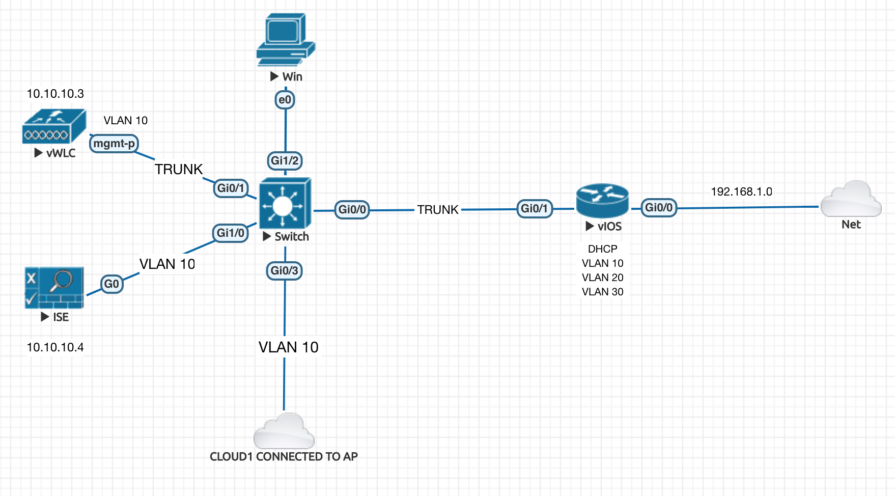
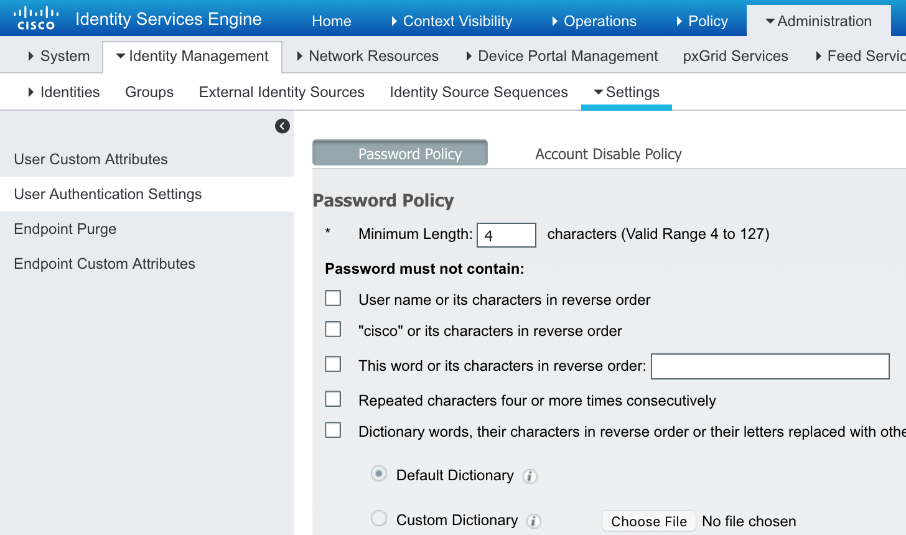
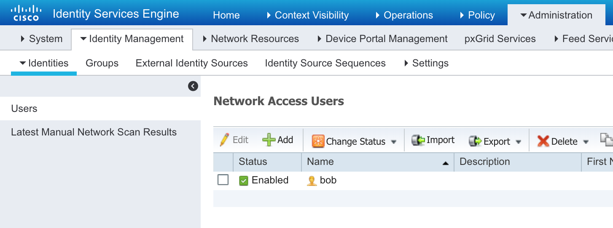
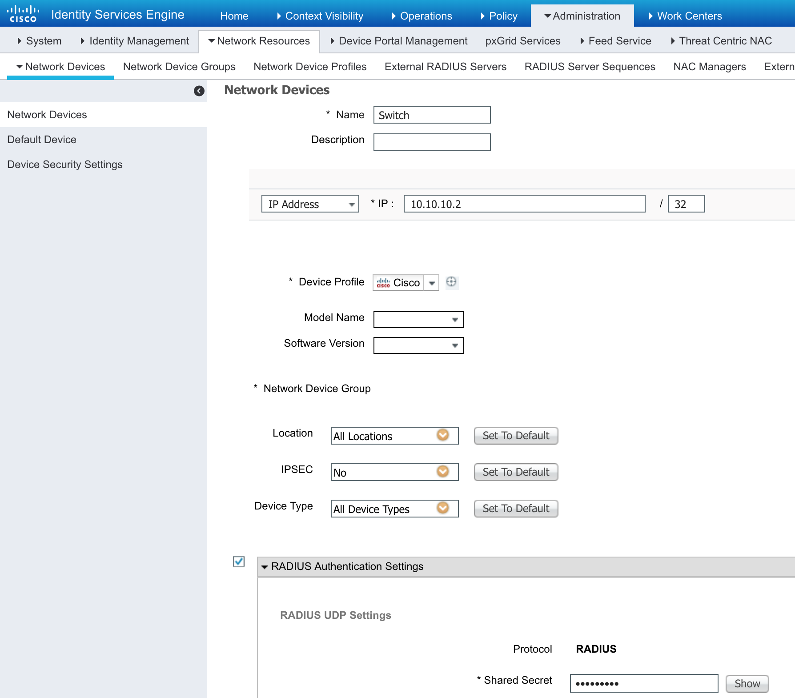
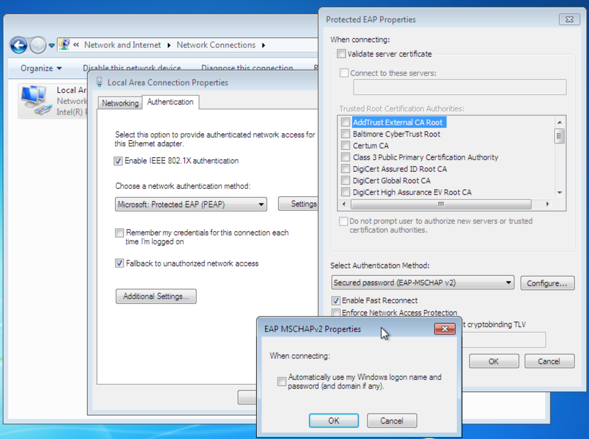
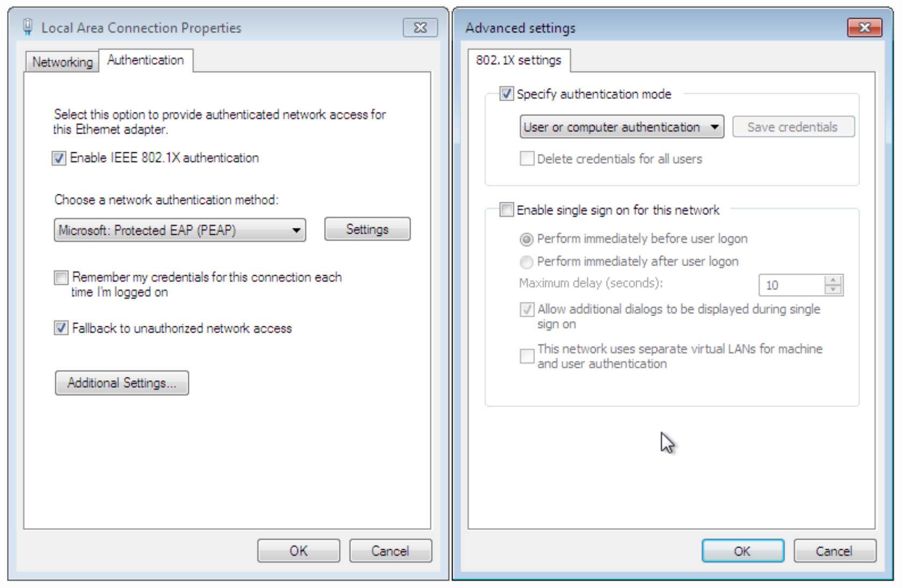

# Cisco ISE Demo Script
- ## Wired DOT1.X  Authentication
- ## Profiling
- ## Posture


Modes :

**single-host**  - Exactly one MAC Address
**multi-host** -   One MAC Address opens the door , and rest (other VMs on the Host)  can get in easily without authentication.
**multi-domain** -  Has nothing to do with AD Domain , its about multiple VLANs like voice and data vlan.
**multi-auth**  -  Every single MAC Address has to be authenticated . Even the VMs has to be authenticated .





```sh
!Make sure a enable password is set
enable secret 5 $1$AGpH$kIw79LdzMFQ395d/
!

!Enable AAA system
aaa new-model
!

!Point to ISE
!
aaa group server radius ISE-group
 server name ISE
!
radius server ISE
 address ipv4 192.168.1.101 auth-port 1812 acct-port 1813
 key **yourpasswordhere**
!
!
aaa authentication login default enable
! Use the Radius Authentication for dot1x
aaa authentication dot1x default group radius

!Authorization is for Dynamic VLANs and ACLs to be assigned
aaa authorization network default group radius

!Default method for account is  RADIUS
aaa accounting dot1x default start-stop group radius
!
!
!
!Include IP Address of the supplicant  IP Address of the suplicant as a part of the request.
radius-server attribute 8 include-in-access-req
!
!Globally enabling Dot1X Authentication
dot1x system-auth-control
!
! Default the port on which the endpoint is connected to reset config
default interface GigabitEthernet1/2
!
!
interface GigabitEthernet0/1
 switchport mode access
 switchport access vlan 10
 spanning-tree portfast
! Open mode for testing
 authentication open
! Authentication mode , see above for what each mode means
 authentication host-mode multi-auth
 authentication port-control auto
! Recurring authentication
 authentication periodic
! Let server decide on how often to re-athenticate
 authentication timer reauthenticate server
! Set port access entity as the  autheticator
 dot1x pae authenticator
! Supplicant retry timeout
 dot1x timeout tx-period 10

!
interface Vlan1
 ip address 192.168.1.102 255.255.255.0
!
!
aaa session-id common
!
!
!
end

```

Copy Paste Snippet (Modify Here)

```sh
enable secret 5 $1$AGpH$kIw79LdzMFQ395d/
aaa new-model
!
aaa group server radius ISE-group
 server name ISE
!
radius server ISE
 address ipv4 192.168.1.101 auth-port 1812 acct-port 1813
 key **yourpasswordhere**
!
aaa authentication login default enable
aaa authentication dot1x default group radius
aaa authorization network default group radius
aaa accounting dot1x default start-stop group radius
!
radius-server attribute 8 include-in-access-req
!
dot1x system-auth-control
!
default interface GigabitEthernet1/2
!
!
interface GigabitEthernet0/1
 switchport mode access
 switchport access vlan 10
 spanning-tree portfast
 authentication open
 authentication host-mode multi-auth
 authentication port-control auto
 authentication periodic
 authentication timer reauthenticate server
 dot1x pae authenticator
 dot1x timeout tx-period 10

! Make sure connectivity to ISE
interface Vlan1
 ip address 192.168.1.102 255.255.255.0
!
!
aaa session-id common
!
!
end

```

Finally

```sh
no authentication open
authentication host-mode single-host
```


! ISE Password Easy


! Add the User


! Add the Switch


! Test Authentication

```sh
debug aaa
test aaa group ISE-group bob cisco123 new-code
```

Windows :

services.msc --> Wired Auto Config --> Start





> Some content here

**Troubleshooting Commands**

```sh
do debug radius authentication
show dot1x all

debug aaa
test aaa group ISE-group bob cisco123 new-code

show authentication sessions interface gi1/2

```
