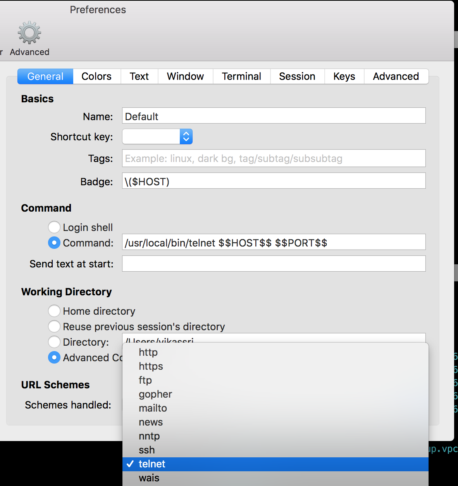

### Error while deploying CSR 1000v directly on  ESXi

### A Required Disk Image Was Missing

```sh
$ ovftool --name="CSR1"  --acceptAllEulas -ds="datastore1" --net:"GigabitEthernet1"="VM Network"  --net:"GigabitEthernet2"="VM Network" --net:"GigabitEthernet3"="VM Network"  /filepath/csr1000v-universalk9.16.03.06\ \(1\)\ copy.ova vi://192.168.1.13/
Opening OVA source: /filepath/Downloads/csr1000v-universalk9.16.03.06 (1) copy.ova
The manifest validates
Enter login information for target vi://192.168.1.13/
Username: root
Password: *********
Opening VI target: vi://root@192.168.1.13:443/
Deploying to VI: vi://root@192.168.1.13:443/
Disk progress: 4%
```


ovftool --name="KISE"  --acceptAllEulas -ds="datastore1" --net:"GigabitEthernet1"="VM Network"  --net:"GigabitEthernet2"="VM Network" --net:"GigabitEthernet3"="VM Network"  /filepath/csr1000v-universalk9.16.03.06\ \(1\)\ copy.ova vi://192.168.1.13/


Opening OVA source: /filepath/Downloads/csr1000v-universalk9.16.03.06 (1) copy.ova
The manifest validates
Enter login information for target vi://192.168.1.13/
Username: root
Password: *********
Opening VI target: vi://root@192.168.1.13:443/
Deploying to VI: vi://root@192.168.1.13:443/
Disk progress: 4%
```


ovftool --noSSLVerify \
        --name="KISE"  \
        --acceptAllEulas \
        -ds="datastore1" \
        --diskMode=thin \
        --network="VM Network"  \
        /opt/unetlab/original-images/ESXi_ISE-2.1.0.474-mini.ova \
        vi://192.168.1.13/


ESXi

https://talesfromthedatacenter.com/2016/02/esxi-6-install-stuck-on-relocating-modules-and-starting-up-the-kernel/


### Re-arranging iTerm

Thanks to `http://azaleasays.com/2014/03/05/iterm2-merge-a-pane-back-to-window-or-tab-bar/`

The secret key combination to drag a pane back to a window or to the tab bar is: `command + shift + option`, while dragging the pane body (not its header!). View the screencast below and you’ll figure it out:


### Having iTerm handle the telnet:// URL


