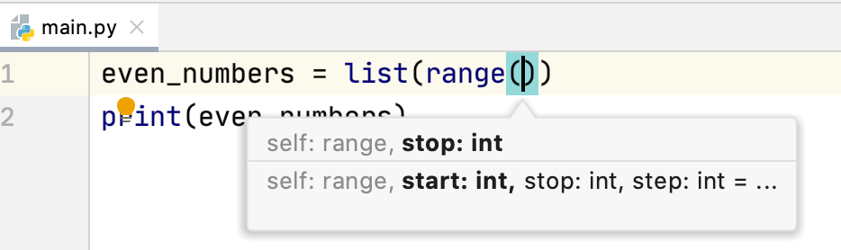

# Day 1 - Target 20 Pages


Zen of Python


```py
import this
```
```
Complex is better than complicated.
Flat is better than nested.
Sparse is better than dense.
Readability counts.
```

A comment can be made anywhere with `#`
```py
# This is a comment
print(Hello) # This is a comment too !
```

Basic Example of a Variable (in this case **message**)

```py
message = "Hello!"
print(message)
```

Basic String Manipulation

```py
message = "Hello!"
print(message.upper())
```

Combining or Concatenating Strings

```py
message1 = "Hello"
message2 = "World!"
print(message1 + message2)
```

Stripping White Space (`rstrip,lstrip,strip`)

```py
message1 = "Hello   "
print(message1.rstrip())
```

Escape Sequence

```py
message1 = "Hello \"World   "
print(message1)
```

**Avoiding type errors with str() functions**

```py
age = 23
message = "Happy" + age + "birthday"
```

The above code will lead to type error as python is unable to know if  `age` int or str. So we need to define like this:

```py
age = 23
message = "Happy" + str(age) + "birthday"
```

**Python List**

List position index starts at `0` not `1`

```py
vegetables = [`tomato`, `brocolli`, `carrot`]
print(vegetables)
```

The above will print the representation of list with the brackets

```
[`tomato`, `brocolli`, `carrot`]
```

Accessing one of the items of the list

```py
vegetables = [`tomato`, `brocolli`, `carrot`]
print(vegetables[2])
```

Prints `carrot`

**Changing, adding, and removing elements**

**Changing**
```py
motorcycles = ['honda', 'yamaha', 'suzuki']
print(motorcycles)
# Changing the Item
motorcycles[0] = 'ducati'
print(motorcycles)
```

```
['honda', 'yamaha', 'suzuki']
['ducati', 'yamaha', 'suzuki']
```

**Adding**
```py
motorcycles = ['honda', 'yamaha', 'suzuki']
print(motorcycles)
motorcycles.append('ducati')
print(motorcycles)
```
```
['honda', 'yamaha', 'suzuki']
['honda', 'yamaha', 'suzuki', 'ducati']
```
**Removing Items from a list**

```py
motorcycles = ['honda', 'yamaha', 'suzuki']
print(motorcycles)
del motorcycles[0]  # Deletes the first item from the list
print(motorcycles)
```

```
['honda', 'yamaha', 'suzuki']
['yamaha', 'suzuki']
```

**Starting with an empty list and adding items**

```py
motorcycles = [] # Start with an empty list
motorcycles.append('honda')  # Add Items
motorcycles.append('yamaha')
motorcycles.append('suzuki')

print(motorcycles)
```

```
['honda', 'yamaha', 'suzuki']
```

**Removing an Item Using the pop() Method**

**pop takes out the first item of the list**

```py
motorcycles = ['honda', 'yamaha', 'suzuki']
print(motorcycles)
popped_motorcycle = motorcycles.pop()
print(motorcycles)
print(popped_motorcycle)
```
```
['honda', 'yamaha', 'suzuki']
['honda', 'yamaha']
```
**The pop() method removes the last item in a list, but it lets you work with that item after removing it.**

```py
motorcycles = ['honda', 'yamaha', 'suzuki']
last_owned = motorcycles.pop()
print("The last motorcycle I owned was a " + last_owned.title() + ".")
```

```
The last motorcycle I owned was a Suzuki.
```

**Removing an Item by Value**

```py
# Original Invitation
guestlist = ['Ben S', 'Tammy G', 'Anna M', 'Bobby L']

for guest in guestlist:
  print("Hello my dear friend "+ str(guest) + " please come to my party")

# A guest said they cant come
can_not_attend = 'Tammy G'
guestlist.remove(can_not_attend)
print (" I am sorry but " + str(can_not_attend) + " wont be able to join us")

for guest in guestlist:
  print("Hello my dear friend "+ str(guest) + " please come to my party")

# Found a bigger table , so invite more guest

guestlist.insert(0,"Bob M") # Insert at beginning of the list
guestlist.insert(2, "Midde M") # Insert at Middle
guestlist.append("Mr Append") # Appended at end of the list

for guest in guestlist:
  print("Hello my dear friend "+ str(guest) + " please come to my party")

# You just found out that your new dinner table won’t arrive in time for the dinner, and you have space for only two guests .

print("I am sorry I can only invite 2 people at the dinner\n")
number_of_guests = len(guestlist)
print (number_of_guests)

# for variable_name in range(start, stop, step)
# https://www.geeksforgeeks.org/g-fact-21-increment-and-decrement-operators-in-python/

## Removing all the people from the list untill only 2 are left

for i in range(number_of_guests, 2, -1):
  popped_guest = guestlist.pop()
  print("Hello my dear friend I m sorry you are popped out "+ str(popped_guest))

print ("The new guest list is " + str(guestlist))
for guest in guestlist:
  print("Hello my dear friend "+ str(guest) + " please come to my party")


# Cleaning up the list to make it empty

del guestlist[0] # Removign the first item
del guestlist[0] # Removign the second item , also at 0 since there were only 2 items , when first was remove , second one came to 0.

print(guestlist)

```


**Organizing a List**

```py
cars = ['bmw', 'audi', 'toyota', 'subaru']
cars.sort()  # These changes the order permanently
# cars.sort(reverse=True)  You can also do reverse.
print(cars)
```
```
['audi', 'bmw', 'subaru', 'toyota']
```

The function `.sorted()` only sorts it temporarily

**Finding the Length of a List**

```py
>>> cars = ['bmw', 'audi', 'toyota', 'subaru']
>>> len(cars)
4
```

```py
places_to_visit = ['Rome', 'Florence', 'Switzerland', 'India', 'Iceland']

print("Original List : " + str(places_to_visit))
print("Printing temp sorted : " + str(sorted(places_to_visit))) # Sorted only sort temporrarily without changign the original list
print("Original List again : " + str(places_to_visit))

temp = sorted(places_to_visit)
temp.sort(reverse=True) # Notice how to reverse.

print("Sorted Reverse Alphabetical" + str(temp))
print("Original List again : " + str(places_to_visit))
places_to_visit.reverse()
print("Reversed List" + str(places_to_visit))
places_to_visit.reverse()
print("back to Original List" + str(places_to_visit))
```


**Avoiding Index Errors When Working with Lists**

```py
motorcycles = ['honda', 'yamaha', 'suzuki']
print(motorcycles[3])
```

```
Traceback (most recent call last):
File "motorcycles.py", line 3, in <module>
    print(motorcycles[3])
IndexError: list index out of range

```

```py
motorcycles = ['honda', 'yamaha', 'suzuki']
print(motorcycles[-1])
```

The index -1 always returns the last item in a list, in this case the value 'suzuki'

**Looping Through an Entire List**

```py
magicians = ['alice', 'david', 'carolina']
for magician in magicians:
    print(magician)
```

```
alice
david
carolina
```

**Using the range() Function**

Python’s range() function makes it easy to generate a series of numbers.

```py
for value in range(1,5):
    print(value)
```
```
1
2
3
4
```

**Using range() to Make a List of Numbers**

```py
numbers = list(range(1,6))
print(numbers)
```

```
[1, 2, 3, 4, 5]
```

We can also use the range() function to tell Python to skip numbers in a given range. For example, here’s how we would list the even numbers between 1 and 10:



```py
even_numbers = list(range(2,11,2))
print(even_numbers)
```

```
[2, 4, 6, 8, 10]
```
