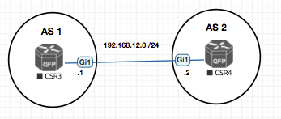

## BGP with BFD on EVE-NG with CSR1000v

BFD is a superfast protocol to detect link failures withing milliseconds or microseconds!

Routing protocols have mechanism to detect link failures as well with `HELLO` like mechanism but is not good enough for convergence where technologies like VOIP is involved. We can tune the routing protocol for exmaple OSPF to use a dead interval of one second. (Which for VOIP is too high)


> BFD runs independent of the routing protocol.

Once BFD is UP you can use other routing protocols to leverage is for fast convergence.

Once BFD stops receiving packets from the peer , it notifies the protocol using it about the same. (Which is faster than the protocols native dead timer expiry)

### BFD had two modes of operation
- `Asynchronous Mode` : The Asynchronous mode is like the Hello and Holddown timer , when BFD does not receive some of them the session is teared.
- `Demand Mode` : In this once BFD has found a neighbour it wont continuously send packets to neighbour but uses only a polling mechanism. For example noticing the rx/tx of the interface. As of now neither Cisco nor any other vendor supports this mode.

Both modes support `echo` mode , in which a device sends a echo packet and other device reponds withour processing it. If the sender does not get the response the neighborship is teared.




```sh
CSR3#show running-config int gi1
Building configuration...

Current configuration : 141 bytes
!
interface GigabitEthernet1
 ip address 192.168.12.1 255.255.255.0
 bfd interval 50 min_rx 50 multiplier 3
end

CSR3#show running-config | sec bgp
router bgp 1
 timers bgp 10 11 10
 neighbor 192.168.12.2 remote-as 2
 neighbor 192.168.12.2 fall-over bfd
CSR3#


CSR4#show running-config int gi1
Building configuration...

Current configuration : 131 bytes
!
interface GigabitEthernet1
 ip address 192.168.12.2 255.255.255.0
 negotiation auto
 bfd interval 50 min_rx 50 multiplier 3
end

CSR4#show running-config | sec bgp
router bgp 2
 timers bgp 10 11 10
 neighbor 192.168.12.1 remote-as 1
 neighbor 192.168.12.1 fall-over bfd

CSR4(config-router)#
*Mar 30 21:19:31.028: %BFD-6-BFD_SESS_CREATED: BFD-SYSLOG: bfd_session_created, neigh 192.168.12.1 proc:BGP, idb:GigabitEthernet1 handle:1 act
*Mar 30 21:19:31.147: %BFDFSM-6-BFD_SESS_UP: BFD-SYSLOG: BFD session ld:4097 handle:1 is going UP
*Mar 30 21:19:41.187: %SYS-5-CONFIG_I: Configured from console by console
*Mar 30 21:19:46.680: %BFDFSM-6-BFD_SESS_DOWN: BFD-SYSLOG: BFD session ld:4097 handle:1,is going Down Reason: ECHO FAILURE
*Mar 30 21:19:46.682: %BGP-5-NBR_RESET: Neighbor 192.168.12.1 reset (BFD adjacency down)
*Mar 30 21:19:46.682: %BGP-5-ADJCHANGE: neighbor 192.168.12.1 Down BFD adjacency down
*Mar 30 21:19:46.682: %BGP_SESSION-5-ADJCHANGE: neighbor 192.168.12.1 IPv4 Unicast topology base removed from session  BFD adjacency down
*Mar 30 21:19:46.683: %BFD-6-BFD_SESS_DESTROYED: BFD-SYSLOG: bfd_session_destroyed,  ld:4097 neigh proc:BGP, handle:1 act

```


> We have configured the BFD timers as 100msecs  with multiplier as 3 so that BFD session will go down if the device did not get response within 300 msecs
For the Voice network we need to have less 200 ms delay in the network otherwise the voice communication will break.
Please consult with your ISP to avoid the delay and let me know if you need any clarification.
