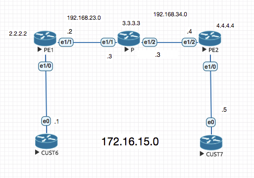

Step1. Configure OSPF between the SP Routers
Step2. Setup MPLS neighborship between the SP routers.
Step. Finnaly Configure xconnect on the Customer facing interface on PE1 and PE2 pointing towards each other.

```sh

hostname PE1
!
interface Loopback0
 ip address 2.2.2.2 255.255.255.128
 ip ospf network point-to-point
!
interface Ethernet1/0
 no ip address
 duplex full
 no keepalive
 xconnect 4.4.4.4 15 encapsulation mpls
!
interface Ethernet1/1
 ip address 192.168.23.2 255.255.255.0
 duplex full
 mpls ip
!
router ospf 1
 passive-interface Ethernet1/0
 network 0.0.0.0 255.255.255.255 area 0


```


```sh
hostname P
!
interface Loopback0
 ip address 3.3.3.3 255.255.255.128
 ip ospf network point-to-point
!
interface Ethernet1/1
 ip address 192.168.23.3 255.255.255.0
 duplex full
 mpls ip
!
interface Ethernet1/2
 ip address 192.168.34.3 255.255.255.0
 duplex full
 mpls ip
!
router ospf 1
 network 0.0.0.0 255.255.255.255 area 0
!

```


```sh
hostname PE2
!
!
!
interface Loopback0
 ip address 4.4.4.4 255.255.255.128
 ip ospf network point-to-point
!
!
interface Ethernet1/0
 no ip address
 duplex full
 no keepalive
 xconnect 2.2.2.2 15 encapsulation mpls

!
interface Ethernet1/2
 ip address 192.168.34.4 255.255.255.0
 duplex full
 mpls ip
!

!
router ospf 1
 network 0.0.0.0 255.255.255.255 area 0
!


```


```sh

hostname Customer-A

!
interface Ethernet0
 ip address 172.16.15.1 255.255.255.0
 full-duplex
!


```


```sh


hostname Customer-B
!

!
interface Ethernet0
 ip address 172.16.15.5 255.255.255.0
 full-duplex


```
