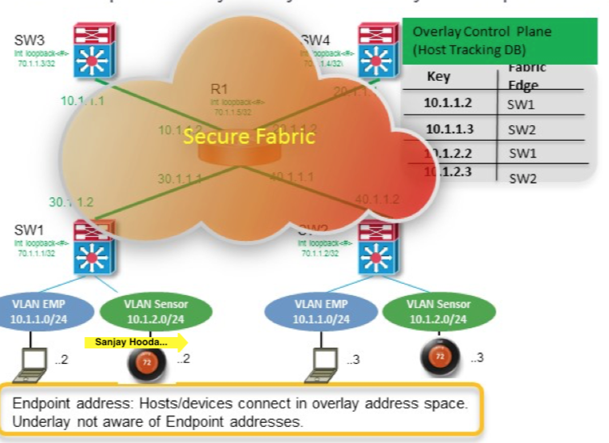
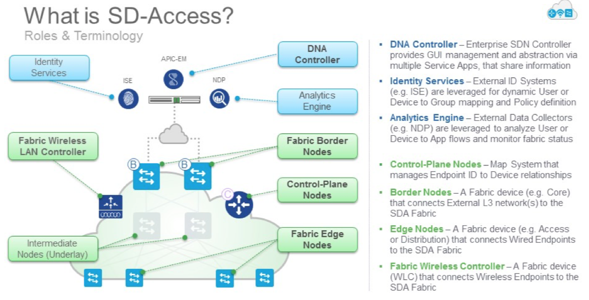
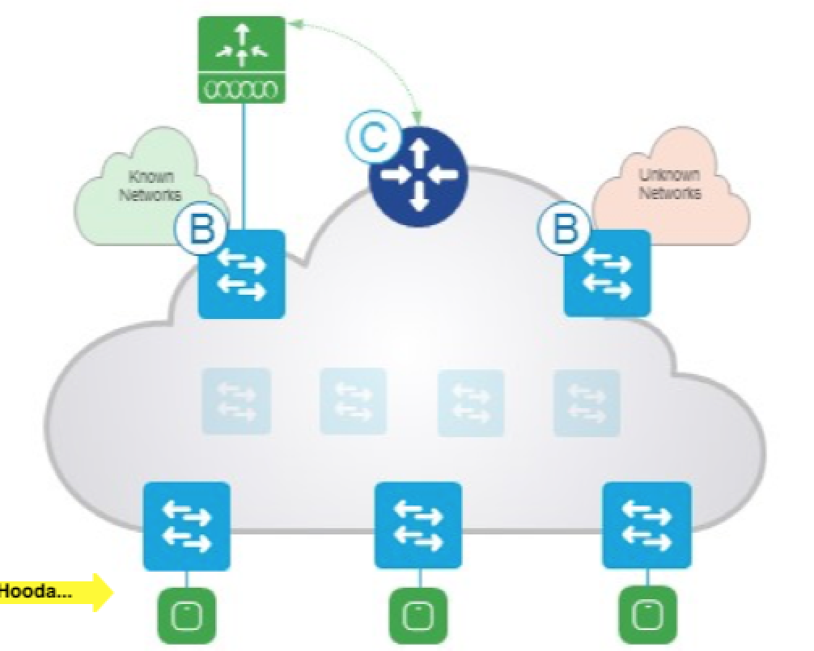

## Catalayst 9000 and SD Access

### LISP is the Control Plane and Data Plane is VXLAN .

The controllers foes support YANG model , but as of today it supports CLI model .

On the top of the underlay we have the overlay network.

The `Overlay Control Plane` also knows as `Host Tracking Database` .

### The Key Concepts

#### Control Plane

In simple terms its a very simple key value pair and does the resolution of lookup.
Once a packet comes on the network , the Control Nodes where the device is (just like the behaviour of a VTEP)
and the packet is sent to that VTEP.

### Edge Node

- Responsible for Indentifying and Authenticating Endpoints (802.1X / AD)
- Registers the specific endpoint to the the `Control Plane`
- The `Edge Node` also becomes the Anycast Gateway for any device connected to it. (Anycast gateway is like the HSRP VIP on any switch! just like the BGP-EVPN Contol Plane)
- `Edge Node` also performs the encap/decap of VXLAN.

### Border Nodes

- `Fabric Border` Connects to Known networks. This is where we know these are our networks and we want it to be routed and import that routing table in your network.
- `Default Border` Used for unknown routes outside your company. This is like where Internet where you do not want to learn all the internet routes and set a default route to the internet. Think of the default border as the one which acts as a default route out for the internet.

### Sounds Like ACI

- The Fabric Does look similar though this is for Access Layer .
- Wireless
- It supports any topology unlike ACI which is strictly a leaf spine architecture.
- Underlay can support any protocol .

### Fabric Border Nodes

- Connects to any `Known` IP subnets attached to the the outside network.
- The Virtual Network is mapped to the VRF .

### Fabric Enable Wireless LAN Controller.

The managment is still centralised as today , but the datapath becomes much more scalablae and high bandwidth capable. Notice in the picture above the Datapath between the WLCs.

The `Fabric Enabled WLC` registers Wireless Clients with the Control Plane (the LISP DB).
