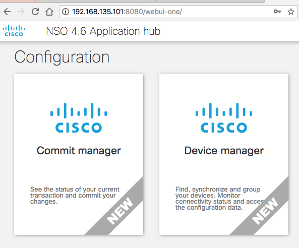
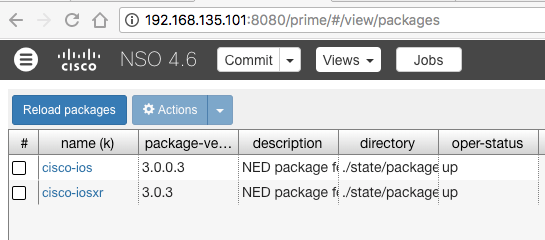
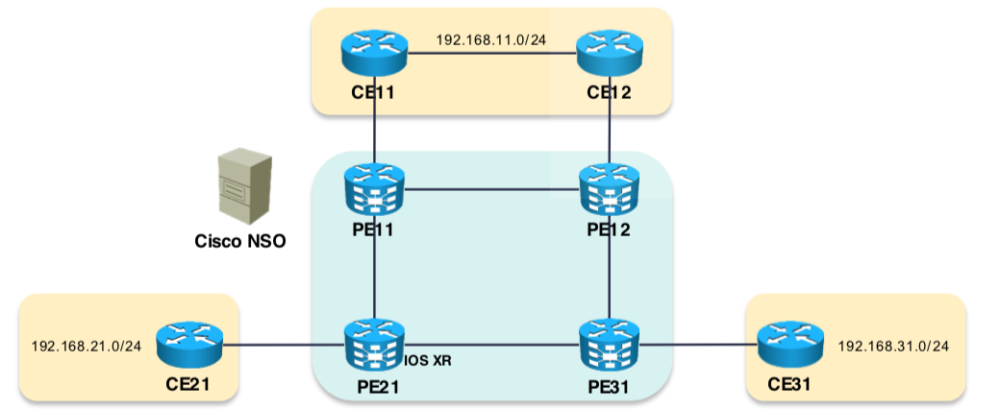
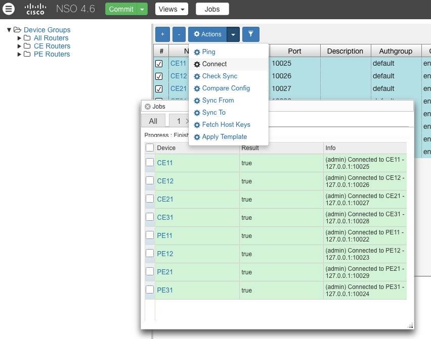
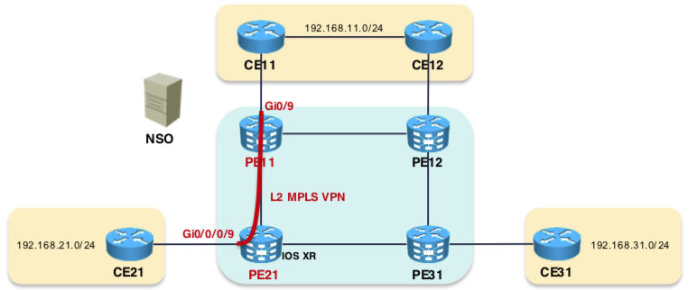

##### NCS Installation

Make sure Java Installed `java -version` and `ant` are installed.

#### Install NCS

```sh
root@mininet-vm:/home/mininet# chmod +x nso-4.6.linux.x86_64.installer.bin
root@mininet-vm:/home/mininet# ./nso-4.6.linux.x86_64.installer.bin /opt/ncs
```

#### Setup NCS

```sh
root@mininet-vm:/home/mininet# source /opt/ncs/ncsrc
root@mininet-vm:/home/mininet# ncs-setup --dest $NCS_DIR/ncs-run
root@mininet-vm:/home/mininet# cd $NCS_DIR/ncs-run
# Start the NCS Server
root@mininet-vm:~/ncs-run# ncs
```

Check NCS Status

`ncs --status | grep status`
`ncs --version`
`3.4.2`

NCS/NSO via the WebUI
Type "http://127.0.0.1:8080/login.html"

Connect to the NCS CLI
`ncs_cli -u admin -C`




#### What are the packages availaible

```sh
root@mininet-vm:~# cd $NCS_DIR
root@mininet-vm:/opt/ncs# ls packages/neds/
a10-acos  cisco-ios  cisco-iosxr  cisco-nx  dell-ftos  juniper-junos
```

#### Compile a new NED

Compile the Cisco IOS NED package by issuing the make command. Make sure that the compilation of the NED and netsim (the part used to emulate Cisco IOS CLI which will be used throughout this course) is successful.

```sh
root@mininet-vm:/opt/ncs/packages/neds/cisco-ios/src# make
cd java && ant -q all

BUILD SUCCESSFUL
Total time: 0 seconds
cd ../netsim && make all
make[1]: Entering directory `/opt/ncs/packages/neds/cisco-ios/netsim'
make[1]: Nothing to be done for `all'.
make[1]: Leaving directory `/opt/ncs/packages/neds/cisco-ios/netsim'
```

Do the same for IOS-XR

```sh
root@mininet-vm:/opt/ncs/packages/neds/cisco-iosxr# cd src
root@mininet-vm:/opt/ncs/packages/neds/cisco-iosxr/src# make
cd java && ant -q all

BUILD SUCCESSFUL
Total time: 0 seconds
cd ../netsim && make all
make[1]: Entering directory `/opt/ncs/packages/neds/cisco-iosxr/netsim'
make[1]: Nothing to be done for `all'.
make[1]: Leaving directory `/opt/ncs/packages/neds/cisco-iosxr/netsim'
```

The two NEDs are now compiled and available for use but they are not available to the running instance of NSO. One of the ways to make them available to the running instance is by linking a directory in the ncs-run/packages directory to point to the location of the NEDs in the packages subdirectory in the installation directory (i.e. $NCS_DIR)

#### To link the newly compiled NEDS
```sh
cd $HOME/ncs-run/packages
ln -s /opt/ncs/packages/neds/cisco-ios cisco-ios
ln -s /opt/ncs/packages/neds/cisco-iosxr cisco-iosxr
```


```sh
ncs_cli -C -u admin
root@ncs# packages reload

>>> System upgrade is starting.
>>> Sessions in configure mode must exit to operational mode.
>>> No configuration changes can be performed until upgrade has completed.
>>> System upgrade has completed successfully.
reload-result {
    package cisco-ios
    result true
}
reload-result {
    package cisco-iosxr
    result true
}
root@ncs#
```

See the Cisco IOS and Cisco IOS XR NEDs loaded into NSO.



You can also verify this with : `show packages` as well

##### Next Objective is to Add emulated devices to the NSO and perform some intial taks like Synchornize Config , Create Device Groups , and make sure all devices share the same config.



#### Add Emulated Devices to the Network

Now we will neither use real or virtual devices but use emulated deives

#### Create device with Net Sim

```sh
ncs-netsim create-device cisco-ios PE11
ncs-netsim add-device cisco-ios PE12
ncs-netsim add-device cisco-iosxr PE21
ncs-netsim add-device cisco-ios PE31
ncs-netsim add-device cisco-ios CE11
ncs-netsim add-device cisco-ios CE12
ncs-netsim add-device cisco-ios CE21
ncs-netsim add-device cisco-ios CE31

# Bulk Export for easy import
ncs-netsim ncs-xml-init > devices.xml

# And then Bulk Import to NCS
ncs_load -l -m devices.xml

admin@ncs# show devices brief
NAME  ADDRESS    DESCRIPTION  NED ID
------------------------------------------
CE11  127.0.0.1  -            cisco-ios
CE12  127.0.0.1  -            cisco-ios
CE21  127.0.0.1  -            cisco-ios
CE31  127.0.0.1  -            cisco-ios
PE11  127.0.0.1  -            cisco-ios
PE12  127.0.0.1  -            cisco-ios
PE21  127.0.0.1  -            cisco-ios-xr
PE31  127.0.0.1  -            cisco-ios
R1    127.0.0.1  -            cisco-ios

```


Now connect to the your NCS CLI `ncs_cli -C -u admin` and add the device to the NCS

```sh
config
 devices device R1
  address 127.0.0.1 port 10022
  device-type cli ned-id cisco-ios protocol ssh
  authgroup default
  state admin-state unlocked
commit
```

Now connnec to the device and fetch the configuration from them

```sh
devices fetch-host-keys
devices sync-from
end
```

#### Create Device Group

Now lets add the devices added above to a device group

```sh
admin@ncs(config)# devices device-group "PE Routers"
admin@ncs(config-device-group-PE Routers)# device-name [ PE11 PE12  PE21  PE31 ]
admin@ncs(config-device-group-PE Routers)# top
admin@ncs(config)# devices device-group "CE Routers"
admin@ncs(config-device-group-CE Routers)# device-name [ CE11 CE12 CE21 CE31 ]
admin@ncs(config-device-group-CE Routers)# top
admin@ncs(config)# devices device-group "All Routers"
admin@ncs(config-device-group-All Routers)# device-group [ "PE Routers" "CE Routers" ]
admin@ncs(config-device-group-All Routers)# top
```

Now lets verify the configuration and `commit` it .

```sh
admin@ncs(config)# show configuration
devices device-group "All Routers"
!
devices device-group "PE Routers"
 device-name [ PE11 PE12 PE21 PE31 ]
!
devices device-group "CE Routers"
 device-name [ CE11 CE12 CE21 CE31 ]
!
devices device-group "All Routers"
 device-group [ "CE Routers" "PE Routers" ]
!
admin@ncs(config)# commit
Commit complete.
admin@ncs(config)#
```

You can verify the above by

```sh
admin@ncs# show devices device-group member
NAME         MEMBER
----------------------------------------------------------
All Routers  [ CE11 CE12 CE21 CE31 PE11 PE12 PE21 PE31 ]
CE Routers   [ CE11 CE12 CE21 CE31 ]
PE Routers   [ PE11 PE12 PE21 PE31 ]

```

- Interesting Screen Shot



#### Create Customer

Now lets create a customer

```sh
admin@ncs(config)# customers customer ACME
admin@ncs(config-customer-ACME)# rank 1
admin@ncs(config-customer-ACME)# status active
admin@ncs(config-customer-ACME)# top
admin@ncs(config)# commit
Commit complete.
admin@ncs(config)#


admin@ncs# show running-config customers
customers customer ACME
 rank   1
 status active
!
```

#### Lets now create a Device template

```sh
admin@ncs# config
admin@ncs(config)# devices template "Common Device Parameters" config
admin@ncs(config-config)# ios:?
admin@ncs(config-config)# ios:ip domain name cisco.com
admin@ncs(config-config)# ios:ip name-server [ 192.168.133.1 ]
admin@ncs(config-config)# ios:ntp server server-list 10.0.0.1
admin@ncs(config-server-list-10.0.0.1)# exit
admin@ncs(config-config)# cisco-ios-xr:domain name cisco.com
admin@ncs(config-config)# cisco-ios-xr:domain name-server 192.168.133.1
admin@ncs(config-name-server-192.168.133.1)# exit
admin@ncs(config-config)# cisco-ios-xr:ntp server 10.0.0.1
admin@ncs(config-server-10.0.0.1)# exit
admin@ncs(config-config)# commit
Commit complete.
```

Verify the configuration above :

```sh

admin@ncs(config)# show full-configuration devices template Common\ Device\ Parameters
devices template "Common Device Parameters"
 config
  cisco-ios-xr:domain name cisco.com
  cisco-ios-xr:domain name-server 192.168.133.1
  !
  cisco-ios-xr:ntp server 10.0.0.1
  !
  ios:ip domain name cisco.com
  ios:ip name-server [ 192.168.133.1 ]
  ios:ntp server server-list 10.0.0.1
  !
 !
!
admin@ncs(config)#

```
Now apply the configuration above to all the routers

```sh
admin@ncs(config)# devices device-group All\ Routers apply-template template-name Common\ Device\ Parameters
apply-template-result {
    device CE11
    result ok
}
apply-template-result {
    device CE12
    result ok
}
apply-template-result {
    device CE21
    result ok
}
apply-template-result {
    device CE31
    result ok
}
apply-template-result {
    device PE11
    result ok
}
apply-template-result {
    device PE12
    result ok
}
apply-template-result {
    device PE21
    result ok
}
apply-template-result {
    device PE31
    result ok
}

```

Note that from the above command the configuration is still not applied on the routers unless it is commited .

Lets do a dry run before comiting it

```sh
admin@ncs(config)# commit dry-run
cli {
    local-node {
        data  devices {
                  device CE11 {
                      config {
                          ios:ip {
                              domain {
             +                    name cisco.com;
                              }
             +                name-server 192.168.133.1;
                          }
                          ios:ntp {
                              server {
             +                    server-list 10.0.0.1 {
             +                    }
                              }
                          }
                      }
                  }
                  device CE12 {
                      config {
                          ios:ip {
                              domain {
             +                    name cisco.com;
                              }
             +                name-server 192.168.133.1;
                          }
                          ios:ntp {
                              server {
             +                    server-list 10.0.0.1 {
             +                    }
                              }
                          }
                      }
                  }

admin@ncs(config)# commit
Commit complete.
admin@ncs(config)#
```

Now that we have the configuration applied , lets check on the devices individually

```sh
admin@ncs(config)# show full-configuration devices device PE21
devices device PE21
 address   127.0.0.1
 port      10029
 ssh host-key ssh-rsa
  key-data "AAAAB3NzaC1yc2EAAAADAQABAAABAQC8dMrFKaxMJWsJZgHkV+LJqqIbxxUB3ntam9BpES32\n86fDHaMQPHqVxMqXGnTP5kJYHL8y5hmR9q6pcdDCZ+eCoLZZnjZvWu74Osqa1Av2e9NW4yoX\nSheaj3GRur7roLcv0rzenpipKUnlzv6Hl9yw2nA3E1FFljMEZZ2yhaZ0j8JlMEIvSVEmGbzD\nATlnblrW0sgAVPtC0ssoEwBQaRX8iicN3GsDcMpW7/mkVfkROws1JTO5C/UC0Um0bL5miJ7z\n+eKvIZiRY80pBKTjY17e8L4iKOvwwPV9VdlHB3ePJuZw4NNqcd5m2NuiqtnGBlu0MIxeoIhu\nnTa+xAyqoKH3"
 !
 authgroup default
 device-type cli ned-id cisco-ios-xr
 state admin-state unlocked
 config
  cisco-ios-xr:domain name cisco.com
  cisco-ios-xr:domain name-server 192.168.133.1
  cisco-ios-xr:ntp
   server 10.0.0.1
  exit
```

#### Now Lets create a Service

In this activity we will create a simple point to point Layer 2 MPLS VPN

> Take a detour a learn a little bit about Layer 2 MPLS VPN , Here is the link to the `blog`


