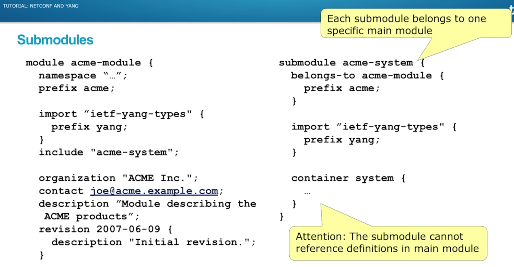
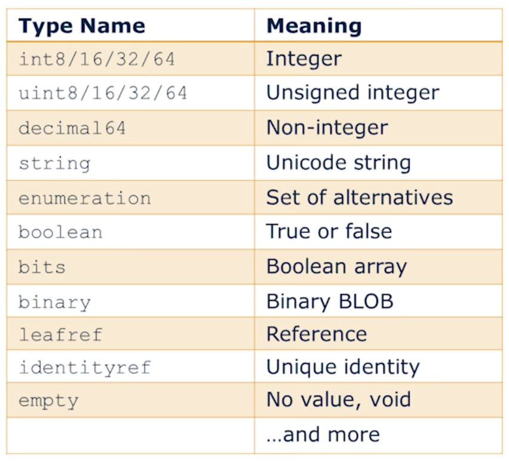
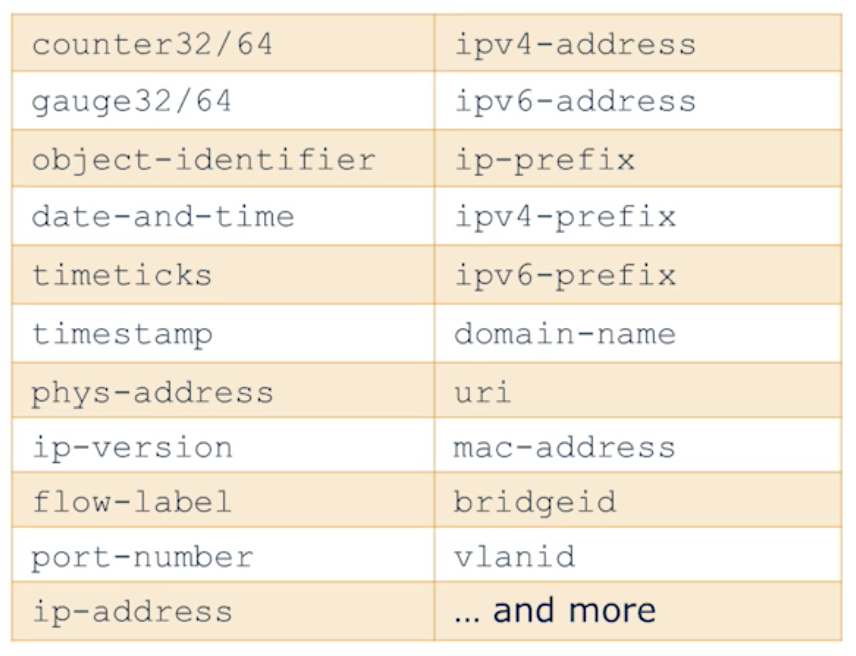

#### Modules

> This file is based on the Youtube video `https://www.youtube.com/watch?v=AdIcYrz3AjU&t=1854s`

Below is a sample YANG file generated by the `ncs-make-package --service-skeleton template ospf_deploy` . We will use this for our learnign and understanding for the YANG file and so the same based on real life YANG file examples.

> Notes are added as comments in the file below

```shell

module ospf_deploy {
  namespace "http://com/example/ospf_deploy";
  prefix ospf_deploy;

  import ietf-inet-types {
    prefix inet;
  }
  import tailf-ncs {
    prefix ncs;
  }
  organisation "ACME Inc";
  revision 2007-01-02 {
    description "Second version v2";
  }
}
```


Note above that each module begins with the module declaration , the filename should equal the module name.Each module is uniqiely identified in the system with the `namespace`
`prefix` below is how the namespace will be refrenced in the file goign forward. Something like `ospf_deploy:` followed by something.


> Note that YANG is XML Definition langauage and maps one to one with XML.

The `import` and `include` add other modules to the YANG model.

Using the revision ifnormation in , when workign with NETCONF ,it will advertise the version wehich will make the managment device know waht s the device caapable of .

`import`  A yang imports is similar to including a Header file in a C Code.

`include` Include statement is used to pull  submodules into a main. A module doees not have to be contained within one file. You can decompose it for ease of maintenance design.

`submodules`

A submodule is a written in a separate `acme-system.yang` file and does not have a namespace of its own. (Notice the same in the picture below)

THe submodule is included in the parent module ,

so paremt module can refer --> to the submodule
but submodule cannot  refere to items in the parent module .




#### YANG Base Types




##### Typedef
Below is the a Typedef defined for `percent` . The leaf `completed` inherits the typedef `percent`.


```shell
typedef percent {
  type unit16 {
    range "0 .. 100"
  }
  description "Percentage";
}

leaf completed {
  type percent;
}
```

##### Type Restrictions

Notice below how Restrictions are applied on derived-int32 .

```shell
typedef my-base-int32-type {
  type int32 {
    range "1..4 | 10..20"  # 1 to 4 and 10 to 20
  }
}

typedef derived-int32 {
  type my-base-int32-type {
    range "11..max";   # Derived from the typedef above but is only limited to 11 to 20 .
  }
}

```

##### Union Statement

```shell
typedef threshold {
  type union {
    type uint16 {
      range "0 .. 100";
    }
    type enumeration {
      enum disabled {
        description "No threshold";
      }
    }
  }
}

```

`Youtube 12:33`

##### Common YANG types

Common Networking Data types are stores in `ietf-yang-types` (RFC 6021) like the following.
These can be added to the your YANG file using the following.

```shell
import `ietf-yang-types` {
  perfix yang
}

leaf remote-ip {
  type yang:ipv4-address {  # Here we refer the ietf yang type for IPv4 address.
    pattern "10\\.0\\.0\\.[0-9]+";
  }
```




.
.
.
.
.
.
.
.
.
.
.
.
.
----

**`optimized.l2vpn.yang`**
---

```shell
module l2vpn {
  namespace "http://com/example/l2vpn";
  prefix l2vpn;

  import ietf-inet-types {
    prefix inet;
  }
  import tailf-ncs {
    prefix ncs;
  }
  import tailf-common {
    prefix tailf;
  }

  import tailf-ned-cisco-ios {
    prefix ios;
  }
  import tailf-ned-cisco-ios-xr {
    prefix cisco-ios-xr;
  }

  augment "/ncs:services" {
    list l2vpn {
      key "name";
      unique "pw-id";
      uses ncs:service-data;
      ncs:servicepoint "l2vpn";
      leaf name {
        tailf:info "Service Instance Name";
        mandatory true;
        type string;
      }
      leaf pw-id {
        tailf:info "Unique Pseudowire ID";
        mandatory true;
        type uint32 {
          range "1..4294967295";
        }
      }
      list link {
        tailf:info "Attachment Circuits";
        min-elements 2;
        max-elements "2";
        key "device";
        leaf device {
          tailf:info "PE Router";
          mandatory true;
          type leafref {
            path "/ncs:devices/ncs:device/ncs:name";
          }
        }
        container ios {
          when "/ncs:devices/ncs:device[ncs:name=current()/../device]/ncs:device-type/ncs:cli/ncs:ned-id='ios-id:cisco-ios'" {
            tailf:dependency "../device";
            tailf:dependency "/ncs:devices/ncs:device/ncs:device-type";
          }
          leaf intf-number {
            tailf:info "GigabitEthernet Interface ID";
            mandatory true;
            type leafref {
              path "deref(../../device)/../ncs:config/ios:interface/ios:GigabitEthernet/ios:name";

            }
          }
        }
        container iosxr {
          when "/ncs:devices/ncs:device[ncs:name=current()/../device]/ncs:device-type/ncs:cli/ncs:ned-id='cisco-ios-xr-id:cisco-ios-xr'" {
            tailf:dependency "../device";
            tailf:dependency "/ncs:devices/ncs:device/ncs:device-type";
          }
          leaf intf-number {
            tailf:info "GigabitEthernet Interface ID";
            mandatory true;
            type leafref {
              path "deref(../../device)/../ncs:config/cisco-ios-xr:interface/cisco-ios-xr:GigabitEthernet/cisco-ios-xr:id";
            }
          }
        }
        leaf remote-ip {
          tailf:info "Loopback0 IP Address of Remote PE (10.0.0.X)";
          mandatory true;
          type inet:ipv4-address {
            pattern "10\\.0\\.0\\.[0-9]+";
          }
        }
      }
    }
  }
}
```


**`ospf_deploy.yang`**
---


```shell

module ospf_deploy {
  namespace "http://com/example/ospf_deploy";
  prefix ospf_deploy;

  import ietf-inet-types {
    prefix inet;
  }
  import tailf-ncs {
    prefix ncs;
  }

  list ospf_deploy {
    key name;

    uses ncs:service-data;
    ncs:servicepoint "ospf_deploy";

    leaf name {
      type string;
    }

    // may replace this with other ways of refering to the devices.
    leaf-list device {
      type leafref {
        path "/ncs:devices/ncs:device/ncs:name";
      }
    }

    // replace with your own stuff here
    leaf dummy {
      type inet:ipv4-address;
    }
  }
}
```
