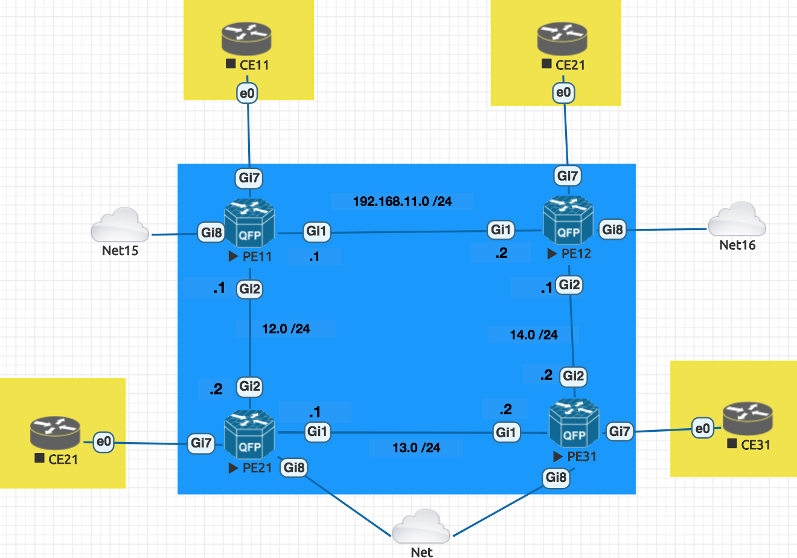
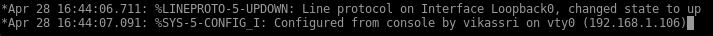
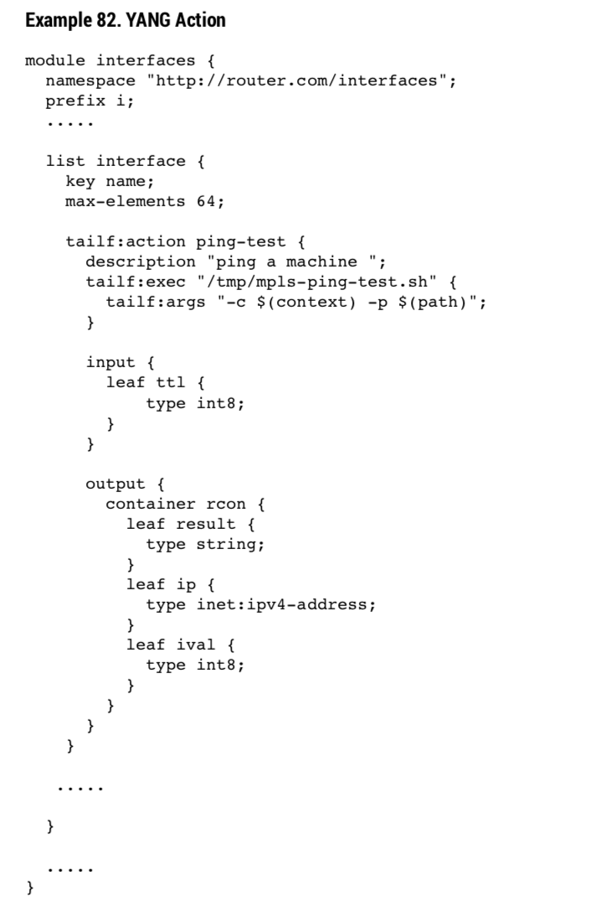
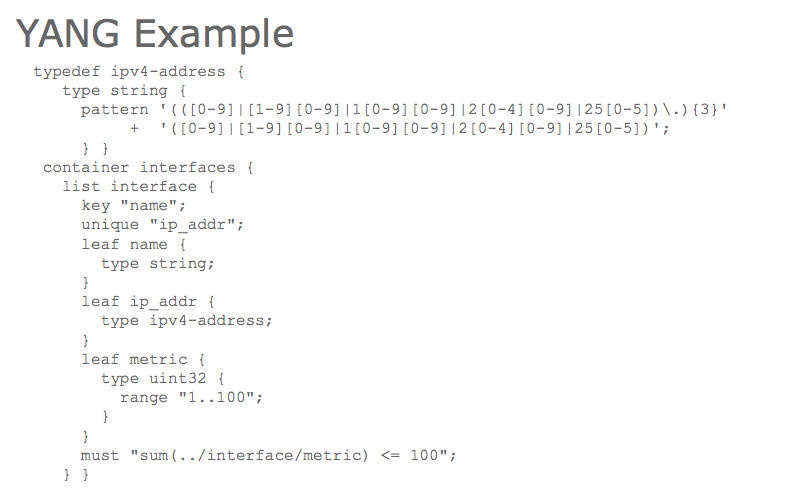

### My NSO Lab ramblings as I learn.



> Lab Details : PE CSR1000v and CEs does not matter for VPN Confgiration . We will only add the PEs to the

#### Lets start with configuring the CE devices to be part of NSO


```cisco
enable password cisco
username vikassri pass cisco

line vty 0 4
 password cisco
 login local
 transport input telnet
!
```

#### EXERCISE 1. Now lets configure loopback address with a service !


Step 1. XML on the Actual CLI Configuration to be applied

```xml
admin@ncs(config)# commit dry-run outformat xml
result-xml {
    local-node {
        data <devices xmlns="http://tail-f.com/ns/ncs">
               <device>
                 <name>PE11</name>
                 <config>
                   <interface xmlns="urn:ios">
                     <Loopback>
                       <name>0</name>
                       <ip>
                         <address>
                           <primary>
                             <address>1.1.1.1</address>
                             <mask>255.255.255.0</mask>
                           </primary>
                         </address>
                       </ip>
                     </Loopback>
                   </interface>
                 </config>
               </device>
             </devices>
    }
}
```

The resulting XML file will be

```xml

<config-template xmlns="http://tail-f.com/ns/config/1.0"
                 servicepoint="loopback_deploy">
  <devices xmlns="http://tail-f.com/ns/ncs">
    <device>
      <!--
          Select the devices from some data structure in the service
          model. In this skeleton the devices are specified in a leaf-list.
          Select all devices in that leaf-list:
      -->
      <name>{/device}</name>
      <config>
        <!--
            Add device-specific parameters here.
            In this skeleton the service has a leaf "dummy"; use that
            to set something on the device e.g.:
            <ip-address-on-device>{/dummy}</ip-address-on-device>
        -->
        <!-- DEVICE1/IOS BELOW IS THE MAIL STUFF WE NEED TO ADD -->
        <interface xmlns="urn:ios">
          <Loopback>
            <name>0</name>
            <ip>
              <address>
                <primary>
                  <address>{/loopback-ip-address}</address>  <!-- Based on the variable from Yang file -->
                  <mask>255.255.255.0</mask>
                </primary>
              </address>
            </ip>
          </Loopback>
        </interface>


      </config>
    </device>
  </devices>
</config-template>


```

Step 2. Basic Yang Model

Here is the model for our loopback configuration looks like


```shell
module loopback_deploy {
  namespace "http://com/example/loopback_deploy";
  prefix loopback_deploy;

  import ietf-inet-types {
    prefix inet;
  }
  import tailf-ncs {
    prefix ncs;
  }

  augment "/ncs:services" {
    list loopback_deploy {
      key "name";
      ncs:servicepoint "loopback_deploy";
      uses ncs:service-data;

      leaf name {
        type string;
      }
      leaf-list device {
        type leafref {
          path "/ncs:devices/ncs:device/ncs:name";
        }
      }
      leaf loopback-ip-address {
        type inet:ipv4-address {

        }
      }
    }
  }
}

```

`services loopback_deploy PE11_Loopback device PE11 loopback-ip-address 1.1.1.1``

```shell
admin@ncs(config)# commit dry-run
cli {
    local-node {
        data  devices {
                  device PE11 {
                      config {
                          ios:interface {
             +                Loopback 0 {
             +                    ip {
             +                        address {
             +                            primary {
             +                                address 10.0.0.1;
             +                                mask 255.255.255.0;
             +                            }
             +                        }
             +                    }
             +                }
                          }
                      }
                  }
              }
              services {
             +    loopback_deploy PE11_Loopback {
             +        device [ PE11 ];
             +        loopback-ip-address 10.0.0.1;
             +    }
              }
    }
}
```



#### Appendix of Exercise Above for Notes and detail annotation on code.

```shell
module loopback_deploy {
  namespace "http://com/example/loopback_deploy";
  prefix loopback_deploy;

  import ietf-inet-types {
    prefix inet;
  }
  import tailf-ncs {
    prefix ncs;
  }

  // Without AUGMENT the service name "loopback_deploy" will not be listed under availaible services.

  augment "/ncs:services" {

    list loopback_deploy {
      key "name";   # A key name is required in a list without it you will get the error yang/loopback_deploy.yang:13: error: the list needs at least one key, because it is used as config
      ncs:servicepoint "loopback_deploy";  # This tells NCS About the entrypoint of the service . Without this you will get  *** ALARM package-load-failure: [loopback_deploy-template.xml:2 Unknown servicepoint: loopback_deploy]
      uses ncs:service-data;  # Now since servicepoint is used above , service-data definition is necessary . yang/loopback_deploy.yang:16: error: A service must use the grouping 'ncs:service-data'.

      leaf name {  # Here we define what the key type is (string in this case)
        type string;
      }

      leaf-list device {   # Change this to just leaf (no list)
        type leafref {
          path "/ncs:devices/ncs:device/ncs:name";
        }
      }

      leaf loopback-ip-address {
        type inet:ipv4-address {
          pattern "10\\.0\\.0\\.[0-9]+";  # Note that the entire pattern line can be deleted. And NCS will still be able to enforce IP Address logic since its based on `ietf-inet-types`
        }
      }

    }
  }
}

```

Now you can bulk configure the Loopback IP Addresses on all the routers ! Next , Lets do something more interesting ...

---


#### EXERCISE 2. Now lets Deploy OSPF Configuration using Device Templates  !

1.Define the template

```sh
admin@ncs(config)# show full-configuration devices template OSPF\ Configuration
devices template "OSPF Configuration"
 config
  ios:router ospf 1
   non-vrf passive-interface interface Gi8  # Make Gi8 Passive so that no neighborshio happens on the home network .
   non-vrf network 0.0.0.0 255.255.255.255
    area 0
   !
  !
 !
!
```

 2.Apply the template to all devices

```sh
admin@ncs(config)# devices device-group All\ Routers apply-template template-name OSPF\ Configuration

```


#### EXERCISE 3. Now lets Deploy Xconnect configuration

1.Define the template


#### * * * ON HOLD  * * * EXERCISE 2. Now Lets Automate the Loopback IP Address selection of the CE11 Routers based on the last octet of the address received on Fa0 (The loopback addressed are not required for the L3 xconnect but this is just for fun )

Lets Start with Skeleton creation

`ncs-make-package --service-skeleton template CE_loopback_deploy`

The XML Template will pretty much remain the same as the above configuration , though the login the YANG file needs to change


```xml

<config-template xmlns="http://tail-f.com/ns/config/1.0"
                 servicepoint="loopback_deploy">
  <devices xmlns="http://tail-f.com/ns/ncs">
    <device>
      <!--
          Select the devices from some data structure in the service
          model. In this skeleton the devices are specified in a leaf-list.
          Select all devices in that leaf-list:
      -->
      <name>{/device}</name>
      <config>
        <!--
            Add device-specific parameters here.
            In this skeleton the service has a leaf "dummy"; use that
            to set something on the device e.g.:
            <ip-address-on-device>{/dummy}</ip-address-on-device>
        -->
        <!-- DEVICE1/IOS BELOW IS THE MAIL STUFF WE NEED TO ADD -->
        <interface xmlns="urn:ios">
          <Loopback>
            <name>0</name>
            <ip>
              <address>
                <primary>
                  <address>{/loopback-ip-address}</address>  <!-- Based on the variable from Yang file -->
                  <mask>255.255.255.0</mask>
                </primary>
              </address>
            </ip>
          </Loopback>
        </interface>


      </config>
    </device>
  </devices>
</config-template>
```

Now lets define the YANG

Ok , remember that we need to based the last octed of the loopback based on the last octet of the Fa0 interface .

This is how you find the XPATH

`show running-config devices device PE11 config ios:interface GigabitEthernet | display xpath`

```

show running-config devices device CE21 address | display xpath

/devices/device[name='CE21']/address

```


This is how you refrence DEREF()


`path "deref(../../device)/../ncs:config/ios:interface/ios:GigabitEthernet/ios:name";`

Ok


---
#### How to Connect to MAAPI

> Make sure you start the NCS Service

```python
import ncs

with ncs.maapi.Maapi() as m:
    with ncs.maapi.Session(m, 'admin', 'python'):
        # The first transaction
        with m.start_read_trans() as t:
            address = t.get_elem('/ncs:devices/device{PE11}/address')
            # Example to access a value with "ncs:"
            # address = t.get_elem('/ncs:devices/device{PE11}/ncs:authgroup')
            print("First read: Address = %s" % address)
```
---


#### Cisco NSO to add Python logic to a service

> `https://www.youtube.com/watch?v=4hCLAYbxjwE&t=817s`

Step 1. Make a service which has a python file to allow premod and post modifications.

```shell
ncs-make-package --service-skeleton `python-and-template` vikassri_auto_lo0_deploy`
```

Step 2. Define the Variable in your XML which needs to updated or changes as per the Python Logic . Lets says its `VARIABLE_IP_Address`

Step 3. Perform logic in the code below and when done add the final variable to for the XML file to read using `vars.add` . This the variable which will be refrenced in the XML file , e.g  {/VARIABLE_IP_Address}

```python
# ------------------------
# SERVICE CALLBACK EXAMPLE
# ------------------------
class ServiceCallbacks(Service):

    # The create() callback is invoked inside NCS FASTMAP and
    # must always exist.
    @Service.create
    def cb_create(self, tctx, root, service, proplist):
        self.log.info('Service create(service=', service._path, ')')

        ###  MYNOTE :  PUT YOUR LOGIC HERE ....
        modified_ip_address = regex (some_IP_Address)

        vars = ncs.template.Variables()

        ###  MYNOTE: Now add the value generated above to the your logic .
        vars.add('VARIABLE_IP_Address', modified_ip_address)

        template = ncs.template.Template(service)
        template.apply('vikassri_auto_lo0_deploy-template', vars)

```
---








```sh
module loopback_deploy {
  namespace "http://com/example/loopback_deploy";
  prefix loopback_deploy;

  import ietf-inet-types {
    prefix inet;
  }
  import tailf-ncs {
    prefix ncs;
  }

  augment "/ncs:services" {
    list loopback_deploy {
      key "name";
      ncs:servicepoint "loopback_deploy";
      uses ncs:service-data;

      leaf name {
        type string;
      }
      leaf-list device {
        type leafref {
          path "/ncs:devices/ncs:device/ncs:name";
        }
      }

      leaf management_ip_address {
        mandatory true;
        type leafref {
           path "/ncs:devices/ncs:device[ncs:name=current()/../device]/ncs:name/address";
         }
      }

      leaf loopback-ip-address {
        mandatory true;
        type inet:ipv4-address {


        }


      }
    }
  }
}

```

```shell
typedef my-base-int32-type {
  type int32 {
    range "1..4 | 10..20"  # 1 to 4 and 10 to 20
  }
}

typedef derived-int32 {
  type my-base-int32-type {
    range "11..max";   # Derived from the typedef above but is only limited to 11 to 20 .
  }
}

```


```shell
module loopback_deploy {
  namespace "http://com/example/loopback_deploy";
  prefix loopback_deploy;

  import ietf-inet-types {
    prefix inet;
  }
  import tailf-ncs {
    prefix ncs;
  }

  augment "/ncs:services" {
    list loopback_deploy {
      key "name";
      ncs:servicepoint "loopback_deploy";
      uses ncs:service-data;

      leaf name {
        type string;
      }
      leaf-list device {
        type leafref {
          path "/ncs:devices/ncs:device/ncs:name";
        }
      }

      leaf management_ip_address {
        type leafref {
           path "/ncs:devices/ncs:device/ncs:name/address";
         }
      }

      leaf loopback-ip-address {
        type inet:ipv4-address {
          "1.1.1"+management_ip_address

        }
      }
    }
  }
}
```

.
.
.
.
.
.
.
.
.
.
.
.
.
.
